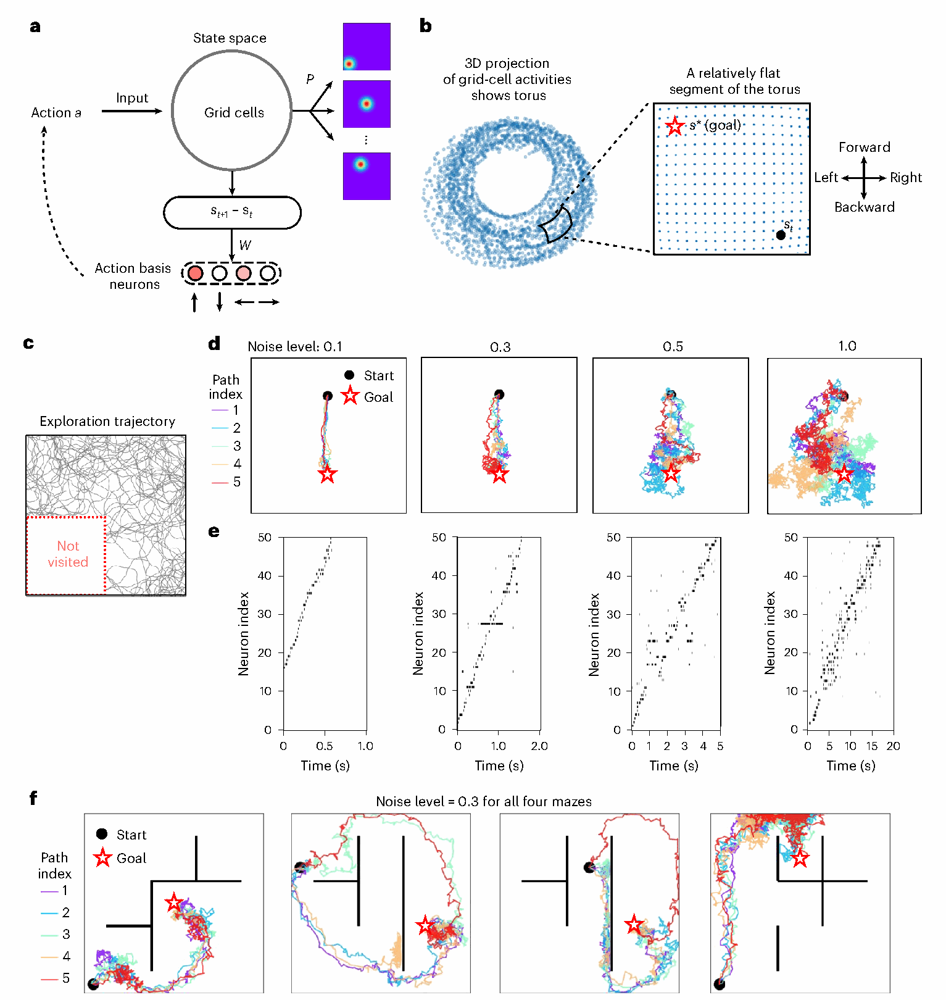
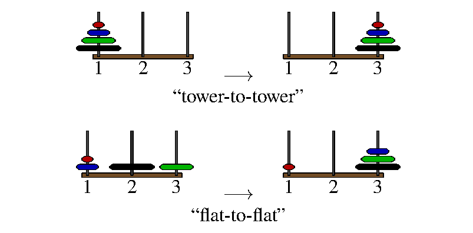

# Related Work

目前关注两条线：**地图如何提供状态与动作结构，以及 LLM 为什么读得出状态却未必能持续用好。**

## 1. GCML：用认知地图生成面向目标的轨迹

**Neural sampling from cognitive maps enables goal-directed imagination and planning**

Hui Lin、Yukun Yang、Rong Zhao、Giovanni Pezzulo、Wolfgang Maass，*Nature Machine Intelligence*，2026。

[论文](https://doi.org/10.1038/s42256-026-01254-4) · [代码](https://github.com/LH-cbicr/GCML)

**摘要。** 将状态与动作放进同一个认知地图空间，通过局部学习预测动作后的状态，再利用目标方向和随机采样生成候选轨迹。论文在空间导航、抽象图寻路和积木分解中展示了这种规划方式；规划器本身不依赖 LLM。

*首图展示二维地图、动作读出和不同噪声下的想象轨迹。图源：Lin 等，Fig. 1；从原 PDF 提取，图内内容未改动，[CC BY 4.0](https://creativecommons.org/licenses/by/4.0/)。*

**对我们的参考。** Q/V 的转移学习是 Step 1 的直接起点；图寻路和积木也提供了可计算状态、合法动作与目标的任务。接下来要回答的是：这类地图接入冻结 LLM 后，能否被读懂并用于动作选择。论文的地图规划成功不直接等于 LLM 接口有效。

## 2. 汉诺塔：已有状态表征会在生成过程中退化

**Transformers Struggle to Use Their Emergent World Models: Revisiting the Tower of Hanoi, and the Illusion of Thinking**

Devin Pereira、Willem Zuidema，arXiv 预印本，2026。

[摘要](https://arxiv.org/abs/2608.07077) · [PDF](https://arxiv.org/pdf/2608.07077)

**摘要。** 作者用汉诺塔检查 Transformer 的内部状态表示。小模型及两种 Qwen 系大推理模型在题目末尾已有可解码的状态空间结构，但长生成过程中表征会退化，读得出状态并不保证能完成规划。在四盘实验中，借助外部符号状态跟踪并持续注入对应状态表征，Qwen3.6-27B 的最优解数从 33/81 提升到 59/81；DeepSeek 蒸馏模型的恢复较弱。

*首图区分整塔搬运与起终点均分散的任务；它是任务示意，状态退化与注入结果见正文第 5 节。图源：Pereira、Zuidema，Fig. 1；从原 PDF 提取，图内内容未改动，[CC BY-NC-ND 4.0](https://creativecommons.org/licenses/by-nc-nd/4.0/)。*

**对我们的参考。** 可作为“让状态信息在推理中持续可用”的动机：问题可能出在已有表征的保持和使用。其“外部跟踪状态＋重新注入”的机制与我们的方向直接相关，也支持把状态读取、表征保持和动作选择分开评测。当前 Step 2 先测读取与单步使用，持续保持留给后续多步实验。
