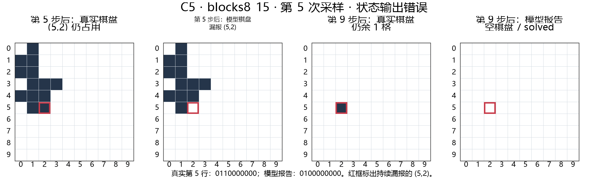

## 汇报结论

我们希望检验目前基于语言智能的llm能否清楚地认知到当前任务的状态，并且能否基于当前状态下进一步正确推理和泛化

目前已有直接结果给出了四类清晰反例：

- 状态输出本身漏掉仍占用的格子，并沿后续步骤传递到最终判断；
- 棋盘报告正确，下一步仍重复移除空格；
- 动作合法、棋盘报告正确，却把可解状态变成死局；
- 开关状态报告正确，却仍尝试走关闭道路。

这些结果暴露了可验证的失败，但尚未证明状态网络能够改善它们。后续任务选择可参考：

- 任务应具备明确的状态、可验证的动作，并且每次动作都会影响后续可行性；
- 优先选择需要持续更新状态的任务；文字编码是否造成困难、预训练是否覆盖均需另行验证
- 满足llm本身可能缺少实际认知，但加上状态网络后能够更好解决的条件。

## 1. 研究动机

> 仅靠语言推理，目前基于语言智能的 LLM 可能不能正确、稳定地维护任务状态。在推理过程中，它可能遗忘自己已经走到哪里，因而影响后续预测、规划和泛化。我们希望模型**在行动前形成并持续更新对当前世界的状态认识，据此想象，推理可能的结果来进行决策**，在行动后用真实反馈校准认识，并据此推演动作后果。

因此需要用具有可建模状态的任务来检验这一判断，本报告就是对前期反例任务选取的简单总结汇报

## 2. 任务选择

任务选择只保留三个条件：规则清楚、状态和动作可核验、动作会改变后续可行性。

| 任务          | 定位  | 判断                                            |
| ----------- | --- | --------------------------------------------- |
| 普通寻路、DAG    | 参考  | 节点和边直接给出，适合检查图结构读取、动作合法性和路径输出。缺点在于状态直接取决于所在节点 |
| 翻硬币         | X   | 状态直接取决于动作数量                                   |
| 五子棋，国际象棋等棋类 | X   | 1.当前模型训练数据中有大量相关情况，影响判断，2.属于react，大部分不符合我们需求  |
| 二维积木轮廓分解    | √   | 每次移除都会改变剩余几何结构和后续可行解，且都能判定可行性                 |

*已经尝试过和模型下五子棋，从思维过程中可以看出其能力非常强*
![[8f005aab41f7fc70914feca537ce234a.jpg|340]]
同时，像是围棋、国际象棋等，都可看做ReAct，我们要做的话方法会和简单加多模态拉不开差距
## 3. 任务背景

### 3.1 32node-DAG：沿有向边到达目标

| 项目 | 给模型的内容与要求 |
| --- | --- |
| 任务背景 | 图中的每条箭头代表一步，只能沿箭头方向移动。 |
| 输入 | 完整节点列表、有向边、起点和目标节点。 |
| 输出 | 按顺序给出每一步 `from/to`，并给出 `final_node`。 |
| 成功条件 | 每一步都使用真实存在的有向边，到达目标；本轮 DAG 还要求路径最短。 |

### 3.2 二维积木：移除形状并保持后续可解

| 项目   | 给模型的内容与要求                                                             |
| ---- | --------------------------------------------------------------------- |
| 任务背景 | 棋盘是 10×10 二值网格，`1` 表示占用，`0` 表示空位；形状固定朝向，不旋转。                          |
| 输入   | 当前棋盘、允许使用的形状，以及形状的放置规则。                                               |
| 输出   | 每步给出 `shape_id`、落点 `row/col` 和更新后的 `board_after`，最后给出 `final_status`。 |
| 成功条件 | 形状的所有 `1` 格都覆盖当前占用格，动作全程合法，并最终清空棋盘。                                   |

## 4. 实验结果

### 4.1 Sol 本轮初测

Sol 直接接收文字规则和完整观测，一次输出完整计划；积木同时自报每步棋盘，没有中途反馈或解题工具。三组各 16 个实例，每题 8 次采样。`pass@8` 表示同一题的 8 次采样中至少有一次成功。

| 任务       |         单次采样成功 | pass@8 | 含非法动作的答案 |     合法前缀整棋盘报告正确 |
| -------- | -------------: | -----: | -------: | --------------: |
| 8-block  |  91/128（71.1%） |  16/16 |   10/128 |  777/802（96.9%） |
| 12-block |  69/128（53.9%） |  13/16 |   15/128 | 973/1008（96.5%） |
| DAG      | 119/128（93.0%） |  16/16 |    9/128 |               — |

12-block 的 `blocks12_05`、`blocks12_09`、`blocks12_13` 三题均为 0/8，其中 24 次输出有 21 次为空计划、3 次为非法动作。另有 6 个非法积木答案在此前已经形成非空且棋盘报告全对的合法前缀，随后仍提交了非法动作。

### 4.2 Luna 结果参考

此前 Luna 完成了 64 个实例、每题 8 次，共 512 个答案。两轮使用的模型、提示词和样本不同，以下结果用于补充失败类型。（积木shape类型不同，寻路限制条件不同，准确率不可比较）

| 条件        |            单次采样成功 | pass@8 | 主要失败                 |
| --------- | ----------------: | -----: | -------------------- |
| 原始 8 块积木  |            99/128 |  15/16 | 非法移除 26、死局 2、提前停止 1  |
| 生成 12 块积木 |            72/128 |  15/16 | 死局 15、非法移除 37、提前停止 4 |
| 原图最短路     |           116/128 |  16/16 | 12 条合法但非最短           |
| 单开关最短路    |             60/64 |    8/8 | 4 次非法移动              |
| 双开关最短路    | 40/64（合法到达 55/64） |    7/8 | 非法移动 9、非最短 15        |

Luna 的原始 8 块、生成 12 块和双开关条件各有一个 0/8 实例，为反例分析提供了稳定样本。

## 5. CASE STUDY
### 5.1 积木：报告正确仍重复移除空格

`blocks8_00` 第 6 次采样中，第 2 步已移除 `(4,6)`，模型随后报告的棋盘也将该格标为空。第 3 步仍选择横向三格 `(4,4)、(4,5)、(4,6)`，非法动作。

### 5.2 积木：状态输出漏掉仍占用的格子

第 5 次采样中，前 4 步的状态报告正确。第 5 步执行 `shape 3 @ (4,5)` 后，真实棋盘的第 5 行（`row=5`）仍为 `0110000000`，其中 `(5,2)` 仍然占用；模型却将这一行报告为 `0100000000`。第 6 至第 9 步持续漏报该格，9 个动作虽然全部合法，真实棋盘最后仍剩 `(5,2)`，模型却输出 `solved`。

| | 第 5 行（`row=5`） |
| --- | --- |
| 真实棋盘 | `0110000000` |
| 模型报告 | `0100000000` |

这个案例直接展示了状态输出错误如何传递到后续状态和终止判断。

### 5.3 积木：初始空格重叠

 第 3 步横向双格覆盖了初始就为空的 (2,5)，非法操作

![[Pasted image 20260908003849.png|700]]
### 5.4 积木：合法动作把可解状态变成死局

第 4 步移除 `(4,4)、(5,4)、(5,5)`。三格当时均被占用，动作和 `board_after` 都正确；但它使 `(5,3)` 变为孤立单格，后续再也没有形状可以覆盖。动作前的棋盘仍有完整解，改用另一种移除即可清空。

### 5.5 积木：空计划，输出unsolved

这种情况是闭源模型思考了但是的确没做出来，输出`{"actions":[],"final_status":"unsolved"}`，思维链加密不可见，但也说明对于此类问题，模型能力有限
 ![[Pasted image 20260908004613.png]]
### 5.6 单向图寻路：走不存在的路
![[Pasted image 20260908004719.png]]

### 5.7 开关+最短路
![[Pasted image 20260908021734.png]]
### 5.8 其他错误罗列

- 终止判断错误
    Luna `blocks12_generated064` 第 1 次采样：13 个动作全部合法，也没有进入死局，但还剩 `(7,1)、(7,2)` 两格，模型却输出 `solved`。再执行一个合法动作即可清空。
    这是独立于状态报告的“完成条件判断错误”。
- 状态报告错误，但动作序列仍然成功
    Sol 中有 3 个样本出现这种情况：动作全部合法并清空棋盘，但中间 `board_after` 有错误。例如 `blocks12_01` 第 7 次采样连续几步漏报 `(4,0)`，最后仍然完成。
