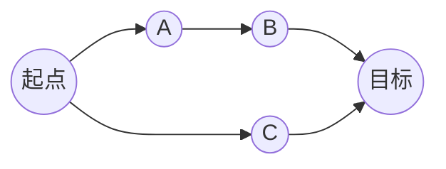
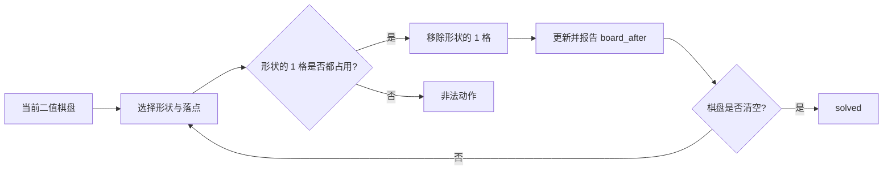

# 9.7 实验总结与初步进展

## 汇报结论

本阶段要检验的不是模型能否复述当前状态，而是它能否用状态指导行动：

> 当前状态 → 候选动作 → 动作后的状态 → 是否仍能完成目标 → 选择动作

已有直接 API 结果给出了三类清晰反例：

- 棋盘报告正确，下一步仍重复移除空格；
- 动作合法、棋盘报告正确，却把可解状态变成死局；
- 开关状态报告正确，却仍尝试走关闭道路。

因此，积木和带开关路径已经能够暴露“状态—动作后果—规划”之间的断点。下一步需要定位断点，再检验显式状态模型能否带来增益。

## 1. 研究动机

我们希望模型在行动前形成并持续更新对当前世界的状态认识，在行动后用真实反馈校准认识，并据此推演动作后果。显式状态模型的价值应体现在这条推演链上，而不只是让模型多输出一份状态描述。

所以，实验将三种能力分开观察：

1. 报告当前状态；
2. 预测动作后的状态；
3. 根据动作后果选择仍能完成目标的动作。

只有把这三步分开，才能判断失败发生在状态维护、转移预测、动作前提检查，还是后续规划。

## 2. 任务选择

任务选择只保留三个条件：规则清楚、状态和动作可核验、动作会改变后续可行性。

| 任务 | 定位 | 选择理由 |
| --- | --- | --- |
| 普通寻路、DAG | 简单对照 | 节点和边直接给出，适合检查图结构读取、动作合法性和路径输出。 |
| 带开关的路径 | 补充诊断 | 当前节点和开关组合共同决定下一步能否执行，能够测试状态条件和必要回访。 |
| 翻硬币 | 暂缓 | 状态主要是少量二值量，空间结构和长期后果较弱。 |
| 五子棋等棋类 | 暂缓 | 棋力、训练经验和对手策略会混入状态推演结果。 |
| 二维积木轮廓分解 | 当前主任务 | 每次移除都会改变剩余几何结构和后续可行解，且每一步都能独立裁判。 |

## 3. 任务背景与模型接口

下面的图示是任务关系的简化示意；模型收到完整规则和任务实例，并按表格中的格式输出计划。

### 3.1 DAG：沿有向边到达目标

| 项目 | 给模型的内容与要求 |
| --- | --- |
| 任务背景 | 图中的每条箭头代表一步，只能沿箭头方向移动。 |
| 输入 | 完整节点列表、有向边、起点和目标节点。 |
| 输出 | 按顺序给出每一步 `from/to`，并给出 `final_node`。 |
| 成功条件 | 每一步都使用真实存在的有向边，到达目标；本轮 DAG 还要求路径最短。 |

### 3.2 二维积木：移除形状并保持后续可解

| 项目 | 给模型的内容与要求 |
| --- | --- |
| 任务背景 | 棋盘是 10×10 二值网格，`1` 表示占用，`0` 表示空位；形状固定朝向，不旋转。 |
| 输入 | 当前棋盘、允许使用的形状，以及形状的放置规则。 |
| 输出 | 每步给出 `shape_id`、落点 `row/col` 和更新后的 `board_after`，最后给出 `final_status`。 |
| 成功条件 | 形状的所有 `1` 格都覆盖当前占用格，动作全程合法，并最终清空棋盘。 |

## 4. 实验结果

### 4.1 Sol 本轮初测

Sol 直接接收文字规则和完整观测，一次输出完整计划；积木同时自报每步棋盘，没有中途反馈或解题工具。三组各 16 个实例，每题 8 次采样。`pass@8` 表示同一题的 8 次采样中至少有一次成功。正式设置见[实验配置](../experiments/sol_dag_blocks/configs/sol_medium.json)。

| 任务 | 单次采样成功 | pass@8 | 含非法动作的答案 | 合法前缀整棋盘报告正确 |
| --- | ---: | ---: | ---: | ---: |
| 8-block | 91/128（71.1%） | 16/16 | 10/128 | 777/802（96.9%） |
| 12-block | 69/128（53.9%） | 13/16 | 15/128 | 973/1008（96.5%） |
| DAG | 119/128（93.0%） | 16/16 | 9/128 | — |

12-block 的 `blocks12_05`、`blocks12_09`、`blocks12_13` 三题均为 0/8，其中 24 次输出有 21 次为空计划、3 次为非法动作。另有 6 个非法积木答案在此前已经形成非空且棋盘报告全对的合法前缀，随后仍提交了非法动作。

### 4.2 Luna 结果参考

此前 Luna 完成了 64 个实例、每题 8 次，共 512 个答案。两轮使用的模型、提示词和样本不同，以下结果用于补充失败类型。

| 条件 | 单次采样成功 | pass@8 | 主要失败 |
| --- | ---: | ---: | --- |
| 原始 8 块积木 | 99/128 | 15/16 | 非法移除 26、死局 2、提前停止 1 |
| 生成 12 块积木 | 72/128 | 15/16 | 死局 15、非法移除 37、提前停止 4 |
| 原图最短路 | 116/128 | 16/16 | 12 条合法但非最短 |
| 单开关最短路 | 60/64 | 8/8 | 4 次非法移动 |
| 双开关最短路 | 40/64（合法到达 55/64） | 7/8 | 非法移动 9、非最短 15 |

Luna 的原始 8 块、生成 12 块和双开关条件各有一个 0/8 实例，为反例分析提供了稳定样本。

## 5. 代表性反例

这些案例覆盖状态维护、动作前提、动作后果、图结构读取、终止判断和路线规划六类问题。

| 类型 | 代表案例 | 可观察事实 | 定位 |
| --- | --- | --- | --- |
| 状态维护与动作前提 | Sol C2：`blocks8_00` | 第 2 步已将 `(4,6)` 报告为空，第 3 步仍提交覆盖 `(4,4)、(4,5)、(4,6)` 的形状。 | 棋盘报告正确，但下一步没有遵守当前状态。 |
| 动作后果与死局 | Sol C4：`blocks12_10` | 第 4 步动作合法、棋盘报告正确，却使 `(5,3)` 成为无法覆盖的孤立格；动作前仍有完整解。 | 需要同时检查动作合法性和动作后的剩余可解性。 |
| 图结构读取与动作表达 | Sol C3：`path_dag_07` | 输出把不存在的 `8→17` 当作边，漏掉必经的 `7`。 | DAG 可作为图读取和路径表达的简单对照。 |
| 状态条件与子目标 | Luna P2-1 | 到达节点 8 后正确报告开关为 `[1,0]`，仍尝试走要求开关 1 为 1 的 `8→4`；该布局 0/8。 | 状态记录没有约束动作前提。 |
| 终止判断与求解结果 | Luna B8-5 | 输出空动作列表和 `unsolved`，离线裁判给出 8 步合法分解。 | 本次求解没有得到可执行结果；闭源模型的思考过程不可见，报告只记录最终输出。 |
| 状态正确与路线规划 | Luna P2-3 | 开关报告全程正确，但走了 8 步；打开开关后回访节点 6 可用 7 步到达。 | 状态报告正确仍可能错过有利回访。 |

### 5.1 积木：报告正确仍重复移除空格

`blocks8_00` 第 6 次采样中，第 2 步已移除 `(4,6)`，模型随后报告的棋盘也将该格标为空。第 3 步仍选择横向三格 `(4,4)、(4,5)、(4,6)`，裁判因此拒绝执行。

### 5.2 积木：合法动作把可解状态变成死局

`blocks12_10` 第 1 次采样的第 4 步移除 `(4,4)、(5,4)、(5,5)`。三格当时均被占用，动作和 `board_after` 都正确；但它使 `(5,3)` 四周皆空，后续再也没有形状可以覆盖。动作前的棋盘仍有完整解，改用另一种移除即可清空。

### 5.3 带开关路径：状态全对仍走关闭道路

Luna 的 P2-1 从节点 21 出发，先进入 23 打开开关 0。模型在节点 8 正确报告状态 `[1,0]`，随后仍尝试 `8→4`；这条边要求开关 1 为 1。该题最短解只有 7 步，正确路线需要先完成第二个开关子目标，再进入目标区域。

完整案例与路线图见 [Luna 反例报告](../experiments/gcml_counterexamples/results/luna_case_studies.md)。

## 6. 当前结论与下一步

当前证据形成了三点判断：

1. 逐步状态报告准确率较高，仍不足以保证下一步动作合法；
2. 合法动作可能改变后续可解性，因此需要单独测动作后果和死局判断；
3. DAG 适合做图结构与输出的简单对照，积木和带开关路径更适合检验状态是否真正参与行动和规划。

下一步先做小规模定位实验：

- 给定棋盘或“节点＋开关”状态，判断候选动作是否合法；
- 预测动作后的棋盘或开关状态；
- 判断动作是否保留完成目标的可能，并比较是否需要回访；
- 在相同模型、提示、样本和推理预算下，对比显式状态记录／检查与状态模型；
- 将空计划单独放入输出协议对照，区分“没有交付解”和状态推演错误。

以上诊断尚未启动。正式配置和逐题结果见 [Sol 实验报告](../experiments/sol_dag_blocks/results/report.md) 与 [Luna 结果汇总](../experiments/gcml_counterexamples/results/luna_case_studies.md)。
