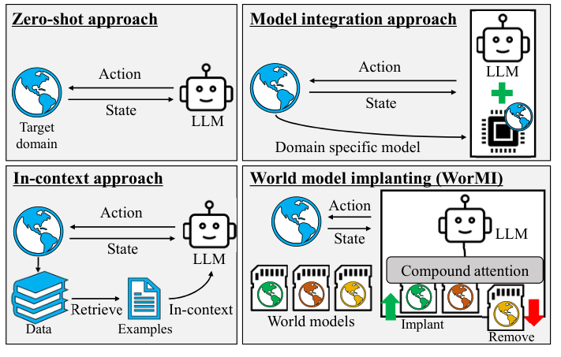
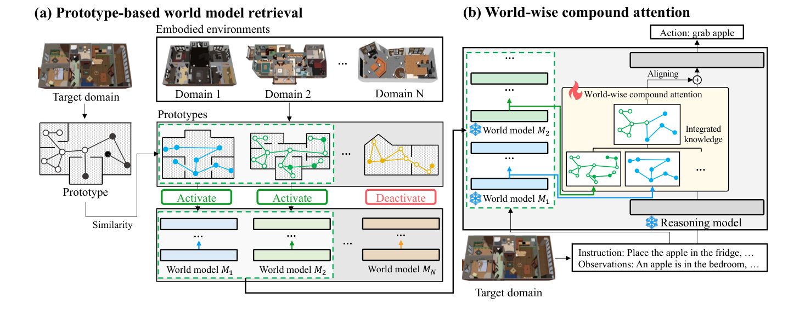
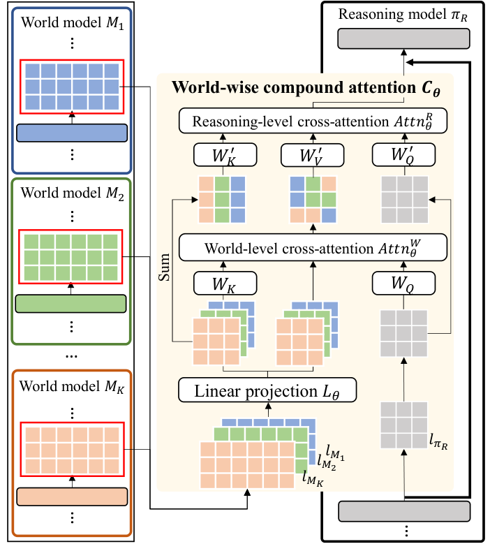
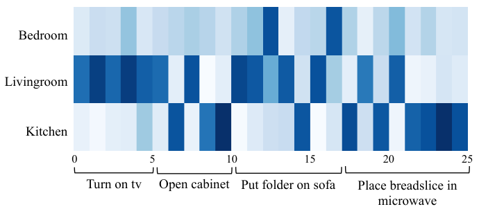
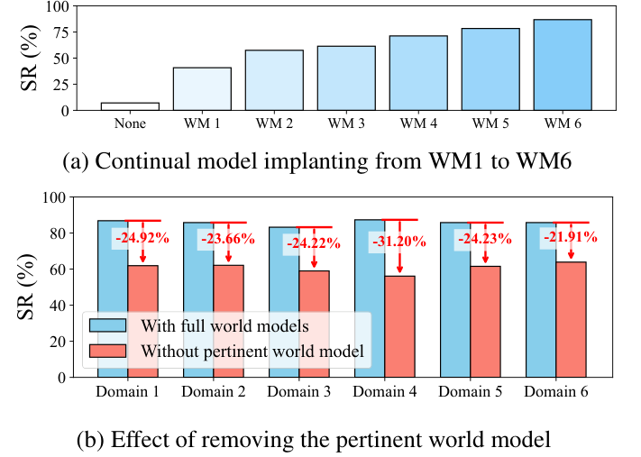

# WorMI 精读分享报告：把多个领域世界模型接入一个固定的语言模型

论文：**World Model Implanting for Test-time Adaptation of Embodied Agents**

作者：Minjong Yoo、Jinwoo Jang、Sihyung Yoon、Honguk Woo

出处：ICML 2025，PMLR 267，72556–72573。

本报告围绕 [PMLR 正式论文正文](https://proceedings.mlr.press/v267/yoo25a.html) 展开，包含 **Figure 1–5，重点解释前四张图**。训练参数需要时参考原文附录；实现核对固定在 [作者代码提交 96a2375](https://github.com/mjyoo2/WorMI/tree/96a2375ad7e96e75073f478bd37462f931dc39bc)。数字来自论文，代码结论来自静态阅读；没有重新训练模型或复现实验。例子中的具体权重和距离为教学示意。

## 1. 汇报先讲清楚的核心问题

一个机器人已经能读懂“把苹果放进冰箱”，为什么换一个房间，或者换一种没有训练过的任务组合，就可能做不好？

因为读懂指令和在具体环境里正确行动之间，还隔着环境知识：苹果可能在哪里、怎样接近它、哪些动作当前可执行、打开冰箱后会发生什么。若把所有知识都写进一个模型，新领域来了往往要重新训练；若每一步都检索大量示例并放进提示词，输入和处理成本又会增加。

**WorMI 想做的是：保留一个固定的主语言模型，把各个已见领域的知识分别训练进小语言模型；遇到当前环境时，选出相关的小模型，把它们的内部表示融合，再注入主模型的中间层，让主模型输出下一步动作。**

所以整篇论文的逻辑是：

~~~
新任务、新场景需要不同的环境知识
    ↓
把知识分别学进多个领域世界模型
    ↓
问题一：当前环境该用哪些模型？——原型检索
    ↓
问题二：这些模型的信息怎样一起用？——两层交叉注意力
    ↓
怎样让融合模块能适应不同模型组合？——元学习
    ↓
在留出的任务和场景上，测动作执行表现与少量示范后的适应效果
~~~

这里“世界模型”首先是作者赋予这些领域模型的功能名称。实际用的是微调后的 Llama-3.2-1B，学习动作、动作后果和领域知识。系统在执行任务时主要读取它们的隐藏表示；论文没有展示一个通过世界模型反复预测未来、展开搜索树再选动作的规划器。理解这个区别，后面就不会把方法讲成另一种架构。[依据：论文 §3、§4、附录 C.2](https://arxiv.org/html/2509.03956v1#S3)

### Figure 1：作者为什么提出“模型植入”

*原图：论文 Figure 1，PDF 第 1 页。*

图里比较四种做法：

| 做法 | 信息怎样进入决策 | 图中对应的意思 |
|---|---|---|
| 直接用预训练 LLM | 当前状态输入 LLM，直接生成动作 | 左上：主要依靠预训练知识 |
| 把示例放入上下文 | 检索相关示例，再交给 LLM | 左下：调用的是数据里的经验 |
| 固定的模型集成 | 用一个领域模型辅助 LLM | 右上：调用的是模型里的经验 |
| WorMI | 从多个世界模型中选择，再融合隐藏表示 | 右下：可以加入或移除领域模型 |

汇报这张图时，重点是“**领域知识的载体从示例变成可组合的模型，接入位置从提示文本进入了网络中间层**”。图上的 Implant / Remove 指运行时接入或移除模型，不是把多个模型的参数平均成一个模型。

这张概念图说明设计目标，真正的架构和证据分别在 Figure 2、3 与实验中。

## 2. 先固定例子和必要概念

下面用同一个例子串起方法：

> 指令：把苹果放进冰箱。
>
> 观测：机器人在卧室，苹果也在卧室，冰箱在厨房，冰箱门关着，机器人没有拿着物品。

一个合理的动作过程可能是：接近苹果、拿起苹果、走向冰箱、打开冰箱、放入苹果。实际命令和前置条件由环境决定，例子只帮助理解信息流。

论文中的符号，可以直接对应到这个例子：

| 名称或符号 | 本文中具体指什么 | 苹果例子 |
|---|---|---|
| 指令 $I$ | 希望最终完成的任务 | 把苹果放进冰箱 |
| 状态 $s_t$ | 当前时刻的环境描述；主实验以文本表达 | 苹果位置、冰箱状态、机器人位置等 |
| 动作 $a_t$ | 当前执行的一条高层命令 | grab apple |
| 轨迹 / episode | 从开始到结束的一串观测和动作 | 一次完整放苹果任务 |
| 领域 domain | 按环境或任务属性划分的数据范围 | 不同场景，或不同任务类型 |
| 世界模型 $M_j$ | 在领域数据 $\mathcal D_j$ 上训练的小模型 | 对某类环境经验更充分的模型 |
| 主推理模型 $\pi_R$ | 最终负责生成动作的 LLM | 默认 Llama-3.2-3B |
| 隐藏表示 hidden state | 模型处理某个 token 后得到的向量 | 某个位置所包含的上下文信息 |
| 原型 prototype $\mathbf p_j$ | 一个领域的若干代表性嵌入向量 | 对该领域对象状态的压缩摘要 |
| 组合模块 $C_\theta$ | 把世界模型表示融合并接入主模型的可训练模块 | 两层注意力及相关投影 |
| 策略 $\pi_\theta$ | 接入世界模型后的整套动作生成模型 | 由当前输入生成下一步命令 |

隐藏表示不能直接等同于一条明确的规则。比如“苹果”位置的向量并不只是“苹果”这个名词，也可能包含指令、位置和之前文本的信息。下文把它称为“对这个位置的理解”，是一种方便理解的说法。

还有两个不同层次需要分清：

1. **整体流程的两个模块**：原型检索 + 复合注意力。
2. **复合注意力内部的两层**：world-level cross-attention + reasoning-level cross-attention。

前者决定谁参与和如何接入，后者是“先融合世界模型，再把融合信息读进主模型”的具体结构。“world-wise”应理解为沿世界模型这一维度处理信息，中文可以说“按世界模型融合”；它不是性能意义上的“世界级”。

## 3. 世界模型从哪里来，究竟学了什么

### 3.1 每个世界模型有自己的领域轨迹数据

论文假设有 $N$ 个世界模型，每个模型 $M_j$ 对应一个领域数据集：

$$
\mathcal D_j=\{(I,s_t,a_t,s_{t+1})\}.
$$

四个字段分别是指令、当前状态、执行的动作和下一状态。例如：

~~~
I：把苹果放进冰箱
s_t：机器人在冰箱附近，拿着苹果，冰箱门关闭
a_t：open fridge
s_(t+1)：机器人仍拿着苹果，冰箱门已打开
~~~

作者用三个辅助任务训练领域模型：

| 任务 | 输入与输出 | 学到的知识 | 教学示例 |
|---|---|---|---|
| Dynamics，状态转移预测 | $(s_t,a_t)\rightarrow s_{t+1}$ | 执行动作后状态如何改变 | 打开冰箱后，门变成打开状态 |
| Action affordance，动作可执行性 | 从 $s_t$ 判断可执行动作 | 当前动作是否满足条件 | 尚未接近苹果时，不能直接拿取 |
| Behavior cloning，模仿示范动作 | $(I,s_t)\rightarrow a_t$ | 面向指令应该采取哪一步 | 要放苹果，当前先拿起苹果 |

这三种训练目标说明，作者希望领域模型同时掌握转移、可执行性和行动经验；不能只根据名称就认为它是一个单独的物理动力学网络。反过来，也不能因为它使用 LLM 架构，就否认状态预测训练可以让它承担世界模型的功能。[依据：论文 §3.2](https://arxiv.org/html/2509.03956v1#S3.SS2)

公开数据接口能够把“观测 → 动作”和“观测 + 动作 → 下一观测”组织成对话样本；但未见独立的三任务损失定义、可执行性标签生成流程及三者的混合比例。因此，上表解释的是论文规定的学习目标，不能把三种任务的具体样本配方说成已经从公开代码完全核实。[代码：VirtualHome 数据接口](https://github.com/mjyoo2/WorMI/blob/96a2375ad7e96e75073f478bd37462f931dc39bc/wormi/datasets/virtualhome.py#L21)

### 3.2 模型大小与训练阶段

默认主模型是 **Llama-3.2-3B**，各个世界模型的底座是 **Llama-3.2-1B**。它们是相同底座在不同领域数据上训练出的不同权重，不是六种架构。

整个训练和测试过程应按下面理解：

| 阶段 | 使用的数据 | 更新什么 | 固定什么 |
|---|---|---|---|
| 先训练各个 $M_j$ | 各自的已见领域轨迹 $\mathcal D_j$ | 世界模型权重 | 尚不进行最终组合策略训练 |
| 建立源领域原型 | $\mathcal D_j$ 中的对象状态嵌入 | 构造原型集合 | 不是再用原型训练 WM |
| 训练组合模块 | 不同已见世界模型子集及对应数据 | $C_\theta$ | 主模型与已训练世界模型 |
| Zero-shot 测试 | 当前测试环境观测 | 不做目标域梯度更新 | 使用已训练组合模块和模型库 |
| Few-shot 适应 | 目标域少量示范 | $C_\theta$ | 主模型与世界模型 |

“固定主模型”不代表最终动作不受世界模型影响：中间层输出被组合模块修改了，只是主模型原有参数不更新。

### 3.3 不能从“6 个已见场景、6 个模型”直接推出一一对应

论文明确写了每个世界模型在关联的领域数据上训练，主消融明确使用 **6 个候选模型、检索 3 个**。Figure 4 也明确选用了卧室、客厅、厨房三个房间来源的世界模型。

但正式论文、附录和所核对代码没有提供完整的“模型编号 → 具体训练场景 / 任务 → 轨迹数量”清单。因此：

- 可以确认知识来自对应 benchmark 的领域轨迹，并非凭空已有一组通用模型。
- 可以确认主实验声明只用已见域训练数据做 zero-shot 评测。
- **不能确定 VirtualHome 的 WM1–WM6 恰好分别只对应 6 个已见 scene。**
- **不能凭总表 $N=6$ 确定 ALFWorld 的六个模型各自怎样按场景类型或任务类型划分。**

代码 README 展示按 bathrooms、bedrooms、livingrooms、kitchens 划分数据训练模型的示例。这是接口用法示例，不是论文主实验完整的训练配置。“6 个已见场景”和“6 个世界模型”数量相同，还不足以证明一一对应关系。[依据：论文 §4、Figure 4、Table A.6；作者 README](https://github.com/mjyoo2/WorMI/blob/96a2375ad7e96e75073f478bd37462f931dc39bc/Readme.md)

## 4. Figure 2：把整体流程走一遍

*原图：论文 Figure 2，PDF 第 4 页。*

先看左半部分 Figure 2(a)。

源领域的数据已经被整理成各自的原型集合，分别绑定世界模型 $M_1,\ldots,M_N$。当前环境的观测也转成对象状态嵌入及原型。比较当前原型和每个源领域原型，距离较近的模型被激活，其他模型暂不参与。图里显示两个绿色 Activate 和一个红色 Deactivate，只是流程示意；主设置实际为从 6 个里选 3 个。

再看右半部分 Figure 2(b)。

指令和观测进入主模型，同时由选出的世界模型处理。主模型与世界模型都产生中间层表示。复合注意力先把几个世界模型的表示融合，再把得到的信息接入固定主模型，最后由主模型输出动作，例如 grab apple。

图中的雪花表示冻结模型，火焰表示组合模块可以训练。箭头上的 Integrated knowledge 是融合后的向量表示，不是一份生成出来的知识文本。

按苹果例子，把每一步落实为：

~~~
当前观测中的对象状态
    → 当前原型
    → 与模型库的各组原型比较
    → 选出三个相关世界模型

相同的指令和观测文本
    → 主模型 + 三个选中的世界模型
    → 取中间层隐藏表示
    → 先沿模型维融合，再沿序列读取
    → 加回主模型中间层
    → 输出下一步动作
    → 环境执行，返回新观测，继续
~~~

注意当前原型来自**当前观测**，源原型来自**源领域训练轨迹**。算法中的检索并不要求先拿到目标域的完整示范轨迹；当前观测本来就是执行任务时允许获得的输入。[依据：Figure 2、Algorithm 1](https://arxiv.org/html/2509.03956v1#S3.SS1)

## 5. 第一个模块：原型检索如何选择世界模型

### 5.1 为什么先拆成对象状态

整段房间描述可能很长，而且同一对象在轨迹中反复出现。作者把状态拆成 object-wise states，即与各个对象有关的状态描述，再分别编码。

比如可以把苹果例子的观测理解为：

~~~
苹果：位于卧室
冰箱：位于厨房，门关闭
机器人：位于卧室，手中没有物品
~~~

这是教学示意；具体对象状态怎样从三元组或文本构造，论文未给出完整预处理实现。作者用 $\Phi_D$ 表示把输入状态分解为对象状态的模型或过程，用 $\Phi_E$ 表示嵌入模型：

$$
\mathcal E_j =
\{\Phi_E(o)\mid o\in\Phi_D(s),\ s\in\mathcal D_j\}.
$$

把文字编码成向量后，语义接近的对象状态希望能在嵌入空间中接近。这里“希望”是设计前提，不能当作已经证明它必然反映任务可迁移性的事实。

### 5.2 原型不是一个标签，而是一组代表向量

如果一个领域有上万个对象状态向量，每次检索都比较全部向量，计算量会大。作者从每个领域的嵌入集合中选 $k$ 个代表点：

$$
\mathbf p_j =
\arg\min_{\substack{C\subseteq\mathcal E_j\\|C|=k}}
\max_{x\in\mathcal E_j}\min_{c\in C}\|x-c\|.
$$

这就是论文写的 **k-center** 目标：让每个原始点离某个代表点都尽可能近，特别控制最难覆盖的点。通俗地说，是挑一组“覆盖这个领域主要状态种类”的样本。

一个教学例子：大量苹果位置状态、冰箱开关状态和家具状态被压缩成少量代表向量。检索时比较代表集合，不逐条检查所有历史状态。

论文给出的 VirtualHome 示例有约 **10,200 个源嵌入**，原型数 **$k=15$**；15/10,200 约为 0.147%，文中概括为约 0.1%。原型数 $k$ 与检索模型数 $K$ 是不同的量，正文这里把 15 写成了大写 $K$，结合公式和 Table A.6 应读作原型数 $k$。

### 5.3 距离、排序和 Top-K

把当前状态转为原型集合 $\mathbf p$，再计算：

$$
d_j=\delta(\mathbf p_j,\mathbf p),
\qquad
\mathcal M_{\mathrm{ret}}
=\{M_j\mid j\in \operatorname{TopK}(\{-d_j\}_{j=1}^{N},K)\}.
$$

$\delta$ 是 **Wasserstein distance**。直觉上，把两组向量看成两堆点，衡量把一组分布匹配到另一组需要付出多大“搬运距离”；距离越小，认为领域越相关。

下面只是教学用的虚构数字：

| 模型 | 与当前原型的距离 | $K=3$ 时 |
|---|---:|---|
| $M_1$ | 0.20 | 选入 |
| $M_2$ | 0.35 | 选入 |
| $M_3$ | 0.80 | 不选 |
| $M_4$ | 0.25 | 选入 |
| $M_5$ | 0.91 | 不选 |
| $M_6$ | 0.67 | 不选 |

**这一步只是挑选参与模型，还没有决定某个 token 最该相信哪一个。** 所有选中的模型进入后面的注意力模块。根据 Algorithm 1，状态每次变化后可以重新检索，不是一次给整段任务固定一个模型。

另外，检索公式直接比较的是状态原型，不是指令和模型性能分数。作者希望状态相似性带来相关知识，但“场景像”并不保证“模型一定训练得好”或“一定能完成当前指令”。

### 5.4 理论与实现各说明了什么

论文的界限是：

$$
\delta(\mathbf p_i,\mathbf p_j)
\leq
\delta(\mathcal E_i,\mathcal E_j)+2\rho,
$$

其中 $\rho$ 是原始点到代表点的覆盖半径。作者用这个式子说明原型距离可以作为完整数据距离的有界替代。它**没有证明 Top-K 排序一定不变，更没有证明检索的模型一定使任务成功**。

严格理解这一推导，还需要说明原型分布的质量如何由原始分布聚合：只知道每个点离某个中心近，并不足以保证“均匀赋权的中心集合”与原分布的 Wasserstein 距离也小。附录没有展开这项权重条件，汇报时可把它作为近似分析，并把 Table A.11 的速度和表现比较作为实际证据。

公开代码也存在一项直接可见的差异：

| 项目 | 论文 | 核对到的公开代码 |
|---|---|---|
| 原型构造 | k-center，中心来自原嵌入集合 | ModelStore 使用 sklearn 的 KMeans |
| 原型数量 | Table A.6 为 15 | ModelStore 默认 n_clusters=12，可配置 |
| 编码对象 | 对象状态 | _compute_prototype 接收字符串集合，取 last_hidden_state 的第 0 个位置 |
| 距离与排序 | Wasserstein + Top-K | TensorSet.dist 调用多维 Wasserstein，retrieve 按距离排序 |

K-means 优化平均平方误差，中心也不必是原样本；k-center 关注最差覆盖距离，两者不是同一个算法。这里能确认的是公开实现提供了“聚类原型 + 距离检索”的组件，不能据此说论文的 k-center 已被完全复现。对象状态怎样准备、各模型的数据路径和主实验配置仍需额外材料。[依据：论文 §3.2、附录 A、Table A.6；ModelStore](https://github.com/mjyoo2/WorMI/blob/96a2375ad7e96e75073f478bd37462f931dc39bc/wormi/model_store.py#L44)

## 6. 第二个模块：Figure 3 的两层注意力到底怎样工作

*原图：论文 Figure 3，PDF 第 5 页。*

这张图建议从下往上讲。

左边是多个世界模型，右边是主模型。取出各模型的中间层表示，在中间浅色框中先投影，再进入 world-level cross-attention；其结果进入上方 reasoning-level cross-attention，最后接回主模型。

图里最容易漏掉的细节是左侧的 **Sum** 路径：第二层注意力的 key 来自多个世界模型表示的求和，value 才来自第一层注意力得到的融合表示。两条路径并不相同。

### 6.1 先只用一个很具体的例子

暂时假设输入被切成：

~~~
把 | 苹果 | 放 | 进 | 冰箱
~~~

实际 tokenizer 的切分不一定如此，下面只把这五个位置作为示意。三个世界模型都处理同一段输入，因而各有五个位置的隐藏表示：

| 位置 | 世界模型 1 | 世界模型 2 | 世界模型 3 |
|---|---|---|---|
| 把 | 对“把”位置的表示 | 对“把”位置的表示 | 对“把”位置的表示 |
| 苹果 | 对“苹果”位置的表示 | 对“苹果”位置的表示 | 对“苹果”位置的表示 |
| 放 | 对“放”位置的表示 | 对“放”位置的表示 | 对“放”位置的表示 |
| 进 | 对“进”位置的表示 | 对“进”位置的表示 | 对“进”位置的表示 |
| 冰箱 | 对“冰箱”位置的表示 | 对“冰箱”位置的表示 | 对“冰箱”位置的表示 |

把三个模型暂时想成厨房、卧室、客厅的顾问。这只是帮助理解分工，不表示每个模型只知道一个房间，更不表示主实验六个模型的真实划分已经确认。

**第一层：每个位置分别决定，各模型的信息占多少。**

在“苹果”位置，主模型当前表示可能使三个模型获得 0.2、0.7、0.1 的权重；于是得到一个融合后的“苹果位置表示”。在“冰箱”位置，可能变成 0.8、0.1、0.1。这里的数值是示意，权重来自训练后的注意力计算。

~~~
三个“苹果位置表示” → 一个融合的“苹果位置表示”
三个“冰箱位置表示” → 一个融合的“冰箱位置表示”
其余每个位置也做同样的事
~~~

结果仍是一条与输入长度相同的序列。

**第二层：主模型再从这条序列中读出当前需要的信息。**

第一层解决了每个位置怎样融合模型；第二层允许主模型某个位置的 query 去匹配序列中的不同位置，把相关信息读入当前表示。例如主模型生成动作所依据的位置，可以读取此前的苹果、冰箱及其状态信息。

所以两层的分工可以直接说成：

> 第一层沿模型维度融合；第二层沿 token 序列匹配和读取；读取结果再加回主模型。

### 6.2 只解释够用的 Q、K、V

注意力里的三个量可以这样理解：

- **Query，Q**：当前想找什么信息。
- **Key，K**：用来和 query 比较、决定从哪里读的索引表示。
- **Value，V**：选中后实际读出的内容表示。

这是向量之间的计算，不是模型真的用自然语言提出一个问题。它通常通过 query 和 key 的相似程度形成权重，再用这些权重对 value 加权。

### 6.3 投影层：先让向量宽度一致

设主模型某个连接层的表示为：

$$
H_R\in\mathbb R^{B\times L\times D},
$$

第 $j$ 个世界模型的表示为：

$$
H_j\in\mathbb R^{B\times L\times D_w}.
$$

$B$ 是批大小，$L$ 是当前处理的 token 数，$D,D_w$ 是向量宽度。默认主模型和世界模型尺寸不同，先通过可训练投影：

$$
Z_j=P_\theta(H_j)\in\mathbb R^{B\times L\times D}.
$$

论文把这部分写作线性投影 $L_\theta$。公开代码的 self.proj 实际是一个小前馈网络 MLP：两路线性变换中的一路经过 GELU 激活，再与另一路相乘，最后做输出变换。它包含非线性处理，功能仍是把世界模型表示变成主模型能够接入的宽度。[代码：MLP](https://github.com/mjyoo2/WorMI/blob/96a2375ad7e96e75073f478bd37462f931dc39bc/wormi/modules/layers.py#L15)

### 6.4 第一层：固定 token 位置，沿世界模型维度做注意力

代码先 stack：

~~~
每个世界模型：[B, L, D_w]
堆叠 K 个模型：[B, K, L, D_w]
投影后转置：[B, L, K, D]
~~~

随后把 batch 和 token 两维暂时合并：

~~~
主模型 query：[B, L, D] → [B×L, 1, D]
世界模型 key/value：[B, L, K, D] → [B×L, K, D]
~~~

这一步意味着：**一次注意力的候选只有同一位置上的 K 个世界模型表示**。

为便于讲述，忽略多头和偏置，把位置 $u$ 的权重及融合写成：

$$
\alpha_{u,j}
=\operatorname{softmax}_{j}
\left(\frac{(W_QH_{R,u})^\top(W_KZ_{j,u})}{\sqrt{d_h}}\right),
\qquad
F_u=\sum_{j=1}^{K}\alpha_{u,j}Z_{j,u}.
$$

这里 $d_h$ 是一个注意力头的宽度。公式表达的是按模型加权，不表示论文把全部模型 token 展平到一个长序列。

实现上还有一个值得说明的细节：world_wise_attn 返回的正常输出被丢弃，代码取其注意力权重，再执行 **attn_weight @ value**。返回权重默认在多头之间求平均，因此实际融合的是用平均权重加权的投影后表示，不是直接采用整套第一层 MHA 输出。[代码：WorldWiseAttentionImplantHook，L397–459](https://github.com/mjyoo2/WorMI/blob/96a2375ad7e96e75073f478bd37462f931dc39bc/wormi/modules/hooks.py#L397)

这不等于“苹果位置只知道苹果”：每个世界模型的隐藏表示已包含它此前处理的上下文。准确说法是，**这一层没有额外跨 token 查找，只在同一位置比较模型**。

### 6.5 第二层：key 用求和，value 用融合，再沿序列读取

定义：

$$
S_u=\sum_{j=1}^{K}Z_{j,u}.
$$

第二层的输入为：

$$
Q_R=W'_QH_R,\qquad K_R=W'_KS,\qquad V_R=W'_VF.
$$

因此它的查询、索引和内容来自：

| 量 | 来自哪里 | 作用 |
|---|---|---|
| $Q_R$ | 主模型当前层表示 | 决定当前需要什么 |
| $K_R$ | 各世界模型投影表示之和 $S$ | 给各序列位置提供匹配依据 |
| $V_R$ | 第一层得到的融合序列 $F$ | 提供已经按模型加权的内容 |

这层的 query 和 key/value 都恢复为 $[B,L,D]$，注意力权重沿序列位置形成。概念上，对主模型位置 $u$：

$$
b_{u,v}=\operatorname{softmax}_{v}
\left(\frac{Q_{R,u}^{\top}K_{R,v}}{\sqrt{d_h}}\right),
\qquad
O_u=\sum_v b_{u,v}V_{R,v}.
$$

第一层的 $\alpha$ 在“世界模型”上归一化；第二层的 $b$ 在“序列位置”上归一化。理解这两个权重分别沿哪一维产生，就理解了架构。

最后论文写：

$$
H'_R=H_R+C_\theta(H_1,\ldots,H_K,H_R).
$$

公开实现中，第二层输出还经过 RMSNorm（按向量的均方根规范其大小）与输出前馈网络 MLP，然后加回 query。主模型继续处理后续层，最终生成动作。[依据：论文式 (5)–(8)；BaseImplantHook.forward](https://github.com/mjyoo2/WorMI/blob/96a2375ad7e96e75073f478bd37462f931dc39bc/wormi/modules/hooks.py#L151)

### 6.6 接在哪几层，执行时到底调用了什么

Table A.6 的组合连接配置是：

~~~
世界模型第 7 层输出  → 复合注意力 → 主模型第 13 层输出处
世界模型第 15 层输出 → 复合注意力 → 主模型第 27 层输出处
~~~

公开代码按 Python 层列表索引注册 forward hook，这些索引从 0 开始，即对应第 8、16 与第 14、28 个 block。报告沿用配置数字 7、15、13、27，避免混用计数方式。每个连接点有自己的组合模块。

代码先对接入的世界模型执行前向计算、记录指定层表示，再运行主模型，在连接层替换为加上组合信息的输出。它们使用相同 input_ids，因此这里能够按 token 位置对齐。换成不同 tokenizer 或不同长度输入时，不能直接照搬 stack 和 reshape，需要额外对齐设计。

Table A.6 在“训练世界模型”部分还有一行 [13,27]，与后面明确的世界模型连接 [7,15] 不一致；汇报架构采用后者，因为 README 配置示例也明确给主模型 [13,27]、世界模型 [7,15]。[代码：implant 与 forward](https://github.com/mjyoo2/WorMI/blob/96a2375ad7e96e75073f478bd37462f931dc39bc/wormi/model.py#L299)

### 6.7 为什么要分两层，能得出多强的结论

作者希望先消化不同领域模型的分歧，再让主模型读取与当前推理相关的信息。这给“按模型融合”和“按序列读取”两个问题各安排了一层处理。

在注意力分数数量上，第一层约为 $B L K$，第二层约为 $B L^2$；如果把 K 条序列拼成长度 $KL$ 后直接给 L 个 query 读取，约为 $B K L^2$。这是结构上的数量比较，不包括投影、模型前向和硬件开销，不能直接当成实测加速比。

Table 3 支持这种结构比作者的拼接和求和变体表现好，但论文没有通过两个独立消融，分别量化第一层和第二层每一条设计的因果贡献。因此“拆分有效”有经验依据，“这个分解必然最优”没有证据。

### 6.8 Figure 4：第一层注意力是否会随任务改变

*原图：论文 Figure 4，PDF 第 7 页。*

前面 Figure 3 解释“它怎样计算”，Figure 4 接着检查“它是否真的对不同任务使用不同模型”。这是理解方法最直观的一张结果图。

**先读坐标。** 纵轴是三个参与模型的来源：Bedroom、Livingroom、Kitchen。横轴是执行过程中的步骤，标出 Turn on tv、Open cabinet、Put folder on sofa、Place breadslice in microwave 几段任务。颜色越深，表示相应世界模型获得的注意力越大。

**再看变化。** Turn on tv 一段，Livingroom 那一行明显更深；执行与微波炉相关的任务时，Kitchen 那一行明显更深；中间步骤的注意力会在几个模型之间变化，没有从开始到结束始终固定在同一个模型。

例如，把图读成一个很朴素的过程：

~~~
现在要打开电视
    → 更多读取客厅来源模型的知识
接下来任务、对象或位置变了
    → 世界模型的相对权重重新变化
最后要把面包放进微波炉
    → 更多读取厨房来源模型的知识
~~~

图中显示的是第一层 **world-level attention**，不是原型检索距离，也不是第二层 token-to-token 的注意力。因此这张图说明的是：在已经参与的三个模型中，组合模块对它们的相对使用程度会随执行过程改变。

把 Figure 2、3、4 连起来：

| 图 | 回答的问题 | 当前苹果任务中的对应 |
|---|---|---|
| Figure 2(a) | 哪些模型参与 | 先检索相关的三个模型 |
| Figure 3 下半部 | 每个位置怎样融合参与模型 | 苹果位置和冰箱位置可以分配不同模型权重 |
| Figure 3 上半部 | 主模型怎样读取融合信息 | 在序列里匹配相关位置并读入内容 |
| Figure 4 | 模型权重会不会动态变化 | 行动推进、当前信息改变时，相对权重也可以变 |

这里需要把图和实现的粒度分开：代码第一层按 **token 位置**计算模型权重，图横轴画的是 **环境执行步骤**。作者没有详细给出把 token、注意力头和连接层的权重汇总成这张步骤热图的方法，所以不能说“每格就是某个苹果 token 的原始权重”。

这张图支持“模型使用具有任务相关性”的解释，但颜色深不等于模型给出的信息一定正确。比如客厅模型可能因任务词汇相似而获得较高权重；只看热图无法证明它提供了某条正确的动作规则。要判断这种动态融合是否对任务有帮助，还应结合 Table 3 的融合消融和任务表现。[依据：Figure 4、论文 §4.2](https://arxiv.org/html/2509.03956v1#S4.SS2)

## 7. 组合模块怎样训练，zero-shot 与 few-shot 怎样执行

### 7.1 元学习：练习在不同模型组合下使用知识

假如只用固定的三个模型训练组合模块，它可能过度依赖这三个模型。作者因此让模块反复接入不同的世界模型子集，学习在组合变化时怎样融合。

可以把一次训练理解为：

1. 从源模型库取一个子集，例如 $M_1,M_2$，使用它们对应的数据集并集。
2. 从当前公共参数 $\theta$ 复制出这一组的参数 $\theta_j$。
3. 在这一组的数据上训练若干步，得到适应该组合的参数。
4. 换另一个组合，例如 $M_1,M_3$，再次从公共参数出发训练。
5. 汇总各组合训练后的参数变化，更新公共参数。

训练目标是提高示范动作的概率：

$$
\mathcal L(\theta_j,\mathcal B)
=\sum_{(s,a)\in\mathcal B}-\log\pi_{\theta_j}(a\mid s).
$$

论文这里把指令等上下文略写进策略输入；实际提示仍包含指令和状态。这个损失是示范动作监督，不是直接用最终任务成功率训练注意力。

外层更新写成：

$$
\theta\leftarrow\theta+
\beta\frac{1}{J}\sum_{j=1}^{J}(\theta_j-\theta).
$$

这里用 $J$ 表示组合数，避免与检索模型数 $K$、原型数 $k$ 混淆。这个更新把公共参数往各组合训练后的参数平均方向移动，形式上属于论文引用的一阶元学习方法。可以直白地讲成“**让组合模块多练习几种模型组合，使它有一个容易适应的起点**”。[依据：论文 §3.4、Algorithm 1](https://arxiv.org/html/2509.03956v1#S3.SS4)

### 7.2 正式论文给出的主要训练参数

以下来自 Table A.6，属于论文配置，不是 README 示例配置：

| 项目 | 设置 |
|---|---|
| 世界模型底座 | Llama-3.2-1B |
| 世界模型训练 | batch size 4；2,000 个梯度步；学习率 $3\times10^{-5}$；cosine 调度 |
| 主推理模型 | Llama-3.2-3B |
| 组合模块训练 | batch size 4；8 次 meta update；内循环 30 个梯度步 |
| 组合模块学习率 | 内循环 $\alpha=10^{-5}$，外循环 $\beta=0.1$ |
| Few-shot 学习率 | $10^{-5}$ |
| 温度 | 1.0 |
| 连接位置 | 主模型 [13,27]，世界模型 [7,15] |
| 原型数与检索 | $k=15,\ N=6,\ K=3$ |

8 次外循环不是整个系统只训练 8 步，内循环还包含多个模型组合及每组 30 步更新。论文没有完整披露组合采样列表、每个模型训练轨迹数或 few-shot 更新步数；不能用 README 里的 200 步、50 步、10 次迭代等示例参数补成正式实验设置。

### 7.3 Zero-shot 和 few-shot 的边界

**Zero-shot**：训练过程中使用已见领域数据，不拿目标领域示范做梯度更新；执行时可以读取当前环境观测并检索模型。它不是“所有组件都未经任务相关训练”。

**Few-shot**：测试时提供目标领域的 1、5、10 个示范，更新轻量组合模块，主模型和世界模型保持冻结。“shot”在论文中指目标域示范，不是 prompt 中某个 token；正式材料没有清楚细化每个 shot 的轨迹长度和采样清单。

其他方法使用 few-shot 数据的方式不同：

| 方法 | 目标域示范怎样使用 |
|---|---|
| LLM+FT | 继续微调语言模型 |
| LLM-Planner | 加入检索库，作为上下文示例 |
| WorMI | 更新组合模块 |
| SayCanPay | 论文给出了整体少样本比较，但各组件如何使用每个目标域示范没有同样详细展开 |

因此不能把表格统称为“所有方法都只在 prompt 里放几个例子”的比较。

## 8. 训练与评测数据：unseen 到底没见过什么

论文使用两个家务任务模拟环境，领域数据来自各自环境；**没有实验说明在 VirtualHome 训练的世界模型直接迁移到 ALFWorld，也没有跨 benchmark 的训练测试结果**。[依据：论文 §4、附录 B](https://arxiv.org/html/2509.03956v1#S4)

### 8.1 VirtualHome：场景图作为文本输入

VirtualHome 包含不同房屋布局、房间和对象位置。这里的场景变化包括布局和物品配置变化。主实验输入是文本化的环境图，图结构被表示成三元组列表，例如：

- (character, inside, bedroom)：机器人在卧室。
- (character, close, plum)：机器人靠近李子。
- (character, hold, none)：机器人当前没有拿着物品。
- (peach, inside, bedroom)：桃子在卧室。

模型接收的是已经结构化的环境描述。这使实验更集中地测试领域知识与动作决策，也降低了视觉感知错误的影响；因此主结果不能直接推广为真实摄像头输入下的成功率。

数据规模与划分：

| 项目 | 作者报告 |
|---|---|
| 收集的 episode 总量 | 1,023 |
| 任务数量 | 78 个具体指令：16 seen，62 unseen |
| 场景数量 | 20 个场景：6 seen，14 unseen |
| 任务类别 | TurnOn 9，Open 7，PutOn 30，PlaceIn 32 |
| 动作类型 | walk、grab、open、put、putin、switchon，共 6 类 |
| 目标判定 | 环境图达到相应关系或属性，例如 (apple, inside, fridge) |

这些总量不等于训练集大小：1,023 是收集的总 episode 数，正式材料没有给出三个评测条件各有多少 episode，也没有给出每个 $M_j$ 的数量清单。

78 个任务可以由四大类目标及不同对象、容器组合形成。因而“62 个 unseen task”不自动表示 62 种全新动作或全新物理规律；至少动作接口仍属于同一套环境命令。

Table 1 测试三种条件：

| 条件 | 什么发生了变化 | 可以回答的问题 |
|---|---|---|
| seen task + seen scene | 任务与场景类别都在训练范围内 | 方法在已见领域是否也有效 |
| seen task + unseen scene | 保留已见任务，换留出场景 | 是否适应新布局、物品配置 |
| unseen task + unseen scene | 任务和场景均留出 | 能否使用源领域知识处理新的任务场景组合 |

论文没有单列 unseen task + seen scene，因此主表不是对任务变化和场景变化的完整四格独立分析，也不能精确分解两者各造成多少性能下降。

模型的系统提示规定可用技能与动作输出格式，用户提示包含指令和当前观测；策略每一步输出一条动作命令，再由环境执行。

### 8.2 ALFWorld：文本交互与历史

ALFWorld 通过文本描述和动作命令与智能体交互。例如机器人先看到房间及容器描述，执行 go to sofa 1 后，才看到沙发上的具体对象。状态信息会随交互逐步出现，模型需要结合历史行动和反馈。

数据设置：

| 项目 | 作者报告 |
|---|---|
| 收集的 episode 总量 | 3,554 |
| 场景类型 | 4 类：3 seen，1 unseen |
| 任务类型 | 6 类：4 seen，2 unseen |
| 划分依据 | 沿用 CL-ALFRED 的场景与任务设置 |
| 任务类别 | Pick & Place、Pick Two & Place、Clean & Place、Heat & Place、Cool & Place、Examine & in Light |
| 交互方式 | 文本描述与文本动作命令 |

比如 Heat & Place 要先加热对象再放置；Clean & Place 要先清洁再放置，成功不能只看最后物品位置。

场景类型与“具体 scene 数”不是同一概念，ALFWorld 的 4 类也不能与 VirtualHome 的 20 个场景直接比较。论文没有在划分说明中列出具体哪两种任务类型、哪一种场景类型被留出，不能自行填成 kitchen 或 Heat & Place 等。

ALFWorld 提示包含 Observation 0、Action 0、Observation 1、Action 1 等历史，用来处理逐步获得的信息。两套环境都使用受限的高层动作接口，评测结果不包含真实机器人低层控制的难度。

### 8.3 如何判断 zero-shot 的说法是否过强

训练测试来自同一个 benchmark，本身不妨碍把留出目标域上的零示范评测称为 zero-shot。它的准确含义是：

> 使用同一模拟器中已见领域的训练数据和模型库，在没有目标域示范更新的情况下，处理留出的任务与场景。

它不意味着没有源领域监督，不意味着基础 LLM 从未接触过相关常识，也不意味着从一个模拟器转移到全新动作空间、物理规律或真实机器人。

**汇报时建议说“benchmark 内留出任务和场景上的零示范适应”，再给出 seen / unseen 的具体划分。** 这样保留作者实验的有效贡献，也不会把证据范围讲得过大。

## 9. 实验结果：先看任务表现，再看各设计是否必要

### 9.1 指标和比较对象先说清

**SR，Success Rate**：VirtualHome 中是完成任务的比例；论文对 ALFWorld 明确写的是完成子目标的比例。因此两套 SR 的绝对值不能直接比较，也不能把 ALFWorld 表里的 51.67% 自动解释为“51.67% 的完整任务全部成功”。

**PS，Pending Steps**：论文称它是完成任务所需的平均时间步数，越低越好。它衡量的是环境动作步数，不是 LLM token 数、推理时间或搜索节点数。论文没有充分交代失败 episode 如何进入这个平均值，因此不能进一步认定它是“只对成功任务平均”的路径长度。

主表采用 5 个随机种子，报告 95% 置信区间。不同方法的数量和训练方式并不完全相同：

| 方法 | 论文中的实际实现 | 应怎样理解 |
|---|---|---|
| ZSP | 固定 Llama-3.2-3B，逐步生成动作 | 没有源领域微调的直接生成参考 |
| LLM+FT | 训练 Llama-3.2-1B | 把领域经验直接学进单模型 |
| LLM-Planner | 固定 3B，检索源数据中的示例放入上下文；检索用 DPR 嵌入 | 数据检索与上下文适应 |
| SayCanPay | Say 用固定 3B；Can 使用环境提供的最优 affordance；Pay 训练 1B | 动作生成、可执行性与成本辅助 |
| WorMI | 固定 3B + 多个训练后的 1B + 可训练组合模块 | 检索模型并融合其隐藏表示 |

SayCanPay 的 Can 在这里获得环境可执行性信息，不能讲成一个在论文里重新学出的 Can 网络。另一方面，WorMI 训练多份 1B 世界模型，世界模型 2,000 步，Table A.5 的可训练基线为 200 步；所以这不是总参数量、训练量完全相同的比较。[依据：论文 §4、附录 C.1、Table A.5](https://arxiv.org/html/2509.03956v1#A3.SS1)

### 9.2 Table 1：zero-shot 主结果

下表每格按“SR / PS”写出论文均值，便于汇报横向比较；完整误差解释见后面的关键结果表。

| VirtualHome | 已见任务 + 已见场景 | 已见任务 + 未见场景 | 未见任务 + 未见场景 |
|---|---:|---:|---:|
| ZSP | 11.15% / 29.02 | 8.95% / 29.25 | 8.19% / 29.36 |
| LLM+FT | 58.55% / 17.37 | 53.42% / 17.70 | 42.82% / 20.79 |
| LLM-Planner | 35.67% / 27.15 | 28.55% / 27.04 | 21.45% / 27.73 |
| SayCanPay | 69.88% / 14.53 | 64.74% / 15.64 | 45.71% / 19.04 |
| **WorMI** | **85.78% / 10.76** | **80.26% / 12.42** | **66.12% / 15.17** |

| ALFWorld | 已见任务 + 已见场景 | 已见任务 + 未见场景 | 未见任务 + 未见场景 |
|---|---:|---:|---:|
| ZSP | 2.30% / 49.34 | 2.26% / 49.04 | 2.13% / 49.68 |
| LLM+FT | 45.72% / 14.63 | 29.26% / 38.49 | 29.40% / 46.84 |
| LLM-Planner | 17.73% / 32.09 | 18.63% / 40.50 | 12.31% / 46.33 |
| SayCanPay | 40.67% / 18.37 | 34.10% / 20.82 | 39.66% / 23.86 |
| **WorMI** | **62.51% / 9.96** | **52.67% / 17.74** | **51.67% / 20.18** |

最应讲的，是“任务和场景都未见”的一列：

| 环境与方法 | SR，95% CI | PS，95% CI |
|---|---:|---:|
| VirtualHome，SayCanPay | 45.71% ± 0.59% | 19.04 ± 0.63 |
| VirtualHome，WorMI | 66.12% ± 0.80% | 15.17 ± 0.08 |
| ALFWorld，SayCanPay | 39.66% ± 1.43% | 23.86 ± 1.90 |
| ALFWorld，WorMI | 51.67% ± 2.23% | 20.18 ± 0.63 |

VirtualHome 的 SR 提高 **20.41 个百分点**，动作平均少 **3.87 步**；ALFWorld 的 SR 提高 **12.01 个百分点**，平均少 **3.68 步**。

要用“百分点”，不要把 66.12−45.71 写成相对提高 20.41%。若以前者基线为分母，相对 SR 提升约为 44.65%。论文引言把 20.41% 说成 average，实际对应的是未见任务与场景那一列；三列差值平均约 17.28 个百分点。

PS 相对基线减少比例，VirtualHome 为 3.87/19.04≈20.33%，ALFWorld 为 3.68/23.86≈15.42%。原文对 ALFWorld 写的 18.23% 使用了 WorMI 的 PS 作分母，不是常见的“相对基线减少”口径。报告采用直接差值避免混淆。[数字来源：Table 1](https://arxiv.org/html/2509.03956v1#S4.SS1)

### 9.3 Table 2：少量目标域示范之后

| VirtualHome，SR / PS | 1-shot | 5-shot | 10-shot | 论文平均 |
|---|---:|---:|---:|---:|
| LLM+FT | 42.35% / 20.46 | 47.22% / 16.82 | 51.45% / 16.82 | 47.01% / 18.03 |
| LLM-Planner | 24.63% / 26.19 | 29.80% / 26.98 | 33.49% / 26.60 | 29.31% / 26.59 |
| SayCanPay | 46.75% / 19.12 | 49.80% / 15.52 | 56.24% / 16.00 | 50.93% / 16.88 |
| **WorMI** | **74.90% / 12.18** | **78.04% / 11.85** | **79.61% / 11.68** | **77.51% / 11.90** |

| ALFWorld，SR / PS | 1-shot | 5-shot | 10-shot | 论文平均 |
|---|---:|---:|---:|---:|
| LLM+FT | 26.78% / 46.51 | 29.79% / 46.21 | 33.57% / 43.70 | 30.05% / 45.47 |
| LLM-Planner | 18.28% / 43.94 | 16.80% / 40.50 | 17.76% / 42.45 | 17.61% / 42.30 |
| SayCanPay | 40.94% / 21.58 | 36.70% / 22.15 | 39.54% / 24.74 | 39.06% / 22.82 |
| **WorMI** | **51.50% / 21.46** | **58.69% / 13.14** | **64.46% / 11.79** | **58.22% / 15.46** |

WorMI 的三档 SR 置信区间：VirtualHome 分别为 ±1.57、±0.34、±0.99 个百分点；ALFWorld 分别为 ±2.21、±1.94、±0.88 个百分点。

可以得出两点：

1. 少量目标域示范能用于更新组合模块，在这组实验里获得较好表现。
2. 不是所有方法都随 shot 数稳定提升，例如 ALFWorld 的 SayCanPay 与 LLM-Planner 并不单调。

不能说“一个示范对所有环境都有效”：ALFWorld WorMI 的 1-shot SR=51.50%，与 zero-shot 未见条件的 51.67% 接近，PS=21.46 还高于 20.18；5-shot、10-shot 的收益更清楚。Few-shot 表与 zero-shot 表是否使用逐 episode 完全相同的测试集合，论文没有给出可直接核对的列表。

原表还有几处平均值与显示的三档均值的简单平均不完全一致。本报告保留作者平均列，不把它重新解释为能由表内每个显示值精确还原的统计量。[数字来源：Table 2，PDF 第 7 页](https://proceedings.mlr.press/v267/yoo25a.html)

### 9.4 Table 3：检索和两层融合是不是可有可无

在 VirtualHome 未见任务与场景上：

| 检索方式 | SR | PS |
|---|---:|---:|
| WorMI-E：所有世界模型都参与 | 48.63% | 18.93 |
| WorMI-R：随机选 3 个 | 62.04% | 16.96 |
| WorMI：按原型检索 3 个 | **66.12%** | **15.17** |

从 6 个里选 3 个并不属于大规模检索，但仍有一个有意义的对照：随机选择已经达到 62.04%，原型检索再提高 4.08 个百分点；全部使用只有 48.63%。因此证据支持“控制参与模型及相关性有帮助”，但原型检索的独立增益应按 4.08 个百分点讲，不应把相对整个基线的所有收益都归给检索。

| 融合方式 | SR | PS |
|---|---:|---:|
| WorMI-CONCAT：拼接世界模型表示 | 47.79% | 20.03 |
| WorMI-ADD：求和世界模型表示 | 56.47% | 17.43 |
| WorMI：复合注意力 | **66.12%** | **15.17** |

复合注意力相对拼接提高 18.33 个百分点，相对求和提高 9.65 个百分点。PS 相对求和减少 **2.26 步**；原文解释段落写成了 1.79，按表值计算应修正。

这些结果说明融合方式重要。它们仍不能排除容量、优化难度、训练组合匹配等其他原因；需要更细的消融才能解释为什么这个结构更好。[数字来源：Table 3](https://arxiv.org/html/2509.03956v1#S4.SS2)

### 9.5 Table 4、5：主模型大小与参与模型数

| 主模型大小 | LLM-Planner SR | SayCanPay SR | WorMI SR / PS |
|---|---:|---:|---:|
| 1B | 9.93% | 42.22% | 49.65% / 18.99 |
| 3B | 21.45% | 45.71% | 66.12% / 15.17 |
| 11B | 51.11% | 49.28% | 71.18% / 13.95 |

主模型变大时 WorMI 表现提高，所以世界模型没有消除主 LLM 能力的影响。这里改变的是**主模型参数规模**。

下面则改变**参与的世界模型数量**，不是把一个 WM 从 1B 增大到 6B：

| 参与 WM 数量 | SR | PS |
|---|---:|---:|
| 1 | 42.75% | 20.54 |
| 2 | 62.94% | 17.21 |
| 3 | **66.12%** | **15.17** |
| 4 | 61.96% | 16.68 |
| 6 | 48.23% | 18.93 |

最多模型不是最好。结果与“相关知识有互补价值、同时混入过多信息会带来困难”的解释一致，但没有单独证明下降一定来自噪声或冲突。Table 5 的六模型 SR=48.23%，与 Table 3 的全部模型条件 48.63% 有小差异，不能把两表当成完全相同的一次运行。

### 9.6 Table 6：复杂任务仍然困难

作者另测两类任务：有顺序的长任务，以及需要统筹完成多个目标的多指令任务。这里新增 **GC**，表示完成子目标的比例；SR 表示完整目标集合是否完成。

| 长任务 | SR | GC | PS |
|---|---:|---:|---:|
| LLM-Planner | 0.65% | 17.16% | 86.12 |
| SayCanPay | 6.54% | 39.22% | 57.87 |
| WorMI | **19.61%** | **49.35%** | **53.15** |

| 多指令 | SR | GC | PS |
|---|---:|---:|---:|
| LLM-Planner | 1.31% | 29.02% | 85.17 |
| SayCanPay | 6.54% | 42.32% | 57.94 |
| WorMI | **20.26%** | **60.62%** | **43.49** |

WorMI 的相对优势仍在，但完整成功率只有约 20%。这组结果更适合讲成“改善了复杂任务，但远未解决长期规划可靠性”，不能只展示最好的一行而忽略绝对值。

### 9.7 Figure 5：模型库可以扩展，相关模型也确实影响表现

*原图：论文 Figure 5，PDF 第 8 页。*

上图 (a) 显示逐步向模型库加入 WM1–WM6 后，整体成功率提高。这里作者有意只使用与目标域相关的模型，因此它测的是“模型库覆盖更多领域”的收益，和 Table 5“同一次决策参与多少模型”不是同一个变量，两组结果并不矛盾。

下图 (b) 在不同领域移除相应模型后，成功率下降约 22–31 个百分点。这支持领域模型确实提供了任务所需信息。作者把移除称为 machine unlearning effect；更准确的证据范围是“移除模块使相关能力下降”，没有证明基础 LLM 和其他模型中的对应知识被彻底删除。

## 10. 如何评价这篇论文

这篇论文最有价值的地方，是把“如何调用领域经验”落实为一个具体的网络结构：先按状态原型选择世界模型，再逐 token 融合模型表示，随后通过另一层注意力读入主模型。它让“组合世界模型”不只停留在分别生成答案或提示词拼接上，Figure 2、3 给出了可解释的信息流，Figure 4 和消融提供了使用这些模型的经验依据。

实验支持的主要结论是：在作者设置的家务模拟环境、留出任务与场景划分下，WorMI 比所比较方法有更高 SR、更低 PS；多个相关模型的融合优于单纯拼接、求和或全部使用，少量目标域示范也可以用于调整组合模块。

但把结果向外推广时，需要保留四个边界：

1. **泛化范围。** 评测留出的是同一 benchmark 内的任务和场景；没有证明跨模拟器、跨动作体系或真实机器人上的零示范泛化。
2. **世界模型的作用。** 模型接受状态转移等训练，但运行时主要提供隐藏表示。没有独立结果显示转移预测准确率、可执行性准确率，也没有验证任务提升究竟由三种训练目标各贡献多少。
3. **资源与绝对能力。** 小世界模型单个是 1B，多个模型同时前向仍有成本；基线与 WorMI 总训练量、总参数并未完全匹配。复杂任务完整 SR 约 20%，可靠长期执行依然困难。
4. **复现材料。** 逐模型领域划分、训练与评测 episode 清单、检索嵌入模型、shot 的具体采样方式没有充分披露。公开代码能帮助确认注意力结构，但不能自动作为整套论文实验的完整复现。

对公开实现，还应把已核实的结构与待补齐的细节分开。除了前文的 k-center / K-means、线性投影 / MLP 差异，代码的元学习回调做参数平均，未见论文 $\beta=0.1$ 的显式插值；其评测脚本比较生成动作和标准动作字符串，未展示正文 SR / PS 所需的完整环境 rollout。不能直接用那个动作匹配准确率替代任务成功率。[代码：元学习回调](https://github.com/mjyoo2/WorMI/blob/96a2375ad7e96e75073f478bd37462f931dc39bc/wormi/trainer.py#L754)、[评测器](https://github.com/mjyoo2/WorMI/blob/96a2375ad7e96e75073f478bd37462f931dc39bc/wormi/scripts/eval.py#L37)

公开注意力调用也没有显式传入因果 mask 或 padding mask。对只含当前已知输入的执行前向，这不等于能看到未来环境状态；但若用整段目标序列做自回归监督，必须核对是否可能读取后续答案 token。这里是静态实现检查中需要进一步验证的问题，不能据此断言论文的实验发生了泄漏。

如果沿着本文的逻辑继续研究，最直接的验证是：明确每个世界模型的数据来源和划分；分别测状态转移、可执行性和示范动作学习；在匹配训练与推理预算下比较组合方式；再把留出测试扩展到新的对象、动作或模拟环境。这样才能判断它学到的是可迁移的环境知识、熟悉任务的行动经验，还是两者共同作用。

汇报最后可以回到开头的苹果例子：**WorMI 没有要求重新训练整个主模型来学习新房间。它从已有模型库找相关知识，先把不同模型的信息融合，再让主模型读入并输出动作。论文证明了这一做法在其 benchmark 划分中有效；新的动作体系、真实环境和长期可靠规划，仍需要另外验证。**
