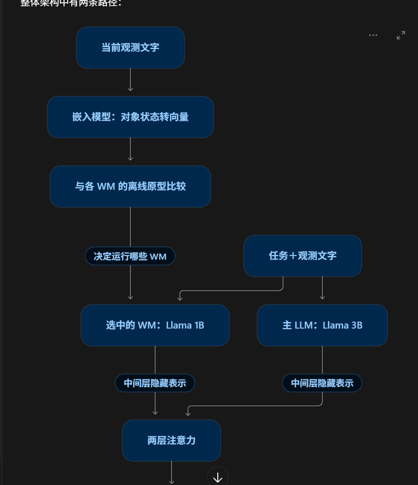

# 2026-10-06 会议原始记录（归档）

以下保留当时的讨论与草稿数字，不代表当前实验合同，也不是待执行指令。失败终止条件、融合 FFN 和 batch 随后已有修订；当前设置见[实验设计](../../experiments/flamingo_map_reader/DESIGN.md)，当前进度见[项目状态页](../PROJECT_STATUS_AND_TODO.md)。

考虑cross attention前加ffn（作为特征提取器），对齐flamingo

画图：cross attention架构，数据怎么构建学到什么东西
类似：
轨迹文字示例
加错误轨迹（前面作为上下文），加个1000条判断输出无解，重头训，把FFN加上去，四卡，10个epoch，bs能承受最大，8-16.
直接把地图不行的输出无解。修改数据
1100，500+500+10
pcie的机器多卡无法通讯，nvlink是很快的，注意

积木两个测试分组的分布为：

|最短长度|训练初始棋盘上的新任务|新初始棋盘任务|
|---|---|---|
|6 步|9|3|
|7 步|340|457|
|8 步|638|535|
|9 步|13|5|
|**总计**|**1,000**|**1,000**|

若对应你原文中的“实际贪心示范长度”：寻路非零步测试任务为 **8–31 步**；积木保存的贪心轨迹为 **5–11 步**，其中包含失败轨迹，**成功的贪心示范为 6–11 步**。
100，200，200，九步随便