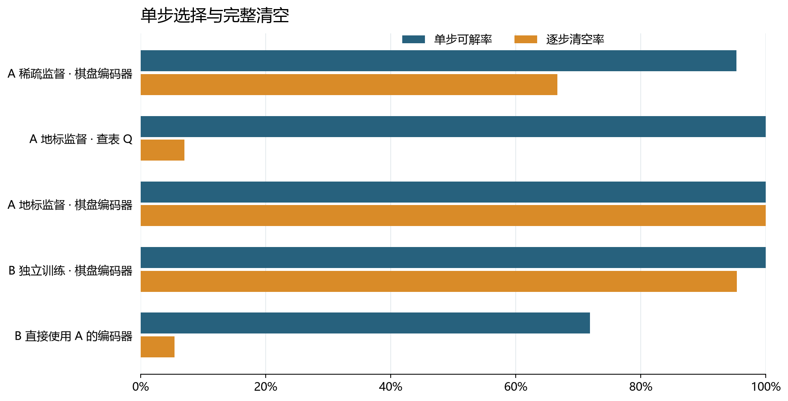
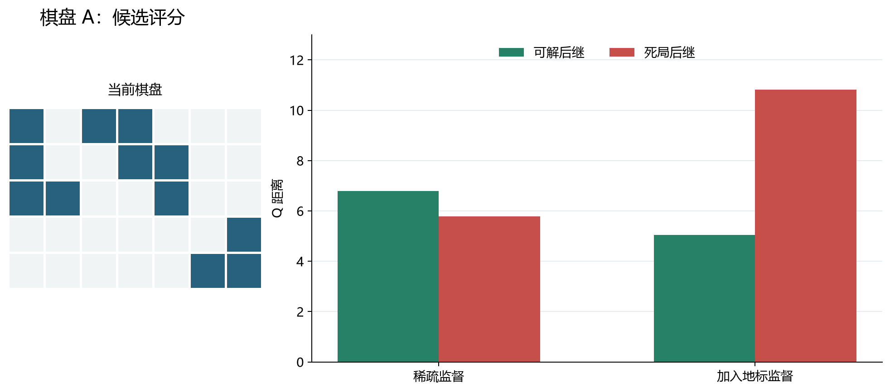
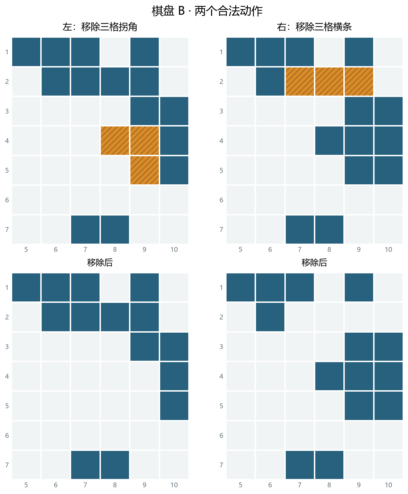
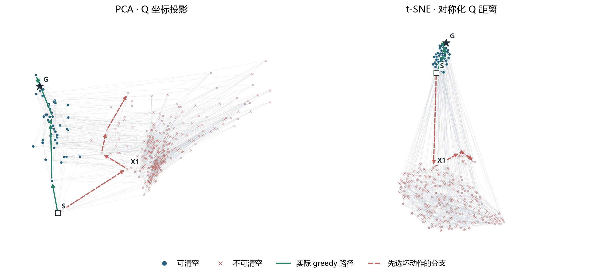

# 已归档：积木 Q-map 实验报告（过程记录）

**处理决定：本页不再是当前结论页，也不再更新。**它自 `codex/blocks-multigoal`（末次提交 `3a4c572`）移植而来，保留第 1–7 节的早期单棋盘 A／B 实验与第 8–10 节的逐级推进，用于复现当时的读数与失败过程；第 11 节同一 1,000 题电池的旧读数（852/1000）已被该电池的封存读数（860/1000）取代。当前结论见[结果报告](../report.md)，数据范围与归属见[执行说明](../../README.md)。

**目前能做到：围绕一张初始棋盘训练后，用 Q 的距离选动作，可以把这张棋盘及其许多残余局面清空。还没做到：把同一个模型直接用于另一张初始棋盘，仍然保持这个能力。**

在棋盘 A 上训练、测试 A，清空 **129/129** 个测试起点；在棋盘 B 上重新训练、测试 B，清空 **123/129**；把 A 的模型直接用于 B，只清空 **7/129**。这些结果只评估 Q；本轮没有训练动作位移模型 V，也没有使用 LLM。

## 1. 我们到底在训练什么

使用原论文较简单的八种积木：四种三格拐角、横竖二格条、横竖三格条。棋盘为 10×10，每次移除一个允许的形状，目标是清空。没有重力和库存限制；移除后，其余格子留在原位。

先区分两个词：**棋盘 A、B** 指两道不同的初始题；**状态**指移除若干块后，棋盘上具体还剩哪些格子。一道初始题可以产生很多状态，所以后面的“129 个测试起点”并不是 129 道独立的原始题。

**Q 就是一个状态在认知地图上的坐标。**本次用 128 个数字表示一组坐标，不要求每个数字都有单独的含义。我们希望两组坐标算出的距离反映“从前一个状态，最少几步能到后一个状态”：一步能到的近，多步才能到的远，不可达的最远。

这里有个关键区别：一个动作合法，不代表走完后还能清空。

```text
当前状态 → 后继甲：1 步；后继甲 → 空棋盘：还需 4 步
当前状态 → 后继乙：1 步；后继乙 → 空棋盘：不可达
```

甲、乙都应离当前状态近；乙应离空棋盘远。**“近”或“远”说的是两个状态之间的关系，不能把死局一律推离所有状态。**

### “查表 Q”和“棋盘编码器”有什么区别

它们是两种给状态生成坐标的方法。

| | 查表 Q：每个状态存一组坐标 | 棋盘编码器：用同一个网络算坐标 |
| --- | --- | --- |
| 输入一个棋盘后做什么 | 找到这个状态的编号，取出对应的 128 个数字 | 把 100 个格子的占用情况送进小网络，算出 128 个数字 |
| 训练时改什么 | 直接调整表中各行的数字 | 调整网络参数，让它算出的坐标符合距离监督 |
| 没见过的状态怎么办 | 表里没有这一行，无法评分 | 可以算出坐标；算得是否有用，还要评测 |
| 两个状态如何共享信息 | 由训练中的状态对关系联系起来 | 除状态对监督外，还共享读取格子的网络参数 |

例如，“这个状态对应第 372 行，取出它的坐标”是查表；“读取这 100 个格子，当场计算坐标”是编码器。下文也分别称它们为**存坐标**和**算坐标**。

两种方法的 Q 都只由当前状态决定。同一状态换一个目标，Q 不会跟着变；选动作时，再比较后继状态的 Q 与目标状态的 Q。

## 2. 监督、训练和 loss

### 监督给了哪些答案

每个训练样本包含：**起点状态、终点状态、真实最短步数或“不可达”**。一个状态可以和许多其他状态组成样本。

| 状态对的真实关系 | 训练希望得到什么 |
| --- | --- |
| 一次合法移除就能到达 | 预测距离接近 1 |
| 最少需要 4 次移除 | 预测距离接近 4 |
| 已经完整求解，证明无法到达 | 预测距离接近一个大于所有有限步数的数 C |

这些标签由**离线精确求解器**生成。只有完整搜索证明确实无解，才标为不可达；计算超时不当作无解。模型学习这些标签，选动作时不调用求解器替自己找答案。

早期“稀疏监督”已经包含一步、多步、到空棋盘和不可达关系，但“到某个非空目标确实无解”的困难样本很少。后来增加了**地标监督**：把只剩一块积木的非空状态当参照，再标注其他状态到这些参照需要几步、能不能到。

可以把这理解为：除了终点和原先采到的状态对，再补上一批中间参照之间的远近关系。本次地标具体是**单块积木状态**，并非任意中间状态。它提供了更多关于可解性的间接信息。

### 模型怎样被这些标签推动

每次训练取一批状态对，生成它们的 Q，算出预测距离，再按以下两种误差调整 Q 表或编码器。距离计算公式本身固定，不额外训练一个打分网络。

| loss | 通俗解释 | 计算方式 |
| --- | --- | --- |
| 距离误差 | 真实是 4 步，预测就应接近 4；无解关系则接近 C | `Huber(预测距离 − 标签距离)` |
| 排序误差 | 真正近的应排在真正远的前面，并至少拉开 0.5 | `max(0, 0.5 + 预测近距离 − 预测远距离)` |

**总 loss = 距离误差 + 排序误差。**

> Huber 是一种平滑的误差罚分，偏差越大，罚分越高。排序同时比较“同一起点到不同终点”和“不同起点到同一终点”；真实步数相同的，不强迫分先后。训练平衡可达与不可达样本，避免大量容易的负样本盖过其他关系。

积木只能移除，不能添加，所以“甲到乙”和“乙到甲”可能不同。本报告主表中的模型使用**有向距离**，不能把它理解为二维图上的普通直线距离。网络直接读取棋盘，输出 Q；主要编码器实验最多训练 5,000 次参数更新，用验证集选模型。具体网络和距离公式留在[方案说明](../../../../docs/BLOCKS_QMAP_PLAN.md)与[执行说明](../../README.md)中。

**测试留出了哪些答案？**

用于单步评测的候选后继，到空棋盘的直接距离标签不参与训练。但这些后继仍可出现在其他训练状态对中。因此这里主要检验的是“学过其他关系后，能否补出没直接教过的关系”，不能说成完全没见过这些状态。

## 3. 怎么测：选对一步与走完一局分开看

目前每一步的实际流程是：

1. 规则程序列出当前所有合法动作，并计算各自执行后的真实棋盘。
2. Q 模型给这些后继棋盘算坐标，再计算它们到空棋盘的距离。
3. 选择距离最小的动作，执行后继续下一步，直到清空或失败。

也就是说，**Q 负责比较哪个后继更接近目标；动作之后棋盘长什么样，目前由真实规则提供。**这还没有验证 V 的后继预测能力。

| 指标 | 具体怎么算 | 回答什么问题 |
| --- | --- | --- |
| 单步选对率 | 在 128 个本来有解的状态中，选出的动作有多少仍保留清空可能 | 这一步会不会走进死局？ |
| 完整清空率 | 从上述 128 个状态再加初始棋盘，共 129 个起点出发，一直选到结束 | 连续选很多步，还能完成吗？ |
| 可达距离平均误差（MAE） | 在留出的可达状态对上，预测步数与真实步数平均差多少 | 地图的距离刻度准不准？ |
| 最优动作率 | 选出的动作是否在某条最短清空路径上 | 能清空之外，是否还走得短？ |

另外检查近远排序、不可达识别，以及**剩余格数相同**的可解／死局后继能否排对，防止模型只靠数格子得分。判卷用精确求解器；它的答案不作为 Q 选动作时的输入。

## 4. 结果：监督和坐标生成方式都重要



*图 1：蓝条是 128 个状态的单步选对率，橙条是 129 个起点的完整清空率。A、B 是不同初始题；“在 B 上重新训练”和“直接使用 A 的网络”是两种不同实验。每行是所列运行的结果，图中没有汇总多个随机种子的误差条。*

| 在哪里训练、在哪里测试 | Q 的生成方式与监督 | 单步选对 | 完整清空 | 可达距离平均误差 |
| --- | --- | ---: | ---: | ---: |
| A 训练 → A 测试 | 网络算坐标，稀疏监督 | 122/128（95.3%） | 86/129（66.7%） | 1.89 步 |
| A 训练 → A 测试 | 逐状态存坐标，增加地标 | 128/128（100%） | 9/129（7.0%） | 2.15 步 |
| A 训练 → A 测试 | 网络算坐标，增加地标 | 128/128（100%） | **129/129（100%）** | **0.57 步** |
| B 重新训练 → B 测试 | 网络算坐标，增加地标 | 128/128（100%） | **123/129（95.3%）** | **0.64 步** |
| A 训练 → 直接测 B | 使用 A 学好的网络 | 92/128（71.9%） | **7/129（5.4%）** | 不作同条件比较 |

#### 是不是只差多训一会儿？

早期查表 Q 从 5,000 步继续到 30,000 步，单步选对率从 55.5% 升到 66.4%，仍不理想。另一个只改有向距离公式的稀疏查表实验为 62.5%。这些结果说明，单纯延长当时那套训练，没有解决问题；它们不能证明所有模型都已经充分收敛。


#### 换成网络、增加监督，各有什么作用？

读取棋盘的编码器在稀疏监督下，单步已达到 95.3%，但完整清空为 86/129；增加地标后，完整清空达到 129/129。结果支持继续关注“如何生成 Q”和“教了哪些距离关系”这两个因素。它们是探索性对照，稀疏与地标数据的状态池并不完全相同，不能把全部提升精确归因于某一个改动。

#### 为什么查表能单步全对，却只清空 9/129？

单步测试中的候选都在表里，连续走下去却可能遇到没存过的状态。严格评测要求给每个合法候选评分，只要有候选查不到 Q 就停止。一个真实例子是：从 A 的初始棋盘走四步后，有 13 个合法后继，其中 12 个不在表中，且有 6 个本来仍能清空。因此这个结果主要暴露了查表的覆盖问题。编码器可以给新状态计算 Q；A 的 129 条成功轨迹中，有 96 条选过训练状态池外的状态。

还要区分“清空”和“最短”：A、B 地标编码器的最优动作率分别为 **93.8% 和 89.1%**，并非每次都选最短方向。129/129 也不表示所有状态对的距离都学得精确。

无解识别也有遗漏：针对“目标格子都还在，但无法通过合法移除到达”的困难状态对，按预先固定的距离阈值判无解，只识别出了 A 的 **61.4%**、B 的 **85.6%**。能把好动作排在坏动作前面，不代表每个无解关系都已经被推到足够远。

## 5. 案例一：都是剩 9 格，左边能解，右边不能

这是棋盘 A 的一个真实残余状态：有 12 个占用格，最少还需 5 步清空。下面比较两个合法动作，它们都移除三格。



*图 2：上排是同一个当前棋盘，橙色斜线标出本列要移除的三格；下排是执行后的真实棋盘。蓝格仍被占用，浅灰格为空。左列对应动作 192，右列对应动作 524。只裁去外围全空行列，四幅图使用相同裁剪范围，行列编号保留原 10×10 棋盘的位置。*

**先看棋盘本身：**左下还能用允许的积木分解，最少 4 步清空。右下的第 5 行第 2 列留下一个孤立格，而八种形状中没有单格块，所以无法清空。两边都剩 9 格，只数格子分不出好坏。

| 图中的后继 | 真实剩余步数 | 稀疏监督模型给的距离 | 加地标模型给的距离 |
| --- | --- | ---: | ---: |
| 左：移除拐角后 | 4 步 | 6.80 | **5.05** |
| 右：移除竖条后 | 不可达 | **5.78** | 10.83 |

**距离越小，模型越想选。**稀疏模型把右侧死局排得更近，实际也选了右侧动作；加地标后，这两个后继的顺序改对了。分数只是各模型自己的预测，不是精确步数，主要比较同一列中的大小。

这里展示的是一对“同面积但结果不同”的候选，不是完整动作列表。地标模型在这个状态实际选的是另一个可解动作 450，随后完成清空；不能把图中左侧动作说成它的实际选择。

## 6. 案例二：A 的模型换到 B，又把死局排在前面

把 A 的模型直接用于 B，从初始棋盘连续走到第三次选择时，出现了下面的局面：还剩 17 格，最少还需 6 步。左右两个候选都移除三格，之后都剩 14 格。



*图 3：上排标出移除位置，下排给出真实后继；颜色、裁剪和行列编号与图 2 相同。左列是动作 196，右列是动作 598。两个模型的评分都在这个相同状态上计算；不表示 B 的模型在它自己的轨迹中也先走了相同的两步。*

左下仍可清空，最少还需 5 步。右下的第 1 行第 9 列成为孤立格，无法清空。

| 图中的后继 | 真实剩余步数 | A 模型直接用于 B | 在 B 上重新训练的模型 |
| --- | --- | ---: | ---: |
| 左：移除拐角后 | 5 步 | 4.66 | **5.77** |
| 右：移除横条后 | 不可达 | **1.77** | 11.96 |

A 模型把右侧死局的距离估得更小，实际选了右侧；B 模型在这个状态会选左侧。这个分叉直接显示了迁移后的排序错误。总体上，A 模型用于 B 时，单步选对还有 92/128，连续清空却只剩 7/129：后续只要有一次进入死局，整条轨迹就失败。

## 7. 当前结论与下一步

**给出足够有用的最短步数／不可达监督后，Q 在单张棋盘范围内可以学出帮助选择动作的距离关系。**第二张棋盘单独训练的结果，说明这套流程不只在 A 上有效；A→B 的失败则说明，目前不能声称已经学到通用的积木地图。

这个结论有明确范围：标签由精确求解器提供；许多测试状态在其他训练关系中出现过；测试结果曾用于改进监督和距离形式，属于探索性实验。两张初始棋盘也不足以代表更广泛的题目。

**Q 和 V 仍然解耦。**

现在是规则程序算出真实后继，再让 Q 评分。未来若固定 Q，单独训练 V，则让它从“当前状态和动作”预测坐标变化：

`V(当前状态, 动作) ≈ Q(真实后继) − Q(当前状态)`

选动作时就可比较 `Q(当前状态) + V(当前状态, 动作)` 与目标 Q 的距离。目标不输入 V；同一状态做同一动作，位移应一致。这会新增一个需要单独评测的误差来源：V 是否准确预测了后继坐标。

因此，后续有两个可以分别验证的问题：

| 后续问题 | 如何验证 | 能回答什么 |
| --- | --- | --- |
| 已有地图上，V 能预测动作位移吗？ | 固定单棋盘上已学好的 Q，单独训练 V，比较真实后继评分与预测后继评分的表现 | 是否能把当前 Q 的决策能力接到动作预测上 |
| Q 能跨初始棋盘泛化吗？ | 用多张棋盘训练共享编码器，按整张棋盘划分训练、验证、测试；加入只预测能否清空的简单对照 | 是否学到了新棋盘也适用的距离结构，以及步数监督比可解性标签多提供了什么 |


跨棋盘 Q 成功不是单棋盘 V 实验的逻辑前提；两项工作的先后是实验优先级的选择。本轮没有验证 V 或 LLM，上表是后续方案。

完整数值和案例数据见[结果摘要](../summary.json)，图表可用[绘图脚本](../plot_report.py)重生成；训练与评测接口见[执行说明](../../README.md)。

## 8. 1000 棋盘共享 Q：多目标训练与换目标检验

**结论：共享 Q 已学到目标相关的动作排序，但这批任务尚不足以证明它学到了不可替代的全局地图。**冻结 Q 在未见的换目标对照中双向排序正确 350/400；然而未见非空目标的 2–8 步逐步到达只有约一半。进一步诊断表明，大部分失败可由很便宜的目标条件规则排除；加入该规则后，单靠面积选动作也接近全解。以下结果均属于规则环境提供真实合法后继、Q 只给候选评分的条件，没有训练 V 或接入 LLM。

### 训练与原始评测

按[正式合同](../../configs/multiboard_1000_multigoal.json)，从同一官方八形状数据源固定选出 1000 张训练初始棋盘和另外 200 张测试初始棋盘。训练状态关系 454,090 对，其中 246,054 对是到**非空目标**的有限距离，207,126 对的目标自身不能清空；不可达关系仍参与惩罚。训练地图加入不同剩余格数的中间地标，另留出 3,980 个从未作为训练目标的地标，分别包含 1,998 个孤立格目标和 1,982 个无孤立格目标。同训练棋盘的未见状态作 checkpoint 验证；未见状态对、未见目标、未见初始棋盘各自测试。这里的“未见初始棋盘”来自同一数据源和规则，并非新形状或新规则。

共享编码器以 100 个棋盘占用位输出 128 维 Q，使用有向距离、pointwise 距离损失和 listwise 排序损失。Adam 的完整参数见合同。最多设定 500,000 步，验证集在第 5,000 步取得最佳值，连续 12 次验证未改善后于第 65,000 步停止；已保存最佳模型与第 25,000、50,000 步的中间 checkpoint。后续结果一律读取第 5,000 步模型。

| 划分 | 有限距离 MAE（步） | 组内最优候选选对率 |
| --- | ---: | ---: |
| 同棋盘未见状态，选模型用 | 1.80 | 87.5% |
| 已见状态、未见关系 | 1.69 | 86.6% |
| 未见目标 | 1.65 | 80.4% |
| 其中含孤立格目标 | 1.58 | 82.9% |
| 200 张未见初始棋盘 | 1.84 | 90.2% |

各组候选分布不同，表内准确率不能直接横比难度。未见初始棋盘上，只按剩余格数计算距离的静态对照为 54.5%，共享 Q 为 90.2%。在固定父状态、只交换两个非空目标且正确动作必须反转的 400 个留出案例中，Q 两个方向都选对 **350/400（87.5%）**，面积对照为 0/400。由这些对照组成的 800 条短逐步任务到达 **669/800（83.6%）**；这些任务的目标距父状态约两步，不能代表更长的换目标规划。

### 多步失败来自哪里

为排除任务长度混淆，从相同的 2–8 步最短距离分布各取 200 条可达任务。已见目标组的状态对留出训练；另两组的目标从未作为训练目标。三组的具体状态不同，以下比较是机制诊断，不当作严格配对的目标新颖性因果估计。

| 目标条件 | 原 Q 到达 | 只排除会删掉目标格子的动作 | 再排除差集存在局部无法覆盖格子的动作 | 同样规则下只按面积选动作 |
| --- | ---: | ---: | ---: | ---: |
| 已见目标、未见关系 | 110/200 | 159/200 | 199/200 | 195/200 |
| 未见普通非空目标 | 95/200 | 162/200 | 198/200 | 189/200 |
| 未见含孤立格目标 | 99/200 | 151/200 | 198/200 | 194/200 |

原 Q 对未见普通目标的 105 次失败中，80 次删掉了目标必须保留的格子，25 次虽保留目标格子却留下无法完整拆除的差集；含孤立格目标的 101 次失败分别为 67 次和 34 次。动作不可逆，一次选错就足以终止到达。已见目标在同样步数下也只有 110/200，因此现有数据**不能**把主要瓶颈单独归因于“未见目标的 Q 坐标放歪”；长程分叉排序本身还不可靠。

上表的“局部覆盖”只检查 `当前后继 − 目标` 中的每个格子，是否至少属于一个当前可放的合法积木；它既不调用精确求解器，也不搜索完整路径，却是到达目标的必要条件。在静态测试中，它排除了未见目标 9,644 对困难不可达关系中的 9,384 对（97.3%），以及未见初始棋盘 10,684 对中的 10,424 对（97.6%）。该规则与面积基线已解决绝大多数逐步任务；Q 在上述三组各多成功 4、9、4 题。因此规则辅助成绩必须与纯 Q 成绩分列，不能算作地图学习的收益。按预定 cap 阈值判不可达的召回保存在完整运行摘要中，不作为本轮是否能换目标到达的判定条件；训练中的不可达惩罚保持不变。

### 针对分叉的微调

为直接改善 Q，另按[微调合同](../../configs/multiboard_decision_finetune.json)从训练关系抽取 12,000 组“同一局面、同一非空目标、一个最优后继与三个竞争后继”，使用精确标签训练候选排序，同时保留原距离与排序损失。只用同训练棋盘的未见状态验证集选模型。第 2,000 步最佳：验证逐步到达从 103/200 到 108/200；在原 200 条孤立格任务上从 99/200 到 120/200；另一批未见初始棋盘逐步任务从 96/200 到 100/200。静态验证目标值从 2.709 变为 2.722，未改善。它证明补候选分叉监督可以改变动作选择，但当前增益有限，不足以宣称全局地图已解决。规则检查叠加微调也没有稳定超过原 Q 加规则。

**下一步应把评测集中到“目标格子仍在、差集每格都有局部合法摆放、但整体仍不可达”的分叉，并与局部规则＋面积基线同题比较。**现有未见目标测试仅有 260 对、未见初始棋盘测试也仅有 260 对这类局部检查仍放行的困难关系。只有 Q 在这些残余难例上带来稳定增益，才能说明学习表示提供了局部规则以外的信息。全量模型、样本划分、诊断和微调摘要保存在忽略路径 `runs/blocks_distance_map/multigoal_1000_97bd3ec` 与 `runs/blocks_distance_map/decision_finetune_f0f4bc9`；基础训练源码提交为 `97bd3ecd100e2f6b4bbd9f306921ae6ba744535f`，微调源码为 `f0f4bc9c66b839ef2e966eeb66e9056d31fe54aa`。

## 9. 增加局部规则无法区分的合法动作分叉

**结果：补困难分叉监督提高了未见目标的分叉判断，但没有明显提高跨棋盘的完整到达。**这次只改变训练关系的采样；仍用同一批 1000 张训练棋盘、同一共享 Q、距离形式、pointwise/listwise 损失和 Adam，并从随机初始化重新训练。候选后继由原八形状的合法动作产生，Q 训练仍只读棋盘与目标状态，不输入动作标签。

按照[困难分叉合同](../../configs/multiboard_1000_hardbranch.json)，对可达的“当前状态—非空目标”枚举一步合法后继，挑选两个**都保留目标格、差集每格都可被某种合法积木局部覆盖、剩余面积相同**的后继；精确 oracle 证明一个可达、另一个整体不可达。训练保留原 454,090 条关系，增加 11,208 组这样的分叉，对应 22,377 条去重关系，其中 21,394 条此前未进入训练；按合同重复采样后训练行数为 633,106。验证、未见目标和 200 张未见初始棋盘各固定 1,000 个同条件分叉。面积与局部覆盖规则在每对内都打平；推理评分只用冻结 Q，没有调用该规则筛选候选。

| 困难分叉：可达后继须排在不可达后继前 | 旧 Q | 补数据后 Q | 新 Q 救回／退步 |
| --- | ---: | ---: | ---: |
| 同训练棋盘未见状态，用于选择 checkpoint | 781/1000 | 852/1000 | 165／94 |
| 从未作为训练目标的地标 | 771/1000 | **877/1000** | 183／77 |
| 未见初始棋盘 | 777/1000 | 809/1000 | 158／126 |

新模型第 5,000 步的困难验证成绩最高，第 65,000 步早停；第 25,000、50,000 步与最佳权重均已保存。未见目标的提升明确；未见棋盘净增 32/1000，同时有 126 题从对变错，幅度较小。原换目标动作反转也从 350/400 到 364/400。相对地，原静态 OOD 距离 MAE 从 1.84 增到 2.12 步，组内最优候选选对率从 90.22% 略降至 90.03%；补强困难关系伴随一般距离校准的退步。

从每个困难分叉的父状态出发，以真实合法后继、**纯 Q** 贪心走向目标，全部 1,000 条任务的结果更严格：未见目标 **369→390/1000**，未见初始棋盘 **340→342/1000**。指定两个后继的排序变好，没有保证它能排对全部合法候选，也没有避免后续多步的一次不可逆错误。因此这轮证据支持“困难监督提高部分目标条件可达性判断”，**尚不支持“共享 Q 已学出可泛化的完整状态转移地图”**。合法动作形状决定了训练分叉的来源；目前没有评测 Q 能否独立恢复具体形状集或预测动作后的状态，不能把这两项能力从距离排序成绩中推出来。

这轮之后先定位完整轨迹第一次错误，而不继续盲目增加同类 pair。完整运行位于忽略路径 `runs/blocks_distance_map/hardbranch_1000_55bd21f`，远端持久目录为 `/zhanghanyue/experiment/grounded_llm_qmap_55bd21f`。训练源码提交 `55bd21f3824a0b5fa0f8613c336f499c0d9bf5c6`，全量配对分析源码提交 `c01c12cc3ccb48dc5ede6375d350b47ed9ac971e`；运行目录保存正式数据、验证曲线、最佳／中间 checkpoint、原始摘要和 `comparison_full.json`。

## 10. 完整轨迹的根因与全部候选训练

**结论：上轮补对了罕见的深层死局，却没有覆盖真正支配逐步失败的竞争动作。**规则上，从状态 `s` 到目标 `g` 必须保留 `g` 的全部格子；剩余差集 `s − g` 必须能由合法形状完整拆分，最少拆分块数就是真实步数。因此，当前状态可达目标时，贪心 Q 至少要让**某一个可达后继的分数低于所有不可达后继**。只比较指定的一个好、一个坏后继，没有检验其余合法动作。

对第 9 节同一批各 1,000 条任务，逐步记录纯 Q 第一次选到不可达后继的原因；失败即停，用 oracle 事后判定，不参与选动作：

| 未见初始棋盘 | 完整到达 | 首错删掉目标格 | 首错差集局部无法覆盖 | 首错局部可行但整体不可达 |
| --- | ---: | ---: | ---: | ---: |
| 第 9 节困难分叉 Q | 342 | 439 | 211 | 8 |
| 全候选微调后 Q | **443** | 318 | 226 | 13 |

原 Q 的 658 次失败中，650 次属于前两列；297 次第一步就选错，167 次第二步选错。未见目标的 610 次失败中，366 次删目标格、241 次局部无法覆盖、仅 3 次是局部可行的整体死局。首错时有中位数 40 个合法候选、8 个真实可达候选；最好的可达候选在 Q 排名中的中位数是第 2 位。可见只需一个不可达候选排在它前面，整条不可逆轨迹就失败。把目标格保留和局部覆盖作为**推理规则**，第 9 节 Q 在未见棋盘达到 986/1000、未见目标达到 992/1000；这仅是机制对照，不能算 Q 学得的能力。

按[全候选合同](../../configs/multiboard_hardbranch_decision.json)，从第 9 节最佳 Q 出发微调，仍保留原距离损失、listwise 损失和不可达惩罚。每个已标注的训练父状态与目标，枚举全部合法后继；把已知可达后继与**所有可证实的坏候选中 Q 当前评分最低的那个**拉开间隔。坏候选包括删目标格、差集局部无法覆盖以及第 9 节 oracle 证明的整体死局；训练时没有把局部可行但未经证明的后继误标为负例。11,208 组训练关系共给出 240,735 次删目标格、140,796 次局部覆盖失败、11,208 次整体死局的候选暴露；与留出未见状态相同的候选已排除。推理时仍只用同一个共享 Q 和原有向距离，不调用这些规则。

| 同一冻结任务 | 微调前 | 微调后 |
| --- | ---: | ---: |
| 同训练棋盘未见状态验证，选 checkpoint | 337/1000 | **468/1000** |
| 未见目标完整到达 | 390/1000 | **533/1000** |
| 未见初始棋盘完整到达 | 342/1000 | **443/1000** |
| 未见棋盘指定两分叉的静态排序 | 809/1000 | 784/1000 |

最佳 checkpoint 在微调第 2,500 步，另保存第 1,000、2,000、3,000 步。未见棋盘 200 题从失败变成功，99 题反向退步；未见目标分别为 228 和 85。静态两分叉排序反而下降，进一步说明它不是完整规划的充分代理。微调后未见棋盘仍有 318 次删目标格、226 次局部覆盖失败、13 次更深的死局；**全候选训练改善了决策监督与实际任务的对齐，但仍没有让 Q 稳定学会最基本的目标保留和局部形状约束。**

另有一个直接的全局一致性检查：按规则，若两对状态具有完全相同的 `s − g`，真实距离必相同。未见棋盘中有 1,403 组这种重复差集，覆盖 9,014 条关系；第 9 节 Q 对同组预测距离的最大差值中位数达 **1.98 步**，微调后仍为 **1.89 步**。未见目标组为 2.28→2.32 步。这表明 Q 距离仍明显受本应无关的共同保留部分影响；它是当前表示泛化不足的证据，但单凭相关性不能把全部轨迹错误归因于此。

**下一步应先检验状态表示能否尊重这个差集不变量，再投入更多训练。**最小对照是让共享 Q 显式保留 100 个“该格为空”的固定坐标；在现有有向距离中，删掉目标格会使对应坐标增加，因而受到确定性惩罚，再让可学习部分处理差集的合法拆分。它须与现有纯学习 Q 同题比较，不能把固定坐标的作用归给学习。若希望检验“学会形状拆分”而不受双状态距离形式限制，可另设只输入差集的学习基线，但它属于不同模型条件，不能冒充状态独立的 Q-map。这批未见棋盘虽未进入训练或 checkpoint 选择，已被多轮方法开发反复查看；最终确认需要冻结方法后另取全新棋盘。微调源码提交 `4eec1f2f51e2d2b8a5832a8a5b8537a628d1a8c4`，结果位于忽略路径 `runs/blocks_distance_map/decision_all_successors_4eec1f2`，远端持久目录 `/zhanghanyue/experiment/grounded_llm_qmap_4eec1f2`；根因诊断与差集一致性分析源码分别为 `f13a43d`、`1690325`。

## 11. 同父分叉全关系监督：新棋盘完整到达

**结论：按有向状态对构造同父分叉监督后，纯 Q 在全新初始棋盘上的多目标逐步到达显著提高。**这里的“目标”只是状态对 `(当前状态, 终点状态)` 的第二个端点。同一对状态的可达标签由固定动作图决定；更换当前任务的终点不会改写它。不同分支可能汇合，所以没有把“来自不同分支”直接当作负标签。

### 数据与训练

旧版生成器已经加入采样轨迹上的祖先→后代正关系；此前缺少的是按**同一个分叉父状态**系统标注所有合法后继到多个后代节点的关系。新[正式合同](../../configs/multiboard_1000_tree_supervision.json)保留旧版 454,090 条训练关系及原 1000／200 张棋盘划分。每张训练棋盘在不同深度抽取分叉父状态，生长合法后继与其后代；每个选中后代节点都由精确 oracle 单独标注所有同父后继到它的有限距离或不可达。两支都可达、仅一支可达、两支都不可达均如实入库。叶子间两个方向也分别标注；真正不可达的关系保留最大距离惩罚。训练关系保存来源位标记，未见目标、验证和测试关系按原边界排除。

| 数据量 | 数值 |
| --- | ---: |
| 旧关系，全部保留 | 454,090 |
| 新总关系，去重后 | 2,176,464 |
| 有限／不可达 | 959,547／1,216,917 |
| 目标格仍在、但整体不可达 | 219,028 |
| 完整换终点反转案例 | 35,000 |

同父后继围绕同一终点形成的“两支都可达／一正一负／两支都不可达”组合，分别出现 310,072／4,336,645／19,378,256 次；这是候选组合计数，不能当作去重训练关系数。分支叶子关系中也有 62 条真实可达，证明实现没有把分支身份当作不可达标签。共享 128 维 Q、原有向距离、pointwise/listwise 损失与 Adam 均保持不变；从随机初始化训练，第 65,000 步的验证目标最优，第 125,000 步早停。第 25,000、50,000、75,000、100,000、125,000 步的中间 checkpoint 均已保存。

### 冻结模型后的新棋盘评测

原 200 张 OOD 棋盘已被之前的研发反复查看。本次另外固定抽取**再往后的 200 张全新初始棋盘**，每张取五个真实距离为 2–5 步的可达任务，共 1,000 题；起点和非空终点都不在既有状态池中。含孤立格终点 400 题，普通终点 600 题。每步只由环境枚举合法后继，模型按 `D(Q(后继), Q(终点))` 选分数最低者；没有规则筛选、搜索或 V。全部旧模型与新模型使用同一批题。

| 冻结评分器 | 全部到达／1,000 | 含孤立格／400 | 普通／600 |
| --- | ---: | ---: | ---: |
| 只按剩余格数 | 12 | 11 | 1 |
| 原 1000 棋盘 Q | 561 | 243 | 318 |
| 困难分叉 Q | 588 | 250 | 338 |
| 全候选微调 Q | 720 | 283 | 437 |
| **本次树关系 Q** | **852** | **342** | **510** |

相对最强的旧微调 Q，新 Q 在同题救回 209 题、退步 77 题，净增 132 题；按棋盘合并五题后，108 张棋盘改善、33 张退步、59 张持平。以棋盘为抽样单位重复抽样 20,000 次，成功率差为 **+13.2 个百分点**，95% 分位区间 **+9.5 至 +16.9 点**。相对原 Q 净增 291 题，棋盘层面的区间为 **+25.5 至 +32.7 点**。这说明提升横跨新棋盘，而非由少数同板任务堆出。

原留出对照同样改善：换终点后两边动作都排对从 350/400 到 **396/400**，对应短逐步任务从 669/800 到 **771/800**；未见孤立格目标的既有 200 题从 99 到 **160**。第 9–10 节的同一批困难任务上，树关系 Q 的纯 Q 完整到达为未见棋盘 **723/1000**、未见目标 **789/1000**；旧全候选微调分别为 443、533。指定两后继的未见目标静态排序则从 879/1000 降到 806/1000，原 OOD 有限距离 MAE 也从 1.84 增至 2.41 步；这次改善集中在完整多候选、多步决策，并非所有静态指标都提高。

新棋盘 148 次失败中，第一次不可逆错误有 96 次删掉终点所需格、47 次留下局部无法覆盖的差集、5 次属于局部仍可行的整体死局。数据构造已明显改善 Q 对分叉及换终点的排序，但这 148 次失败说明地图仍未完全稳定。结果支持**同规则、同形状集合下的跨初始棋盘多目标泛化**；合法后继仍由环境提供，本实验没有独立证明 Q 能输出动作形状或预测执行后的棋盘，也没有训练 V。新增关系数量与采样结构同时改变，本次不能单独分解各类关系的贡献。

训练源码提交 `132f5a1a33965cf9dc55d37987b5b802511a9c42`，棋盘层面配对分析提交 `322eab4cdb42c9e37692592f0d22da9608404027`。远端持久运行目录为 `/zhanghanyue/experiment/grounded_llm_qmap_tree_132f5a1/runs/blocks_distance_map/tree_1000_132f5a1`；本地忽略目录 `runs/blocks_distance_map/tree_1000_132f5a1` 备份了最佳／中间权重、训练数据和原始评测 JSON。`fresh_ood_comparison_boardpaired.json` 保存全部 1,000 题的来源棋盘、状态对、模型逐题结果与配对计数。

## 附：把 Q-map 画成状态转移图



*图 4：同一案例的 336 个后续状态和 1,064 条真实合法转移。蓝点可清空，红叉不可清空；S 是案例起点，G 是空棋盘。绿线是当前模型实际选出的 5 步清空路径；红色虚线先强制选择一个坏动作，再由模型继续贪心，并非当前模型实际选错的轨迹。点的位置只由学得 Q 的降维决定，真实标签只用于事后着色。*

这张图让我们看见案例中的表示结构，但二维线长不能直接当作真实步数，也不能完整保留有向 Q 距离。可清空区域的放大图、与节点对应的真实棋盘、投影方法及误差说明，见[Q-map 可视化图例](../qmap_geometry.md)。
