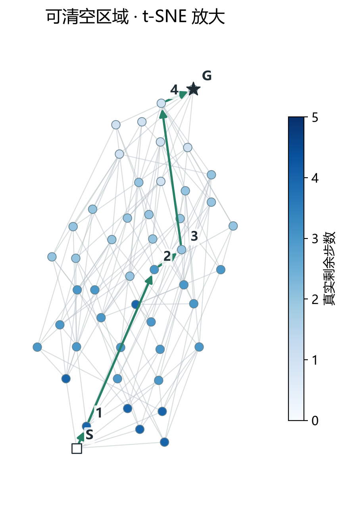
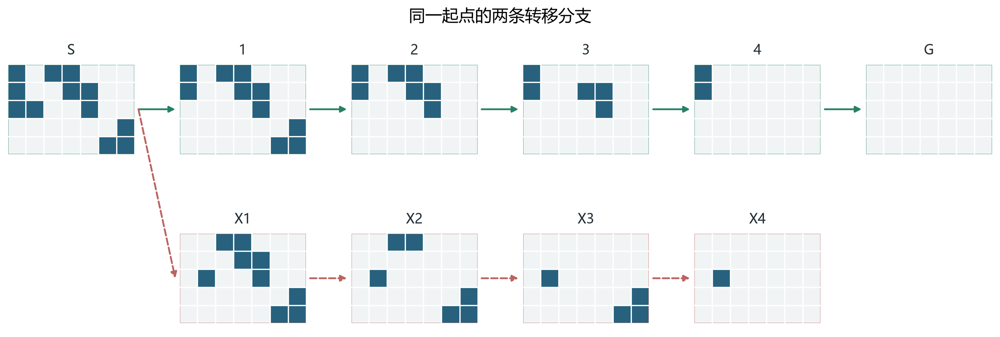

# 把积木 Q-map 画成可读的转移图

**可以从目前训好的 Q 画出“状态在哪里、一步能走到哪里、模型实际怎么走”。**下面使用棋盘 A 的地标监督编码器，固定参数，只提取坐标和画图，没有重新训练 Q 或 V。

选用[实验报告](report.md)中那个还剩 12 格的案例，从它出发，枚举全部后续状态：共 **336 个不同状态、1,064 条合法转移**，其中 **48 个状态可清空、288 个无法清空**。这是该案例的完整后续图，不是整张初始棋盘的全部状态空间。相同状态会由不同移除顺序到达，所以图中有分叉也有汇合，严格说是有向无环图，而非树。

## 先看整体：Q 把这些状态放在了哪里

*图 1：每个点是一种残余棋盘；蓝点可清空，红叉不可清空。灰线连接真实的一步合法转移，为减少遮挡省略箭头，方向始终是占用格较多的状态到较少的状态。S 是本案例起点，G 是空棋盘；绿色箭头是当前模型实际选择的完整路径。红色虚线先强制选择一个坏动作，再由同一模型继续贪心，X1 是该坏动作后的第一个状态。两个面板包含完全相同的点和边。*

左图直接对 **128 维 Q 坐标做 PCA**；右图对**从 Q 计算出的对称化距离做 t-SNE**。两者都只用模型的 Q 来决定点的位置；可解性、真实步数和转移边均在降维之后添加，没有拿这些答案指导布局。

在这个案例中，两种图都呈现出可清空状态与死局状态的分离。它让我们看见了模型表示中的结构，但仅凭这张图还不能证明地图普遍有效：这是一个已经研究过的单棋盘案例，107 个节点属于原训练状态池，另外 229 个不在该池中。

## 放大可清空区域：实际路径走向哪里

*图 2：从图 1 的 t-SNE 中取出全部 48 个可清空状态及它们之间的 136 条转移，只放大显示，没有重新降维。颜色表示真实最短剩余步数，越浅表示离清空越近。绿色箭头是 S → 1 → 2 → 3 → 4 → G，与下图棋盘编号一一对应。*

这条路径确实是模型逐步贪心得到的，动作序列与原完整清空评测记录一致。每一步先由规则提供合法后继，模型比较它们到空棋盘的 Q 距离，选最小者。这里用 **5 步**清空，恰好也是该起点的最短解。

## 对回真实棋盘：为什么另一条分支会失败

*图 3：上排是模型实际选出的 5 步清空路径；下排第一步强制移除三格竖条，之后仍用当前模型贪心。蓝格为占用格，其余为空；所有棋盘都使用同一裁剪范围。X1 已留下孤立单格，后续再移除其他积木，最终到 X4 时只剩该格，无法继续。棋盘按步骤排列以便阅读；图 3 的位置是示意排版，不是 Q 的投影。*

**当前地标模型没有选中红色分支。**红线用于展示同一起点的另一种合法后果，不能误读成模型实际失败。它的第一步与先前报告中稀疏模型选错的动作相同；这里后续步骤使用的是地标模型。

| 图中状态 | 剩余格数 | 真实最短剩余步数 | 模型预测到空棋盘的距离 |
| --- | ---: | ---: | ---: |
| S | 12 | 5 | 4.81 |
| 1 | 10 | 4 | 4.63 |
| 2 | 7 | 3 | 4.10 |
| 3 | 5 | 2 | 3.18 |
| 4 | 2 | 1 | 2.32 |
| G | 0 | 0 | 0.00 |
| X1 | 9 | 不可达 | 10.83 |
| X4 | 1 | 不可达 | 8.03 |

实际路径上的预测距离逐步减小，但并不等于真实步数，也不是每走一步就减少 1。X1 和 X4 都是死局，预测分数也不相同。这些细节比“图上分成两团”更直接地说明模型学到了什么、还存在哪些误差。

## 图上远近，不能直接当作还需几步

我们的 Q 距离有方向：`D(甲, 乙)` 可以小，`D(乙, 甲)` 可以大。纸面上两点之间的直线距离却是对称的，二维投影不可能完整保留这种区别。

本次 t-SNE 输入取两个方向预测距离的平均：

`对称化距离(甲, 乙) = [D(Q甲, Q乙) + D(Q乙, Q甲)] / 2`

对于当前使用的有向求和公式，这等价于 Q 的 L1 距离除以 `2√128`。这仍来自学得的 Q，没有换成求解器的真实距离，但平均操作会丢失方向信息。

例如下面两个动作都只需一步，反向却都无法通过“只移除”的规则实现：

| 一步转移 | 预测正向距离 | 预测反向距离 | t-SNE 使用的平均距离 |
| --- | ---: | ---: | ---: |
| S → 1：当前模型的选择 | 1.29 | 3.24 | 2.27 |
| S → X1：坏动作分支 | 1.70 | 10.65 | 6.18 |

因此，图中 S 到 X1 的长线**不能解释为“这个动作需要很多步”**；两者确实相邻，长线同时受到反向距离和投影失真的影响。模型正向估计也有误差，但要看原 128 维读出的数值来判断，不能拿图上长度代替。

PCA 的前两维保留了 **78.8% 的坐标方差**，这不是“78.8% 的规划关系正确”。若按对称化 Q 距离找到每个点原本最近的 10 个邻居，再看二维图中还保留几个，PCA 平均保留 **3.77 个**，t-SNE 平均保留 **6.18 个**。这项检查也说明二维图确实损失了信息。

t-SNE 侧重局部结构，并不显式保留全局结构；不同初始化也可能给出不同布局。本图固定参数和随机种子，未挑选多个结果中最好看的一张。方法说明见 [scikit-learn 的 t-SNE 文档](https://scikit-learn.org/stable/modules/manifold.html#t-distributed-stochastic-neighbor-embedding-t-sne)。

## 与汉诺塔参考图的关系

你提供的图注描述的是把中间表示映射到二维的**距离匹配探针**，并比较不同训练阶段。本次先完成了最直接的版本：把现成 Q 降到二维，叠加真实转移和棋盘案例，没有另训探针，也没有把不同模型冒充为同一次训练的不同阶段。

两者相似的地方是“点对应状态、线对应一步转移、局部配上真实局面”。本次展示的是一个冻结模型的案例结构，尚未用随机初始化模型或原始棋盘编码作投影对照，也没有据此声称训练产生了某种独有几何。认知地图是否有用，仍以原始距离与完整清空评测为准。

数据与复现：模型 `encoder_c40e5ba`，训练源码 `c40e5ba395e3898c84cfbcf3dbdfb6a321de1103`。完整小图、二维坐标、路径和投影参数在[图数据](qmap_geometry.json)；[绘图脚本](plot_geometry.py)可以重生成三张 PNG 和可编辑 SVG。原始 Q 向量留在忽略运行目录，未写入报告数据文件。执行方法见[实验说明](../README.md#q-坐标与转移图可视化)。
