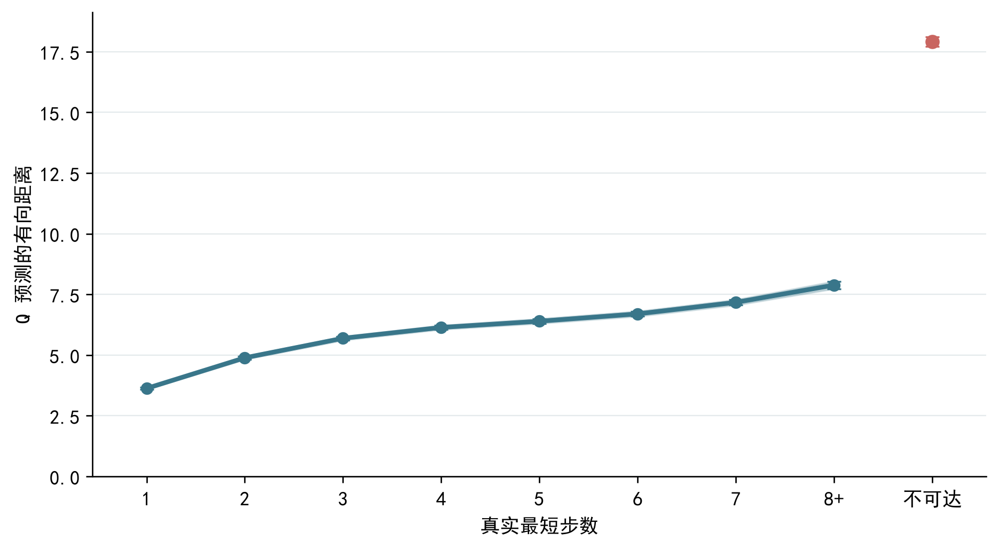
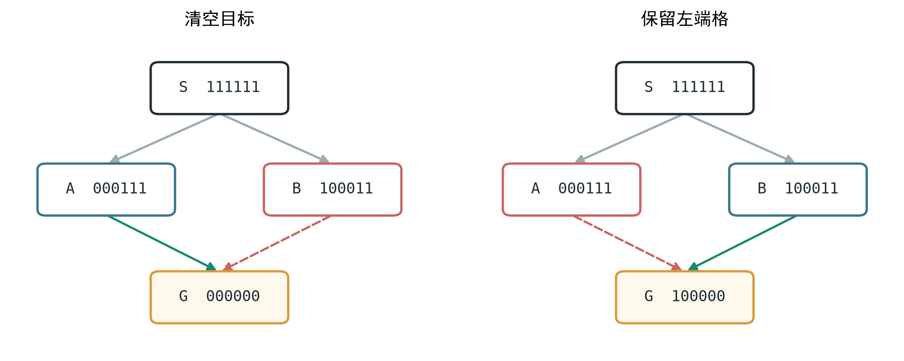
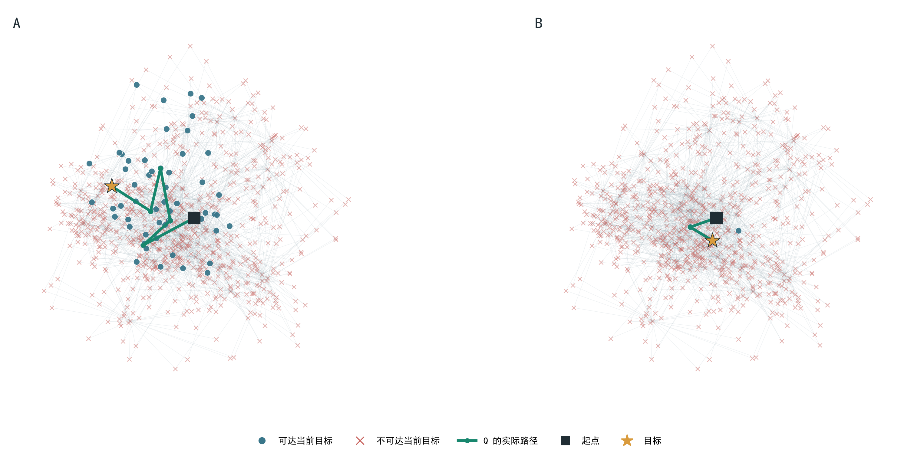
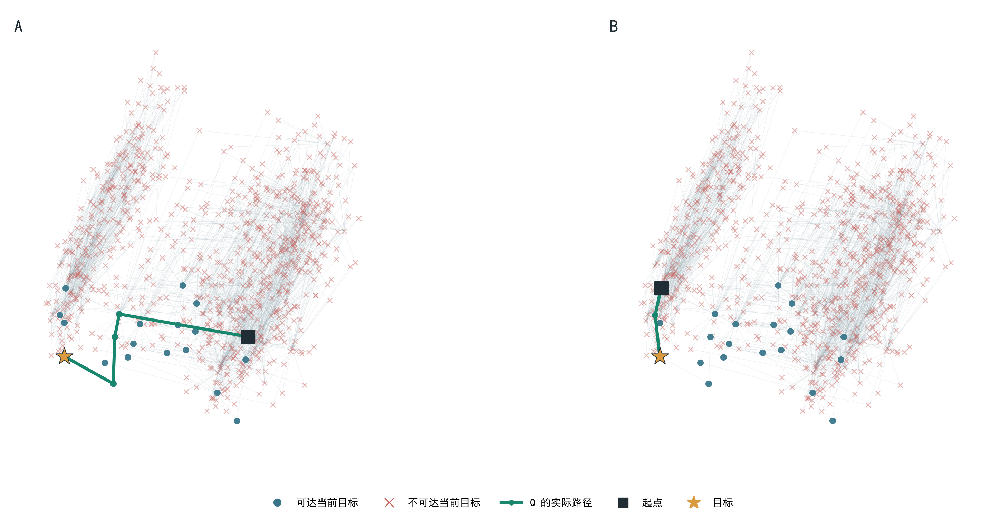

# 积木 Q-map：树关系补全后的跨棋盘结果

## 总结果

**整体结论：**在 **1,000 张训练棋盘**的求解树上采样起点、目标和分支，用精确最短步数与可达性监督同一个 Q。选定续训 **15,000 步**权重后，在未参与训练和选权重的 **200 张新棋盘**上，Q 对合法后继贪心排序，完成 **3,928/4,355 道任务（90.2%）**；清空目标最强，含孤立格的非空目标仍最难。

| 指标          |       正确／总数 |         比例 |
| ----------- | ----------: | --------: |
| 总到达         | 3,928/4,355 | **90.2%** |
| **第一步后仍可达** | 4,167/4,355 | **95.7%** |
| 第一步在最短路上    | 3,812/4,355 | **87.5%** |

首步仍可达为 95.7%，但连续走到目标为 90.2%；首步走在最短路上的比例更低，说明“保留解”和“走最短路”是不同要求。

### 按真实最短步数分组

| 指标        |       正确／总数 |        到达率 |
| --------- | ----------: | ---------: |
| 1 步       |     600/600 | **100.0%** |
| **2–4 步** | 1,656/1,800 |  **92.0%** |
| **5–6 步** | 1,024/1,200 |  **85.3%** |
| **7–8 步** |     648/755 |  **85.8%** |

一步题全部到达；2–4 步为 92.0%，5–8 步约为 85%。长程仍有明显错误；后两组题的目标构成不同，不能把 85.8% 略高于 85.3% 解读成长程更容易。

### 换目标

| 目标类型 | 完整到达／总数 | ACC |
| --- | ---: | ---: |
| 清空目标 | 1,515/1,530 | **99.0%** |
| 普通非空目标 | 1,213/1,354 | **89.6%** |
| 含孤立格的非空目标 | 1,200/1,471 | **81.6%** |

清空目标到达 99.0%，但普通非空目标为 89.6%，含孤立格的目标只有 81.6%。保留指定结构仍是这轮 Q 的主要短板。

## 模型学到的距离关系

*图 1：同一 15,000 步权重；点是封存新棋盘上各真实距离组的平均预测距离，误差条为按棋盘重采样的 95% 区间。*

### 错误统计

在固定 1,000 道非空目标任务里，140 道失败中

- 有 **76** 道在某一步移除了目标必须保留的格子，
- **61** 道因局部余量不能再正确覆盖目标，
- 另有 **3** 道在判卷时成为全局不可达。
- 首个错误发生在第 1 步的有 **82** 道。

### 监督机制

*图 2：同一父状态的两个合法后继 A、B，换目标后可达性互换；这是机制示意，不是测试样本。*

把每张棋盘看成一棵“不断合法移除”的求解树：节点是剩余棋盘，边是一次移除。我们从 **1,000 张训练棋盘**采路径，再展开沿途的兄弟分支；目标既有空棋盘，也有普通及含孤立格的非空棋盘。

| 取什么数据 | 可达／较近 | 不可达／较远 |
| --- | --- | --- |
| 路径与多个目标 | 路径上的祖先到后代；按最短步数标注 | 目标格已被移除，或目标格仍在但余块无法按规则移完 |
| 同父分叉、互换目标 | A 分支到 A 的后代目标，B 分支到 B 的后代目标 | A、B 互换目标后，经求解器证实走不到的关系 |
| 补全清空和长程 | 枚举同一父状态的合法后继，找出通向空盘或远处非空目标的最短选择 | 无法到达目标的后继，以及虽可到达但要绕路的后继 |

训练不只看一条标准解：同一父状态的多个合法后继都会进入比较。某个后继是否有用，取决于它能否到达**当前目标**。

图 2 中 `S→A` 和 `S→B` 都是合法的一步转移；下面比较 A、B 到不同目标的关系：

| 目标 | A 到目标 | B 到目标 | Q 应排出的顺序 |
| --- | ---: | ---: | --- |
| 清空 | 1 步 | 不可达 | A 比 B 近 |
| 保留左端格 | 不可达 | 1 步 | B 比 A 近 |

换目标后，A、B 的好坏正好反过来。因此训练的是“当前棋盘到指定目标”的关系，不给某个节点贴永久的好坏标签。

- **正样本**：从当前棋盘确实能到指定目标，包括一步到达、沿路径走多步后到达，以及同父分叉中仍通向目标的后继。目标可以是空棋盘，也可以是指定的非空棋盘；每对都标注最少还需几步。
- **负样本**：从当前棋盘已经到不了指定目标。一种是目标要保留的格子已被移除；另一种是目标格还在，但其余格子无法按允许的形状全部移除。

**还能到达但需要绕路**不标为不可达，只在与最短路后继比较时算较差选择。同一个后继换了目标，正负也可能反转（图 2）。

*图 3：封存棋盘上的同一起点与同一批状态；左右只切换目标。圆点／叉号根据当前目标是否真实可达着色，绿色为该目标下 Q 实际选出的路径。二维位置来自同一组 128 维 Q 的投影，换目标后位置不变，着色和路径改变。线段长度不能当作模型的有向距离。*

*图 4：封存棋盘上目标相同、起点不同的两个例子。两边的真实可达状态集合相同，Q 选出的路径随起点变化；这说明图只用于展示状态与轨迹关系，不能把单个成功案例替代分层到达率。*
