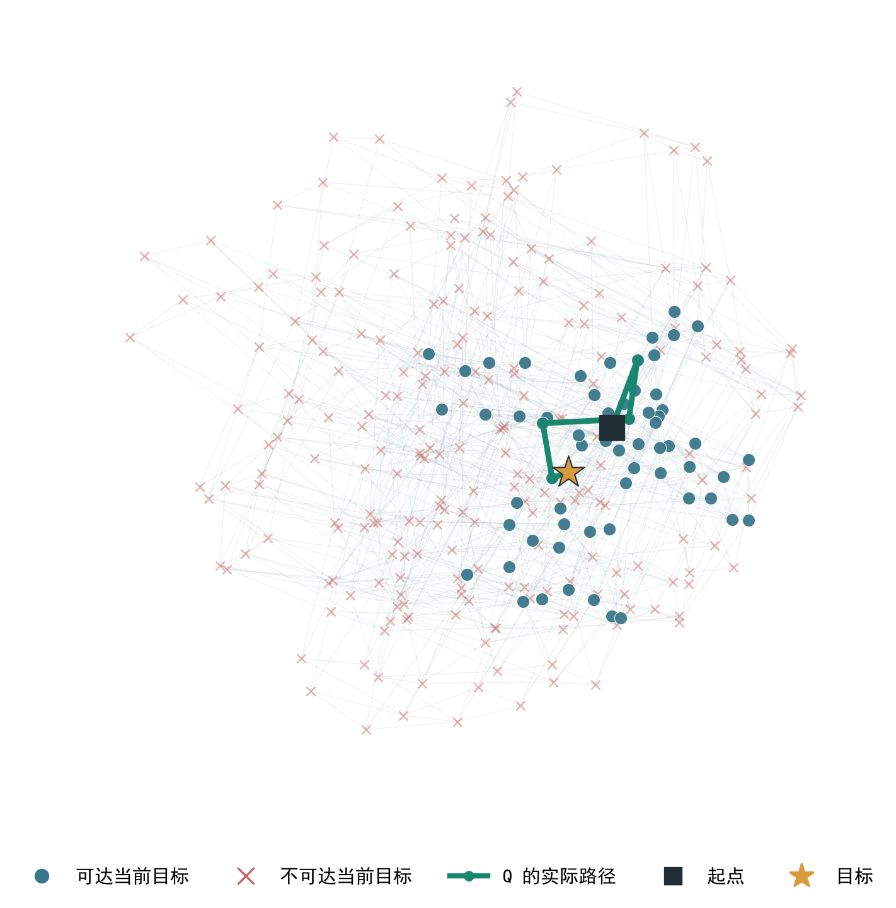

# 积木 Q-map：树关系监督后的最终报告

## 总成绩

**最终树关系 Q-map 在 200 张全新初始棋盘的 1,000 道非空目标任务中，完整到达 852 道，准确率 85.2%；从这 200 张棋盘的初始局面直接清空，到达 120 道，准确率 60.0%。**前一组每张棋盘选五道题，真实最短解为 2～5 步；清空题每张棋盘一道，真实最短解为 7～8 步。模型需要连续选择动作，最终棋盘与指定终点完全一致才算成功。

| 全新棋盘任务 | 题数 | 最终 Q 到达 | 准确率 |
| --- | ---: | ---: | ---: |
| 普通非空终点 | 600 | 510 | **85.0%** |
| 含孤立格的非空终点 | 400 | 342 | **85.5%** |
| **非空目标合计** | **1,000** | **852** | **85.2%** |
| 从初始局面清空 | 200 | 120 | **60.0%** |

清空题中，最短 7 步的题到达 **46/61（75.4%）**；最短 8 步的题到达 **74/139（53.2%）**。

每一步由环境列出全部合法积木动作。Q 分别编码动作后的棋盘和目标棋盘，选距离目标最近的后继；这里使用的就是训练好的 Q。

## 监督是怎么构造的

棋盘只有“移除积木”这一类动作。一个状态可以走向多个后继，后继又会继续分叉；不同的移除顺序也可能在后面汇合。训练时，从 **1,000 张初始棋盘**长出这样的状态图，选不同深度的中间状态作地标。对每一对有方向的状态，精确搜索给出最少需要几步，或判定不可达。

下面是一个真实符合动作规则的小例子：只看棋盘中的一行，1 是还在的格子，0 是空格，其余行为空。S 左侧移除横三格得到 A，中间移除横三格得到 B。

*图 1｜绿色实线表示后继可以到目标，红色虚线表示不可达。清空时应走 A；保留左端格时应走 B。*

这正是本次数据补齐的关系：**同一个父状态的合法后继，要分别与多个终点配对标注。**例如 A → 000000 为 1 步，B → 000000 不可达；换成终点 100000，则 B 为 1 步、A 不可达。不可达关系始终给最远惩罚；某个状态自身不会被固定贴上“坏”的标签。两条分支若还能汇合，也按实际可达关系标注。

| 最终训练数据 | 数量 |
| --- | ---: |
| 有向状态对，去重后 | 2,176,464 |
| 可达，附最短步数 | 959,547 |
| 不可达 | 1,216,917 |
| 目标格仍在、但整体拆分不可达 | 219,028 |
| 换终点对照案例 | 35,000 |

棋盘由共享编码器映射成 **128 维 Q**。训练让状态间的有向距离贴近真实步数，同时让同一目标下的候选按远近排对。采样参数见[正式配置](../configs/multiboard_1000_tree_supervision.json)。本次从随机初始化训练，选用第 65,000 步的最佳 checkpoint；中间 checkpoint 均已保存。

## 各项评测测了什么

主评测的 1,000 道题来自原有训练与开发棋盘之外的 **200 张新棋盘**。其他固定题池检查换目标、未见终点和困难分叉。下表全部为**最终树关系 Q**的结果。

| 评测 | 具体要求 | 最终 Q |
| --- | --- | ---: |
| 全新棋盘完整到达 | 200 张新棋盘，每张 5 题，连续走到非空终点 | **852 / 1,000 · 85.2%** |
| 普通非空终点 | 主评测中的普通目标 | **510 / 600 · 85.0%** |
| 含孤立格终点 | 主评测中要求保留孤立格 | **342 / 400 · 85.5%** |
| 清空任务 | 同一批 200 张新棋盘，从完整初始局面走到空棋盘 | **120 / 200 · 60.0%** |
| 换终点后动作反转 | 同一起点、同一组候选动作，换目标后两次都选对 | **396 / 400 · 99.0%** |
| 留出非空终点的短程行动 | 连续行动到指定中间终点 | **771 / 800 · 96.4%** |
| 未见含孤立格终点 | 固定的完整到达题池 | **160 / 200 · 80.0%** |
| 困难分叉：未见棋盘 | 固定的困难多步题池 | **723 / 1,000 · 72.3%** |
| 困难分叉：未见终点 | 固定的困难多步题池 | **789 / 1,000 · 78.9%** |

### 距离关系

这组评测直接检查两个状态间的距离：可达时，Q 的预测与真实最短步数相差多少；不可达时，Q 能否把它排在可达关系的更远处。下表的平均误差越低越好；“不可达排序”越高越好。

| 状态关系题池 | 可达距离平均误差 | 不可达排序 AUC | 候选排序准确率 |
| --- | ---: | ---: | ---: |
| 训练棋盘内未见状态 | 2.25 步 | 95.8% | 85.3% |
| 未见非空终点 | 2.01 步 | 97.2% | 89.7% |
| 未见含孤立格终点 | 1.98 步 | 96.2% | 89.8% |
| 原有独立棋盘 | 2.41 步 | 92.9% | 89.3% |

不可达排序 AUC 可以这样读：随机抽一条可达关系和一条不可达关系，Q 把不可达关系判得更远的比例。下面只画**最终 Q**在原有独立棋盘上的有向距离。真实需要的步数从 1 增到 8 以上时，Q 的平均预测距离逐渐增大；不可达关系的平均预测距离为 **13.87**。

*图 2｜横轴是精确搜索得到的真实距离，末列是不可达状态对。折线为预测距离均值，阴影和误差线为按状态对重抽样得到的 95% 置信区间；红点单列不可达关系。数据来自原有独立棋盘的 64,918 个状态对。*

主评测还有 **148 道失败题**。第一次导致目标无法再到达的选择如下：

| 首次不可逆错误 | 题数 |
| --- | ---: |
| 删掉目标必须保留的格子 | 96 |
| 留下无法用合法形状局部覆盖的格子 | 47 |
| 局部可覆盖，但整体仍无法拆到目标 | 5 |

清空任务失败 80 道：72 道首次错误留下了局部无法拆分的结构，8 道留下了局部可拆、但整体不可清空的结构。

## Q 的状态投影：看不同的起点和终点

以下各图都来自**最终 checkpoint**。点的位置是 Q 的 128 维输出投到二维后的坐标；淡线是真实合法动作。**蓝点能到当前图的终点，红叉到不了**，这项颜色由精确搜索逐点计算。绿线是 Q 实际选出的动作路径。

### 一张新棋盘：展开完整的后继图

这道含孤立格目标题从起点可展开 **288 个状态、960 条动作边**；其中 48 个状态还能到目标。Q 实际走了五步到达。

*图 3｜黑方块是起点，黄星是指定终点；这张图纳入了该起点的全部后继状态。*

### 同一起点，换两个终点

下图两侧从**完全相同的起点**出发，点的位置也完全相同。A 的终点含孤立格，B 的终点是普通非空状态。换终点后，在图中的 1,100 个状态里有 **127 个点改变了可达颜色**；Q 对 A 走两步到达，对 B 走六步到达。

*图 4｜A、B 共用同一套二维坐标。展示起点附近两层后继与两条实际路径；颜色分别针对各自终点计算。*

### 同一终点，换两个起点

下图目标相同，因此**蓝点和红叉保持一致**；起点改变后，Q 选择了不同的到达路径。A 走五步，B 走两步。两侧展示同一批 **766 个状态、1,621 条动作边**。

*图 5｜A、B 共用坐标和目标；展示两个起点附近两层后继与各自的实际路径。*

这三组图对应训练中的三种关系：沿合法动作靠近某个终点、同一起点换终点后改变可达判断、同一终点下从不同位置出发。整体成绩见开头的完整到达准确率。

## 实验记录

训练源码提交 132f5a1，配对评测源码提交 322eab4。[清空评测脚本](../src/tree_clear_eval.py)与[绘图脚本](plot_tree_report.py)均读取同一冻结权重；[图表数据](tree_qmap_figure_data.json)记录各投影的状态数、边数和到达步数。权重、逐题评测文件 fresh_ood_comparison_boardpaired.json、清空结果 clear_goal_fresh200.json 及中间 checkpoint 位于忽略目录 runs/blocks_distance_map/tree_1000_132f5a1/。
