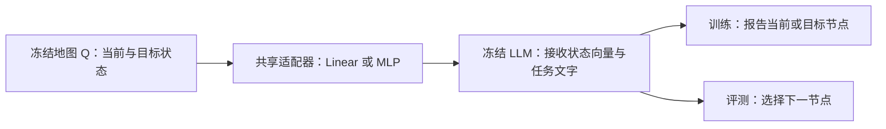

# Step 2 方案：让冻结 LLM 读懂认知地图，并测试一步动作选择

本方案面向当前固定图实验：**复用 Step 1 学好的地图，冻结地图和 LLM，只用状态报告训练一个共享适配器；训练结束后，检验节点读取与一步动作选择，并用几何变化解释结果。** 正式对照为 Linear 与两层 MLP。

本文由此前讨论收束而成，沿用文件名作为唯一方案入口。主线采用已确认的研究选择；第六节补齐首轮试点的推荐实现默认值。本文是设计，不表示训练已经启动。项目进度统一见[状态页](../../docs/PROJECT_STATUS_AND_TODO.md)。

## 一、这一步要回答什么

Step 1 已得到能够拟合一步转移、区分节点并形成远近关系的 Q/V。Step 2 将这张独立地图接到冻结 LLM 上，依次回答两个问题：

1. **接口是否可读？** 给出当前和目标状态向量，LLM 能否按提问正确报告对应节点？这是适配训练的直接目标。
2. **读取能否支持判断？** 只训练状态报告之后，LLM 能否根据当前和目标状态，选择一个合法且更接近目标的下一节点？这是独立的下游评测。

地图保持独立，接口可以替换。适配输出的距离、角度可以改变；几何分析用于理解这种变化，不进入训练损失，也不作为接口是否有效的门槛。

## 二、系统如何连接



地图中的节点 `i` 对应向量 `q_i = Q o_i`，其中 `o_i` 是节点身份编码。适配器将向量转换成 LLM 输入层可接收的连续 token，再与“当前状态”“目标状态”和任务说明的文字嵌入拼接。状态坐标不打印成数字文本，也无需占用一个新词表词项。

| 模块 | 本轮职责 | 是否训练 |
| --- | --- | --- |
| Q/V 认知地图 | 提供 Step 1 学到的节点表示和动作位移；本轮单步输入读取 Q，V 随地图保留 | 冻结 |
| 共享适配器 | 将任意节点的地图向量转换成 LLM 输入向量 | 训练 |
| LLM | 根据状态输入和提问生成节点编号 | 冻结 |
| 环境裁判 | 在动作生成后检查节点、连边和到目标的距离 | 无学习参数 |

设地图维度为 `D`，LLM 嵌入维度为 `H`。首轮每个状态使用一个连续 token：Linear 为 `D → H` 的仿射映射，两层 MLP 为 `D → 1024 → H`，中间使用 GELU。

**每次实验只有一套适配器，所有节点以及当前、目标两个角色都共享它。** Linear 和 MLP 是两次对照实验，使用同一份冻结 Q/V、同一个 LLM 和同一批数据。两者分别训练；它们不串联，也不按当前／目标分工。

角色由输入中的固定文字标签区分。同一节点无论放在哪个槽位，适配器自身的输出相同。两种接口使用相同状态 token 数和训练预算，并记录实际参数量、耗时和显存，比较两种结构的实际效果。

## 三、训练数据与监督

从固定图中选取当前节点 `u` 和目标节点 `g`，为每个节点对生成两条训练样本：

```text
当前状态：[Adapter(q_u)]
目标状态：[Adapter(q_g)]
请报告当前所在节点，只输出节点编号。
答案：u

当前状态：[Adapter(q_u)]
目标状态：[Adapter(q_g)]
请报告目标节点，只输出节点编号。
答案：g
```

方括号表示连续输入向量，`u/g` 在答案中替换为真实编号，例如 17 和 8。标签直接来自采样时的节点索引，无需人工标注。输入文字不包含这两个具体编号。样例展示任务正文，实际使用模型官方的非 thinking 对话模板封装。

**唯一训练损失是答案 token 的交叉熵：**

\[
L_{\mathrm{report}}
= -\frac{1}{|y|}\sum_j \log p_\theta(y_j\mid \text{状态输入、问题},y_{<j}).
\]

`y` 是正确节点编号及回答结束标记，`θ` 是适配器参数。损失衡量模型给正确答案的概率，不计算“预测编号与真实编号相差多少”。当前和目标两类报告等量；先对每个答案按长度取平均，再对样本取平均。

任务文字、状态槽位和答案前的模板控制 token 的训练标签设为忽略，只监督节点答案及其结束标记。损失经过冻结 LLM 回传到适配器；LLM 的参数不更新，但前向计算仍保留通向适配器的梯度。推理时使用训练后的适配器和冻结 LLM 直接生成答案。

训练样本只含身份报告，不加入邻接、距离、动作后果、正确下一步或路径标签。几何保持、文本对比和表示重建也不作为辅助损失。

**数据划分以节点对为单位。** 首轮使用固定原始 32 节点图的全部不同节点对，将 496 个无序节点对固定打乱，划分为训练 396 组、验证 50 组、测试 50 组；每组的两个方向放在同一集合，再各生成当前／目标两类提问。因此报告样本分别为 1,584／200／200 条，动作测试为 100 个有序起终点对。

所有节点都需在训练中出现，验证／测试保留新的节点组合。这衡量同一张已知地图上的组合使用，不要求识别从未训练过的节点。Q/V 在 Step 1 学习过全图，是本实验提供的固定地图知识。

每轮训练结束，用验证集当前／目标两类样本合并后的自由生成报告准确率选择模型；准确率相同时取答案交叉熵更低者，再相同则取较早轮次。动作测试与几何指标不参与模型选择。

## 四、训练结束后如何评测

### 1. 状态报告：检验接口可读性

在测试节点对上分别问当前节点和目标节点，统计两类报告准确率、同一节点对的两次报告均正确的比例，以及输出格式错误率。训练前后的报告结果一起保留，观察适配带来的变化。

### 2. 一步动作选择：检验读取后的迁移

对同一批测试起终点，直接输入：

```text
当前状态：[Adapter(q_u)]
目标状态：[Adapter(q_g)]
一次移动只能沿图中的一条边到达相邻节点。
请选择一个合法且更接近目标的下一节点，只输出节点编号。
```

两个连续状态之外，只提供通用任务说明和节点编号范围。LLM 不先被要求生成状态报告，也不获得合法邻居列表、候选节点表示、动作向量或全图邻接表。它直接输出下一节点，程序随后判分。

设输出为 `v`，一步成功的条件是：

\[
(u,v)\in E\quad\text{且}\quad d(v,g)<d(u,g).
\]

`E` 是真实连边集合，`d` 是图上的最短距离，由裁判计算。在当前无权图中，这表示走出了某条最短路径的第一步。满足条件的下一节点全部接受，不指定唯一答案。

分别报告：**编号有效率、动作合法率、合法且接近目标的成功率**，分母均为全部测试样本；另按起点到目标的距离展示成功率。非法编号、非法移动和合法但未接近目标分别记录，输出不被自动纠正。主测试排除当前等于目标的情况，停止判断留到多步任务。

训练与评测均关闭 thinking；评测使用贪心生成，每题一次，直接输出编号。保留原始输出，去除首尾空白后只接受一个范围内的整数，不从解释性句子中抽取答案。

### 3. 几何分析：解释接口如何改变表示

在原图全部不同节点对上，分别比较图最短距离与以下表示的欧氏距离，计算 Spearman 秩相关：原始 Q、训练前适配器输出、训练后适配器输出。这里直接取适配器产生的状态向量，不混入角色文字或 LLM 内部 hidden state。

这些结果与报告、动作表现并列解释。几何相关下降而报告准确，仍说明接口完成了读取任务；动作选择是否改善由动作结果回答。本轮不根据几何结果追加训练。

最终使用同一张结果表展示两种接口：

| 条件 | 当前报告准确率 | 目标报告准确率 | 双报告均正确率 | 动作合法率 | 一步成功率 | 适配输出距离相关 | 参数量／训练成本 |
| --- | --- | --- | --- | --- | --- | --- | --- |
| Linear | 待运行 | 待运行 | 待运行 | 待运行 | 待运行 | 待运行 | 待测量 |
| 两层 MLP | 待运行 | 待运行 | 待运行 | 待运行 | 待运行 | 待运行 | 待测量 |

格式错误和训练曲线随表附上。首轮比较接口结构的可读性与使用效果；要进一步判断学到的地图结构是否优于单纯身份编码，可在下一轮加入随机编码或文字状态对照。

### 补充讨论：直接评测 LLM 对远近关系的理解

用户提出一步动作选择同时包含多项要求，希望增加更直接的远近评测。建议将**相对远近比较**作为主要的距离理解评测，一步动作继续观察较完整的使用能力。下面是候选设计，训练仍只做状态报告，不因评测变化自动增加监督或启动运行。

**首选：给定目标，比较两个状态谁更近。** 三个状态均经过原有共享适配器，只要求模型输出 A 或 B：

```text
目标 G：[Adapter(q_g)]
位置 A：[Adapter(q_a)]
位置 B：[Adapter(q_b)]
从 A 和 B 分别沿图中的边到达 G，哪个位置需要的最少步数更少？
只输出 A 或 B。
```

A、B 是本题的槽位名称，不是节点编号。两者是任意两个待比较位置，不要求是当前节点的合法邻居。标准答案由图最短距离 `d(a,g)` 与 `d(b,g)` 的大小关系生成，实际距离不输入模型。任务只要求作关系判断，无需搜索下一节点或报告具体步数，也不规定适配后的几何形式。

**建议判分与样本构造。** 固定互不相同的 G、A、B，主任务先使用两个距离不同的样本，等距另作补充。每个三元组测试 A/B 两种摆放顺序，正确答案标签因此均衡，二选一随机参考为 50%。报告全部样本的正确率、格式有效率和交换位置后两次均正确的比例；不要只统计格式正确的样本。按距离差为 1 步和至少 2 步分别报告，使细微差异与明显差异都可见，实际例数由图的距离分布决定。

优先从已有测试节点对中选取共享同一目标的两对来构造三元组，并固定样本清单；样本不足时先报告实际覆盖，不根据模型表现补挑容易样本。重复目标和交换顺序的题目属于相关样本，汇报时同时列出独立目标／三元组数量，不把所有问法当作独立重复。距离题仅作训练后的测试，不用于选择 checkpoint。

| 其他候选 | 提问与判分 | 选择理由与定位 |
| --- | --- | --- |
| 给定移动的进展判断 | 输入移动前 A、移动后 B 和目标 G，问更近、相同或更远；标签由两次图距离比较产生 | LLM 不用提出动作。若裁判提供一条真实边，则已替模型解决动作合法性，作为连接远近比较与动作选择的独立评测；三类实际存在的类别分别报告 |
| 有界距离判断 | 只输入当前和目标，问“最少移动步数是否不超过 k”；标签为 `d(u,g) <= k` | 保持原有两个状态槽位，便于接入；阈值须明确，真假样本均衡。它还要求把状态与具体步数尺度对应，未必比相对比较更容易 |
| 多位置远近排序 | 给定目标和三个待比较位置，输出由近到远的顺序；接受正确的并列关系 | 检查一组关系是否一致；先看两两顺序正确比例，再看完整排序，适合二选一之后扩展 |
| 直接估计最短步数 | 输入当前和目标，输出距离；统计绝对误差及预测与真值的秩相关 | 同时要求远近关系与步数尺度，不推荐作为第一项距离理解评测 |

**把 LLM 的判断与地图自身的信息分开看。** 同一批三元组可额外用原 Q 的欧氏距离、适配输出的欧氏距离各做一次直接比较，并检查它们与图距离标签的一致率。图距离是任务真值，原 Q 只是参考，不是 LLM 的成绩上限。这样可以区分“地图自身的距离排序已有偏差”与“接口输入中有可用线索，但模型没有在该问法中用好”。本轮重点仍是 LLM 直接生成的关系答案，而非训练额外探针后预测成功。

三状态输入比报告训练多一个状态槽位。建议用同一三槽模板额外问“请报告位置 A／B／G 的节点编号”，检查新模板下是否能读对状态；它只作为评测，不自动加入训练。A/B 顺序交换用于检查位置偏好，参考已有关于[多选题选项顺序敏感性](https://arxiv.org/abs/2308.11483)的研究。若后续训练额外探针，需另外区分模型自身使用信息与探针学到关系，参见[探针与控制任务](https://arxiv.org/abs/1909.03368)。

建议先增加相对远近比较，按“状态报告 → 远近比较 → 给定移动的进展判断 → 自行选择一步”的层次汇报。进展判断和其他候选是否进入首轮、样本量与等距处理，留待本轮讨论确认。现有几何分析继续作为解释性结果。

## 五、按什么顺序实施

1. **加载固定资产。** 读取 Step 1 的 `local1000/official32` 最终 `map.npz` 及对应 `inputs.npz`，复用节点编号、邻接表和动作目录；加载冻结 LLM，生成固定的数据划分。地图权重与环境判分数据分别交给接口和裁判。
2. **打通一个小批次。** 完成连续向量插入、答案标签遮罩和生成解析；用少量报告样本检查损失是否能下降、适配器是否收到梯度、Q/V 与 LLM 是否保持冻结。同步测量反向传播显存和单步时间，据此设置微批次。
3. **完成两组报告训练。** Linear 和 MLP 使用同一数据、采样顺序、有效批次与轮数上限。按报告验证集规则各选一个 checkpoint。
4. **统一评测并汇报。** 在固定测试集上完成报告和一步动作评测，再导出几何分析；保留两组结果，给出哪个接口更易读、是否出现动作迁移以及下一步应处理的问题。

试点使用已指定的开发机，先按单卡加载与反传设计，在一张小图上完成整个流程。随后沿同一协议推进已有的更大地图，逐图训练共享适配器，观察规模变化；不要求一套适配器直接跨不同 Q 坐标系使用。

源码、正式配置和针对性的正确性检查仍放在当前实验目录。正式运行前，将下面的默认值、准确模型 revision、数据划分和预算写入已提交配置。运行目录保存适配器权重、训练曲线、样本原始输出、逐题判分及几何摘要；配置和报告记录实际版本、时间与显存。checkpoint 和原始产物放在 Git 之外。

## 六、首轮试点的推荐默认值

以下是为使方案可实施而补齐的工程起点，不代表这些参数已被实验验证为最优。研究主线已固定；实施时只需补齐准确的模型／产物路径与版本，并根据实测显存确定微批次。

| 项目 | 推荐默认值 | 选择理由 |
| --- | --- | --- |
| 地图 | Step 1 局部更新 1000 维、原始 32 节点图、最终 20 轮产物 | 直接衔接已有结果，先用小图验证完整接口流程；1000 维是起点而非容量结论 |
| LLM | `Qwen/Qwen3-8B`，非 thinking，BF16，不量化，原参数全部冻结 | 沿用讨论中的模型起点，使用原生连续输入接口 |
| 每状态输入 | 1 个连续 token；`H` 从模型配置读取 | 先检验最简单接口，两个角色合计两个状态 token |
| 适配器 | Linear：`1000 → H`；MLP：`1000 → 1024 → H`，GELU；线性层均有偏置 | 一套最简单基线与一套适度增加容量的非线性接口 |
| 尺度与初始化 | 输入统一除以冻结 Q 的全元素 RMS，使用一个固定标量；不加输出归一化；线性层使用 PyTorch 默认初始化 | 避免逐节点缩放改变相对关系，保持 Linear 整体为仿射映射 |
| 标签和提示 | 原始整数节点 ID；固定当前／目标两个报告模板；不新增可训练角色嵌入 | 用最少的额外接口参数完成角色区分和读取 |
| 随机性 | 数据划分、适配器初始化与训练洗牌分别使用固定 seed 17，记录各自状态 | 固定比较数据和重放条件；首轮为单初始化试点 |
| 优化 | AdamW，学习率 `1e-3`，betas `(0.9, 0.999)`，eps `1e-8`，weight decay 0；恒定学习率，梯度范数裁剪 1 | 使用单一优化起点，不开展超参数网格 |
| 预算 | 有效 batch 32，上限 10 轮，每轮末验证；不足一批仍训练 | 两种接口获得相同样本量；微批次由反传显存实测确定，以梯度累积保持有效 batch |
| 生成 | 贪心，每题一次，最多 16 个新 token，遇模型回答结束标记停止 | 节点编号任务无需长输出；超长或格式错误按原样记录 |

若小批次检查暴露明确问题，先修正对应实现或优化设置并留下记录；两种接口沿用修正后的共同协议。改变状态 token 数、地图维度或训练监督，则作为后续独立条件讨论，不在本轮中逐项扩大搜索。

## 七、如何衔接后续的状态维护与规划

本轮每题输入固定当前／目标状态，生成一次答案后结束。LLM 通过注意力读取状态 token；它不在这次生成过程中自动调用 V 或更新地图。

后续多步可沿用同一地图和适配器，采用“程序保存显式状态，LLM 读取并选择动作”的分工。真实执行后可以从实际后继观测重新编码当前状态；在执行前试想后果，则另存假想状态，按 `q_hat_next = q_hat + v_action` 更新，再经适配器送回 LLM。真实状态和假想状态分别维护。

要使用后一种方式，需明确动作输出、暂停生成、地图更新和继续生成的边界。当前动作编码按有向边定义，输出下一节点后还要结合当前位置取得对应动作 V；内部试探如果返回连边合法性，也会提供额外反馈，应作为后续规划条件记录。这些是 Step 2 接口完成后的衔接设计，不增加本轮的训练任务或动作输入。

## 参考依据

[PaLM-E](https://arxiv.org/abs/2303.03378) 提供将连续状态编码接入语言模型的参考；[BLIP-2](https://arxiv.org/abs/2301.12597) 提供冻结两端、学习中间接口的参考。两者支持接口设计思路，不替本实验回答图上的动作迁移问题。

[Qwen3 官方接口文档](https://huggingface.co/docs/transformers/model_doc/qwen3) 已核对 `inputs_embeds`、答案标签遮罩及生成缓存入口。具体模型与运行库版本在实现时固定。
