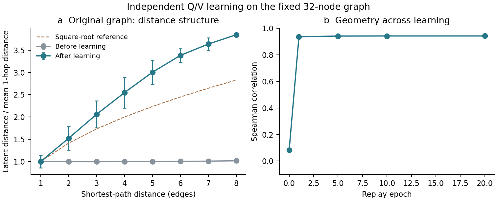
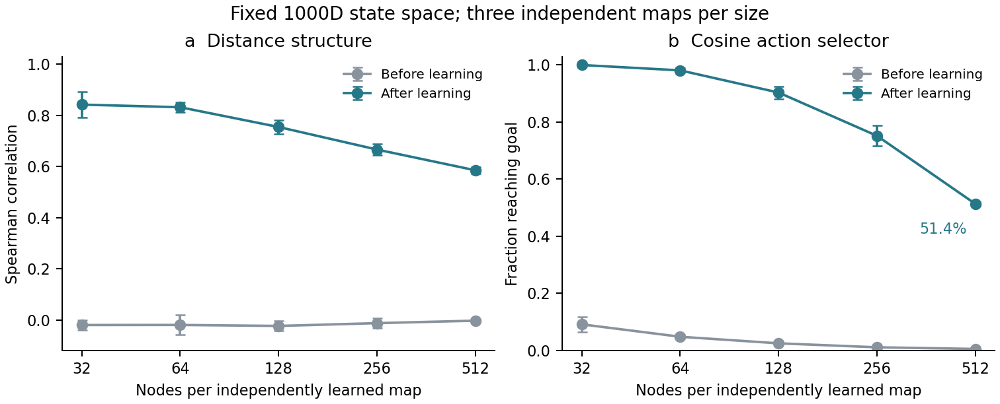

# Step 1 结果：Q/V 在 32–512 节点图上学出了全局远近关系

**Step 1 的核心目标已完成：仅通过局部转移学习，Q/V 在全部测试规模上形成了与图最短距离相关的表示。** 原始 32 节点图的距离秩相关从 **0.082 提高到 0.941**；规模扩展到 512 节点后，三张独立图的平均相关仍为 **0.585**，学习前则接近零。本轮共完成 16 张独立地图，为下一步将地图接入冻结 LLM 提供了已训练的表示、规模基线和可复用评测。

正式运行源码为 `b31cced`，参数见 [step1.json](../configs/step1.json)，全部逐图结果见 [summary.json](summary.json)，比较数值见 [source_data.csv](source_data.csv)。结果使用预先固定的图与最终训练轮次。全部训练在用户指定开发机的 CPU 上完成，合计约 **105 秒**。

## 核心结果：局部学习形成整体距离结构

原始 32 节点图上，图最短距离与原始高维欧氏距离的 Spearman 秩相关由 **0.0818 提高到 0.9408**。也就是说，学习后图上越远的节点，在表示空间中通常也越远。训练仅使用一步转移，整体距离结构由学习过程形成。

左图按图距离分组，展示表示距离均值 ± 1 个组内标准差；分别除以学习前后各自的一步邻居平均距离，以比较关系形状。右图展示固定训练轮次的距离秩相关。绝对距离见 [distance_buckets.csv](distance_buckets.csv)。误差条描述节点对的组内分布；距离 8 的分组仅有一个节点对。

学习后的平均表示距离随图距离持续增长。平方根虚线提供形状参考，另行拟合比例常数后的全节点对 R² 为 0.826；本轮的主要结论是远近结构的形成，平方根关系作为描述性观察。

## 规模扩展：五种规模均学到远近关系

每种规模训练三张独立随机图，每张图从头学习自己的 Q/V。下表为图间均值 ± 样本标准差。

| 节点数 | 学习后的距离秩相关 |
| --- | ---: |
| 32 | 0.842 ± 0.050 |
| 64 | 0.831 ± 0.020 |
| 128 | 0.754 ± 0.027 |
| 256 | 0.666 ± 0.021 |
| 512 | 0.585 ± 0.014 |

**所有规模、所有重复均获得了相对随机初始化的距离相关提升。** 随规模增大，相关程度逐步降低，但 512 节点图仍保留清晰的正相关。这给出了当前学习规则在固定表示维度下的规模基线。

全部图的训练数据覆盖 **100% 节点和有向动作**，每条有向动作至少出现 33 次。最终逐维转移 MSE 为 **1.09×10⁻¹² 至 2.78×10⁻¹⁰**，说明本轮同时获得了准确的局部转移拟合与可测量的整体距离结构。

## 补充参考：简单余弦选择器如何使用地图

余弦选择器按动作向量与目标差向量的夹角选择合法动作，用来观察一种简单读出方式的表现。**其到达率作为补充参考，不作为 Step 1 地图学习是否成功的判据。** 全局远近关系与逐步选择正确路径是不同要求：复杂图上的路径可能需要绕行，整体距离结构也不要求每一步都能由一个朝向目标的向量直接决定。因此，应结合读出方式理解到达率；本轮尚未单独识别图结构复杂度对该指标的影响。

原始图上，该选择器到达 **990/992 对起终点（99.80%）**，学习前为 92/992；其中 **923 对（93.04%）**走出最短路，两对进入循环。成功路径平均为最短路的 1.019 倍。

| 随机图节点数 | 到达率（图间均值 ± 标准差） | 最短路率（全部起终点对） | 第一步缩短图距离 |
| --- | ---: | ---: | ---: |
| 32 | 100.00% ± 0.00% | 89.42% | 92.71% |
| 64 | 98.12% ± 0.87% | 79.47% | 88.25% |
| 128 | 90.35% ± 2.21% | 67.38% | 82.58% |
| 256 | 75.20% ± 3.60% | 53.63% | 76.65% |
| 512 | 51.36% ± 0.75% | 37.27% | 71.80% |

左图为几何主指标，右图为余弦读出参考。各点为三张图的均值，误差条为 ±1 个图间标准差；灰线对应学习前，青线对应最终轮次。读出每步使用真实节点表示和真实合法动作，采用确定性余弦排序，不含搜索、回滚或循环规避；完整 GCML 的 W/G 与历史处理也不在此读出中。

## 对下一步的意义

本轮已经建立了从局部转移到整体远近关系的实测基础，并保存了各规模的独立地图。**建议按原 TODO 推进地图／状态到冻结 LLM 的适配，检验 LLM 如何使用这些已学到的结构。** 后续可分别测量状态／关系报告、动作选择和多步到达，并比较适配前后的距离结构；简单余弦选择器可继续作为参考基线。

当前结果对应固定图内改变起终点，探索覆盖全部边。跨拓扑共享表示与 LLM 适配效果将在相应阶段评估。

## 方法与复现口径

本实现依据 [CML 2024 式 2–3](https://www.nature.com/articles/s41467-024-46586-0)逐转移更新：使用同一个旧误差修改后继节点 Q 和动作 V。当前节点 Q 不接受本次更新。这不是对完整三项表达式做普通 MSE 反向传播。

[GCML 官方 notebook](https://github.com/LH-cbicr/GCML/blob/ff76859b71a2bc2056b50f5e052475351c007f76/gcml_abstract_graph.ipynb)对整条轨迹使用更新前快照及重复索引批量赋值，并且大 batch 加载后只使用 `trajectory[0]`。[CML 官方 notebook](https://github.com/IGITUGraz/Cognitive-Map-Learner/blob/e36a17771bbe758c1d6b5f0446aa4a167b154a12/Cognitive%20Map%20Learner.ipynb)用 batch size 1，但仍有重复索引赋值。这里明确采用论文的顺序语义，因此是**局部规则的机制复现，不是原 notebook 或原图数值的精确复现**。

原始图沿用仓库先前从 GCML 提取的图，单独报告。随机图沿用发布生成程序，其度数参数在对称化后并非硬边界；本轮实际最大度数为 7，没有按“必须不超过 5”事后删图。更大图的探索数据同比增加，因此本轮比较固定维度下的规模表现，不是固定计算量表现。

## 成本、验证与复现

全部训练处理 11,656,000 个转移，CPU 训练合计 **104.64 秒**；各图从开始训练至结果写入的计时合计 **127.98 秒**，不包含前置数据生成、文件同步或绘图。原图训练 1.22 秒；各 512 节点图约 17.4–17.6 秒。使用 Python 3.11.13、NumPy 2.2.6，BLAS/OpenMP 单线程，不需要占用 A800。

本地和远端均通过 6 项针对性正确性检查，覆盖局部更新公式、重复访问的顺序更新、动作编号与轨迹连续性、并列秩、到达与循环判定，以及“转移全对但没有远近性质”的构造反例。另用 NetworkX 独立核对全部图最短距离，并用反向策略图遍历复核学习前后合计 **2,091,136 条起终点记录**的到达判定和成功路径长度；全部通过。保存策略的物理合法性、动作访问数及 16/16 图完整性也已核对。

复现实验使用 [README 中的命令](../README.md#运行与产物)。原始邻接、探索轨迹、初始／最终 Q/V、逐对距离、确定性策略和逐对规划结果保存在开发机运行目录 `runs/cml_step1_b31cced`，不纳入 Git。图表由 [report.py](../src/report.py)从保存结果生成，提供 PNG 预览和可编辑 SVG/PDF；已目视检查两幅图的坐标、图例和文字排版。图间误差描述本轮三张独立地图的差异。
