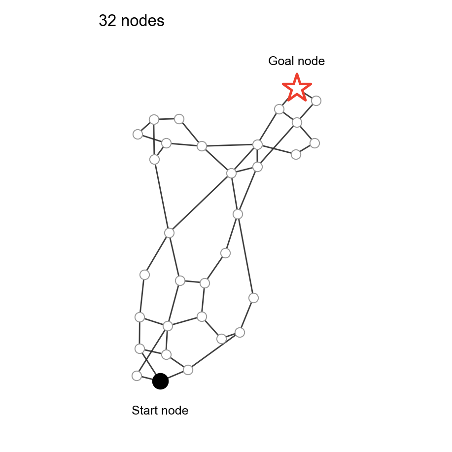
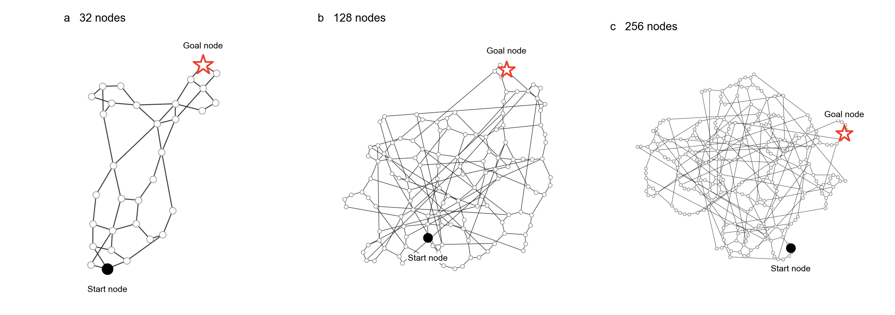
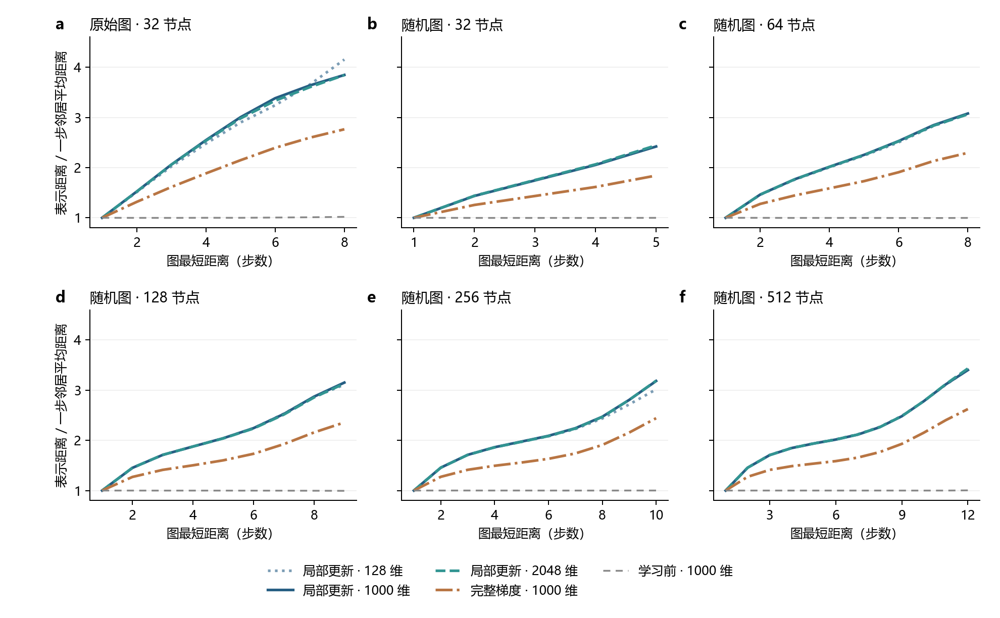
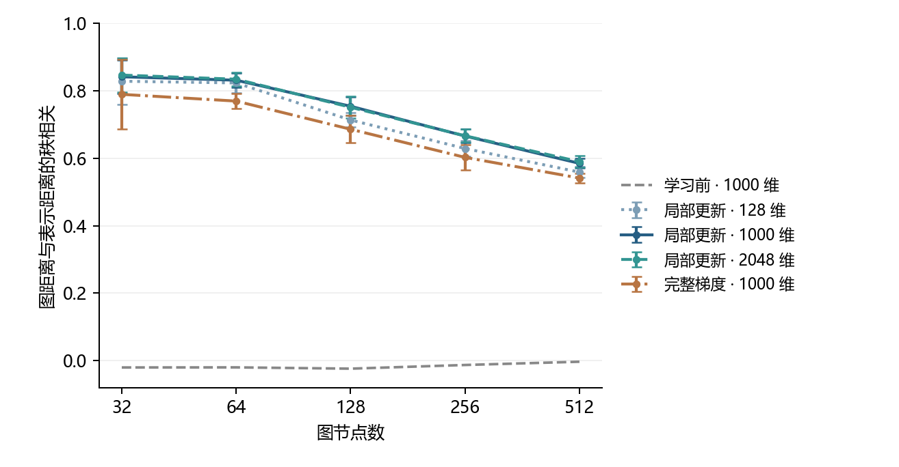

# Step 1 重跑：不同维度与更新方法均能学好状态转移

**四个条件、共 64 张地图全部完成。所有地图在全部有向动作上的后继节点识别准确率均为 100%，转移逐维 MSE 均低于 3×10⁻¹⁰。** 128 维已能完成这批固定图的一步转移拟合；完整平方误差梯度更新同样有效。

本轮按用户要求，仅在当前 Step 1 内采用探索判断：主要看 `Q o_{t+1} ≈ Q o_t + V a_t` 的拟合和状态可区分性；距离结构为地图诊断，余弦选择器为补充参考。项目级研究约定已恢复。

## 先看一张学出来的认知地图

**32 节点的地图已经可以呈现为清晰的 roadmap。** 下图沿用 GCML 论文图 b 的表达方式：将学到的 Q 向量用 t-SNE 投影到二维，再画出环境中的真实连边。白圈是节点，黑点是起点，红星是目标。

选用本轮的原始 32 节点图、局部更新条件，包含 32 个节点和 48 条无向边。起点与目标选为图距离最远的一对节点（2→26，相隔 8 步）。节点位置来自 Q 的 t-SNE 投影，全部真实连边均保留；仅对整幅投影作旋转与等比例缩放以便阅读。

### 扩展到 128 和 256 节点

三张图使用相同的 t-SNE 参数。较大图取各自的 seed 0 case，局部邻域仍可辨认，整体连边更密、交叉更多。建议用 32 节点图作主文示例，用 128／256 节点图展示规模扩展后的结构。

| 可视化 case | 节点／无向边 | 原表示空间的距离秩相关 | 二维投影中的距离秩相关 |
| --- | ---: | ---: | ---: |
| 原始 32 节点图 | 32／48 | 0.941 | 0.906 |
| 128 节点，seed 0 | 128／197 | 0.753 | 0.543 |
| 256 节点，seed 0 | 256／369 | 0.678 | 0.515 |

二维图直观展示地图结构；下面的距离曲线和主指标在原始表示空间中计算。尤其对较大图，t-SNE 投影会改变全局距离，二者结合阅读。

绘图配置见 [roadmap_visualization.json](../configs/roadmap_visualization.json)，基础 t-SNE 参数沿用 [GCML 发布实现的 `run_t_sne`](https://github.com/LH-cbicr/GCML/blob/ff76859b71a2bc2056b50f5e052475351c007f76/gcml_abstract_graph.ipynb)。三个 case 按正式训练配置和固定种子在本地重建，最终距离相关、转移 MSE 和平均表示距离与已保存结果核对一致。单图可单独使用：[32 节点](roadmap_official32.svg)、[128 节点](roadmap_random128_seed0.svg)、[256 节点](roadmap_random256_seed0.svg)；节点坐标、边表和投影指标保存在同目录。

## 远近关系：图上越远，表示空间中平均也越远

**64 张地图全部形成了远近关系：在每张图、每种条件下，按图最短距离分组后的平均表示距离都随步数严格递增。** 学习前的随机表示距离大致不随图距离变化；学习后曲线持续上升。这是本轮直接观察到的地图性质。

横轴是两个节点之间最少需要走几步，纵轴是它们的 Q 向量在原始表示空间中的欧氏距离。为比较不同维度与更新方法，将每张地图的一步邻居平均距离设为 1，其余距离按同一比例缩放。

原始图单独展示；随机图曲线为三张独立地图的均值，每个距离点都使用同一组三张图，展示三图共有的距离范围。蓝／青线为局部更新，棕线为完整梯度，灰色虚线为同图 1000 维初始化对照。曲线展示分组均值；完整逐图均值、组内标准差与节点对数量见[距离源数据](exploration_distance_buckets.csv)。原始图距离 8 仅有一个节点对，较远分组的样本数量也可在源数据中查看。

以 **512 节点图**为例，下表是三张图各自归一化后的平均表示距离：

| 图上相隔步数 | 局部 128 维 | 局部 1000 维 | 局部 2048 维 | 完整梯度 1000 维 |
| --- | ---: | ---: | ---: | ---: |
| 1 | 1.000 | 1.000 | 1.000 | 1.000 |
| 2 | 1.456 | 1.455 | 1.455 | 1.274 |
| 4 | 1.850 | 1.847 | 1.847 | 1.486 |
| 6 | 2.020 | 2.016 | 2.016 | 1.586 |
| 8 | 2.269 | 2.263 | 2.264 | 1.767 |
| 10 | 2.782 | 2.781 | 2.782 | 2.153 |

**三种维度的局部更新曲线几乎重合；完整梯度也学出了同方向的远近变化，但远距离相对于一步距离的拉开程度较小。** 例如，相隔 10 步的节点，局部更新下的平均表示距离约为一步邻居的 2.78 倍，完整梯度下约为 2.15 倍。

分组均值展示整体趋势；下面的距离秩相关则对所有节点对逐一比较，反映具体节点对的远近排序。因此，均值曲线相近的条件仍可有不同的秩相关。

## 512 节点的直接比较

下表为相同三张随机图的均值。后继识别是将预测向量 `q_current + v_action` 与所有节点向量比较，最近节点是否为真实后继；评测包含全部有向动作。

| 条件 | 转移 MSE | 后继识别 | 距离秩相关 |
| --- | ---: | ---: | ---: |
| 局部更新 · 128 维 | 2.03e-11 | 100% | 0.559 |
| 局部更新 · 1000 维 | 2.11e-11 | 100% | 0.585 |
| 局部更新 · 2048 维 | 2.10e-11 | 100% | 0.590 |
| 完整梯度 · 1000 维 | 3.95e-12 | 100% | 0.541 |

**维度结果**：1000→2048 维的距离秩相关由 0.585 增至 0.590，平均增量约 0.005；128 维为 0.559。三种维度都能准确拟合转移，当前结果没有显示必须扩大到 2048 维的收益。128 维可作为紧凑接口的候选，1000 维可继续作为已有参考。

**更新方法结果**：完整梯度在所有 16 张地图上均达到 100% 后继识别，转移 MSE 范围为 1.92×10⁻¹³–9.21×10⁻¹¹。512 节点图上平均 MSE 比局部更新更低，距离相关为 0.541。两种方法都提供了可用的一步转移地图；局部更新在本轮设置下保留了更强的距离相关。

## 各规模的距离结构

各点为三张图的均值，误差条为 ±1 个图间样本标准差。所有条件学习后均形成正的距离相关，1000 维初始化对照接近零。较大图的相关程度有所降低，同时保留了上图所示的整体远近趋势。

每格为三张图的距离秩相关均值 ± 图间样本标准差；原始 32 节点图另列。

| 图 | 局部 128 | 局部 1000 | 局部 2048 | 完整梯度 1000 |
| --- | ---: | ---: | ---: | ---: |
| 原始 32 | 0.915 | 0.941 | 0.939 | 0.937 |
| 32 | 0.828 ± 0.068 | 0.842 ± 0.050 | 0.847 ± 0.050 | 0.790 ± 0.103 |
| 64 | 0.823 ± 0.029 | 0.831 ± 0.020 | 0.834 ± 0.021 | 0.770 ± 0.023 |
| 128 | 0.713 ± 0.021 | 0.754 ± 0.027 | 0.751 ± 0.033 | 0.686 ± 0.040 |
| 256 | 0.629 ± 0.024 | 0.666 ± 0.021 | 0.667 ± 0.019 | 0.603 ± 0.037 |
| 512 | 0.559 ± 0.017 | 0.585 ± 0.014 | 0.590 ± 0.017 | 0.541 ± 0.014 |

各条件的全部地图都较初始化获得了距离相关提升。最终状态逐维中心化 RMS 为 0.052–0.194，全部不同节点对的距离大于零，表明本轮低转移误差伴随可区分的状态表示。

## 补充参考：余弦选择器到达率

| 随机图节点数 | 局部 128 | 局部 1000 | 局部 2048 | 完整梯度 1000 |
| --- | ---: | ---: | ---: | ---: |
| 32 | 99.43% | 100.00% | 100.00% | 99.23% |
| 64 | 95.25% | 98.12% | 98.45% | 93.15% |
| 128 | 80.50% | 90.35% | 92.20% | 76.51% |
| 256 | 60.45% | 75.20% | 75.48% | 54.67% |
| 512 | 39.06% | 51.36% | 53.05% | 34.03% |

该选择器用目标差向量与动作向量的余弦相似度排序真实合法动作，每步读取真实后继节点的 Q；无搜索或循环规避。结果反映这一简单读出方式，不作为本轮转移地图学习的成败标准。

## 运行与结果入口

- 正式合同：[exploration.json](../configs/exploration.json)，继承首轮图、探索与训练参数；四个条件都重新训练。相同维度的两种方法使用相同初始 Q/V，所有条件共用图、探索轨迹、重放顺序与训练轮数。
- 完整梯度使用 `0.5 * sum(error²)` 对前态 Q、后态 Q 和 V 的解析梯度，与该损失的反向传播等价；各坐标更新步长与局部条件一致。训练规则见 [core.py](../src/core.py)。
- 源码版本 `d813282`；CPU 训练合计 **438.46 秒（7.31 分钟）**，不含数据生成、评测、保存和同步。Python 3.11.13、NumPy 2.2.6。
- 本地与开发机 7 项检查通过，包括完整梯度的有限差分核对。另独立复核全部 64 张地图的图／轨迹匹配、同维初始化、全部动作 MSE，并直接重算 512 个后继识别样本，全部通过。
- [逐图数据](exploration_data.csv)与[结构化摘要](exploration_summary.json)已保存。原始 Q/V 和轨迹在开发机 `/zhanghanyue/experiment/grounded_llm/runs/cml_step1_explore_d813282`。首轮数据仍保留在 [summary.json](summary.json)。

本轮范围是固定图、探索已覆盖全部边的一步转移与地图结构。下一阶段的接入调研与待讨论选择见 [Step 2 讨论稿](../STEP2_DISCUSSION.md)。
