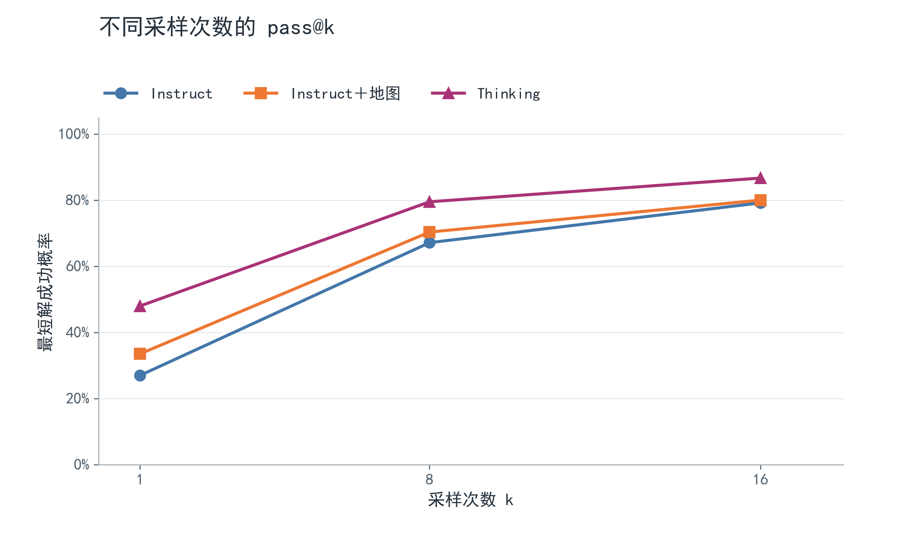
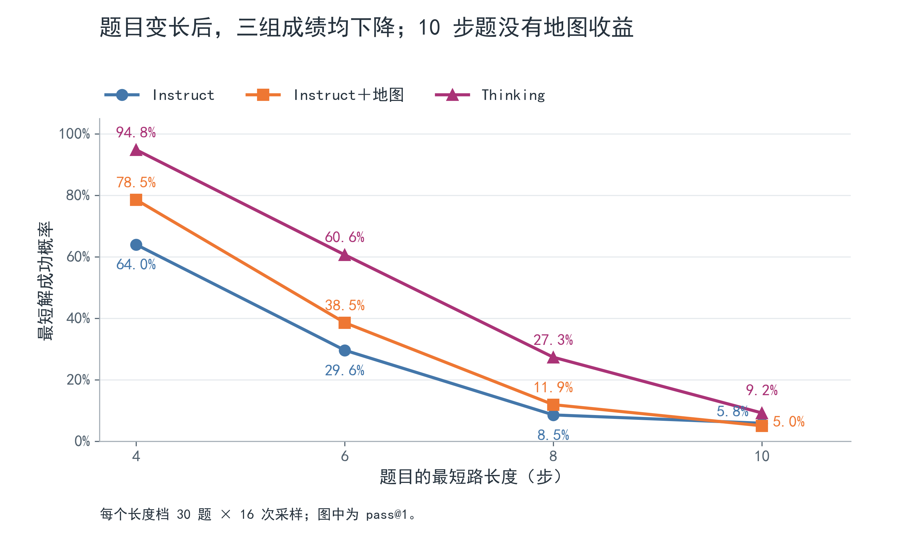
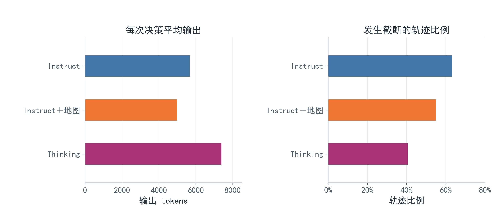
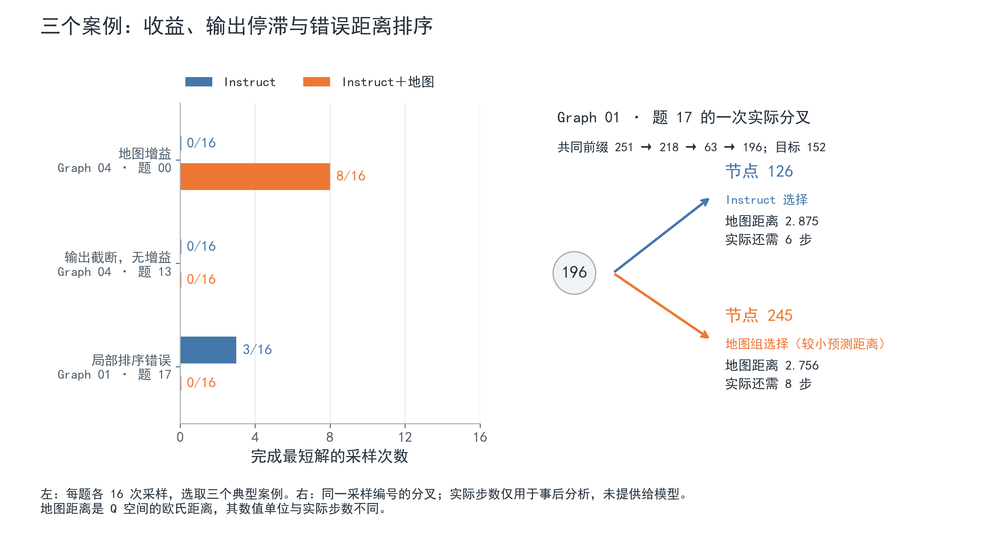

# 五图寻路实验汇报

外部地图提高了 Instruct 的单次最短路成功率，并减少了生成消耗；长程题和多次采样后的题目覆盖，仍是当前瓶颈。

## 实验目的与设置

检验冻结 LLM 能否利用外部 learned Q-map 提供的动作后果距离，改善逐步寻路。

五张独立的 256 节点图，每图 24 题，最短路长度 4、6、8、10 各 6 题；每题每组采样 16 次，共 5,760 条轨迹。
### 模型设置
三组是 Qwen3-4B-Instruct-2507、同一 Instruct 加地图，以及无地图的 Qwen3-4B-Thinking-2507。

每次动作决策的输出上限为 16,384 tokens，包含推理。


从正常结束回答的末尾提取动作。
### 模型每一步看到什么
下面是地图组 prompt 中与当前状态和候选动作有关的片段；完整 prompt 还包含图的邻接表。无地图组保留相同信息，只去掉每个动作后的地图距离。

```text
Current node: 4
Goal node: 98
Executed node sequence: 4
Legal actions (already visited nodes excluded):
action_id=26, to_node=216, learned_map_distance_to_goal=2.415296
action_id=28, to_node=251, learned_map_distance_to_goal=2.593553
action_id=24, to_node=120, learned_map_distance_to_goal=2.612124

Choose ONE action now. The environment executes it and provides the actual new state for the next decision.
Respond with one JSON object: {"action_id": integer}.
```

地图在这里给出的是各动作执行后预测状态到目标的距离。模型选择一个动作，环境执行后更新当前节点，再生成下一步的候选信息。

## 认知地图
**后继预测准确，远近排序仍有误差**

五张地图的一步后继识别率均为 **100%**：将 `Q当前 + V动作` 匹配回节点，能找到正确后继。但知道动作会到哪个节点，与判断这个节点离目标多近，是两项不同的能力。

这里用 **Spearman 秩相关系数**衡量 learned-map 距离与真实最短路距离的排序是否一致：

越接近 1，远近排序越一致；接近 0 表示缺少单调关系。它不是准确率，0.55 不能解释成“55% 的距离预测正确”。每图统计全部 32,640 对不同节点，真实距离只用于事后评估。

| 地图       | 距离排序 Spearman | 最小地图距离候选处于最短方向的比例 |
| -------- | :-----------: | :---------------: |
| Graph 00 |     0.547     |      67.56%       |
| Graph 01 |     0.559     |      68.24%       |
| Graph 02 |     0.551     |      66.67%       |
| Graph 03 |     0.539     |      66.37%       |
| Graph 04 |     0.544     |      67.23%       |

第三列是在所有不同起点／目标组合上，检查选择最小地图距离候选能否让真实剩余步数减少 1。这说明地图包含可用的远近信息，但局部分叉仍可能排错。Graph 01 的整体拟合并不更差，后面的 LLM pass@8 却下降，需结合具体决策理解。

在本次 120 题上，**只按最小 learned-map 距离贪心选择、禁止重访，就能全部到达目标；其中 69/120 题为最短路（57.5%）**。
4、6、8、10 步题分别解出最短路 29、21、13、6 题，每档 30 题。

这是地图的固定贪心读出诊断，供理解地图质量；三组 LLM 的成绩另列如下。

## 全量结果

### 到达目标（允许绕路）

这里的成功是**沿合法路径走到目标节点**，不要求路径最短。到达 pass@k 表示从同一题的 16 次采样中取 k 次，至少有一次到达目标的概率；pass@16 则是 16 次中至少到达一次的题目比例。

| 条件 | 到达／1,920 次 | 到达 pass@1 | 到达 pass@8 | 到达 pass@16（题数） |
| --- | ---: | ---: | ---: | ---: |
| Instruct | 691 | 35.99% | 85.40% | 94.17%（113/120） |
| Instruct＋地图 | 846 | 44.06% | 89.98% | 97.50%（117/120） |
| Thinking | 1,140 | 59.38% | 93.35% | 97.50%（117/120） |

同一 Instruct 加地图后，1,920 次尝试多到达 **155 次**，单次到达率提高 **8.07 个百分点**，五张图分别都提高。到达 pass@8 提高 4.58 点；按题配对重采样的 95% 区间约为 +0.47 至 +8.89 点。到达 pass@16 从 113 题增至 117 题：新增 6 题、失去 2 题，净增 4 题；对应区间约为 −0.83 至 +7.50 点，题目覆盖的增益仍有不确定性。这些区间只反映固定五张图上题目之间的变化。

| 题目的最短路长度 | Instruct 到达／480 次 | ＋地图到达／480 次 | Thinking 到达／480 次 | 16 次中至少到达一次：Instruct／＋地图／Thinking |
| --- | ---: | ---: | ---: | ---: |
| 4 步 | 330 | 397 | 461 | 30／30／30 题 |
| 6 步 | 202 | 248 | 351 | 30／30／30 题 |
| 8 步 | 100 | 132 | 226 | 29／29／30 题 |
| 10 步 | 59 | 69 | 102 | 24／28／27 题 |

10 步题按到达目标计算仍有增益：单次到达率为 12.29% → 14.38%，16 次采样的题目覆盖为 24/30 → 28/30。它与下面“10 步最短解下降”并不矛盾：地图组多走一些弯路后到达，也算在本表中。

### 最短路径（更严格的标准）

这里的最短路 pass@k 指 k 次采样中至少出现一次最短解的概率。
pass@1、pass@8 从每题 16 次采样估计，pass@16 是至少成功一次的题目比例。到达目标另计，可能走了更长的路。

| 条件          | 最短解／1,920 | pass@1 | pass@8 | pass@16 | 到达／1,920 |
| ----------- | --------: | -----: | -----: | ------: | -------: |
| Instruct    |       518 | 26.98% | 67.13% |  79.17% |      691 |
| Instruct＋地图 |       643 | 33.49% | 70.34% |  80.00% |      846 |
| Thinking    |       921 | 47.97% | 79.50% |  86.67% |    1,140 |



*图 1：蓝色圆点为 Instruct，橙色方点为 Instruct＋地图，紫色三角为 Thinking；后续图保持相同配色。折线连接本次题集的估计值。*

按最短路标准，地图组的 pass@1 提高 **6.51 个百分点**，五张图的方向一致。pass@8 提高 3.20 点，但按题配对重采样的 95% 区间为 −2.36 至 +8.79 点，当前还不足以确认稳定的多采样增益。pass@16 仅从 95/120 题变为 96/120 题：新增成功题 11 道，同时失去原本能成功的 10 道，最短路题目覆盖净增很小。

## 长程题与地图利用

| 最短路长度 | Instruct pass@1 | ＋地图 pass@1 | Thinking pass@1 |
| --- | ---: | ---: | ---: |
| 4 | 63.96% | 78.54% | 94.79% |
| 6 | 29.58% | 38.54% | 60.63% |
| 8 | 8.54% | 11.88% | 27.29% |
| 10 | 5.83% | 5.00% | 9.17% |



*图 2：每个长度档 30 题，每题 16 次采样。地图组在 4、6、8 步题上高于同一 Instruct 无地图组，10 步题上略低。*

按最短路标准，地图收益主要出现在 4、6、8 步题。10 步题最短解从 28/480 降为 24/480，pass@8 从 35.32% 降为 28.30%，pass@16 从 16/30 题降为 13/30 题；按到达目标标准则有所提高，见上表。

10 步地图组的 480 次尝试中，首次失去最短解机会的情况包括：**233 次仍在正确路径前缀上就截断；146 次跟随了错误的最小地图距离；66 次没有采用当时正确的最小距离候选**。另有 10 次地图最小候选与模型实际选择都偏离最短方向、1 次非法动作，24 次完成最短解。这些分类按首次事件计，后续再次截断不重复计入。

地图的固定贪心读出能解出 69 题最短路，LLM＋地图单次最短解成功率为 33.49%，16 次采样则覆盖 96 题。地图提供的信息尚未在单次决策中稳定兑现；多次采样也能覆盖部分固定贪心失败的题目。

## 推理成本

| 指标                  | Instruct | Instruct＋地图 | Thinking |
| ------------------- | -------: | ----------: | -------: |
| 每条轨迹平均输出 tokens     |   25,072 |      23,024 |   35,415 |
| 每次决策平均输出 tokens     |    5,671 |       4,984 |    7,391 |
| 每条轨迹平均输入 tokens     |   20,583 |      21,660 |   22,317 |
| 累计输出／最短解成功次数，包含失败尝试 |   92,932 |      68,750 |   73,830 |
| 发生截断的轨迹比例           |   63.28% |      55.00% |   40.57% |



*图 3：每组 1,920 条轨迹。截断指轨迹中至少一次决策达到单步输出上限。Thinking 使用独立权重。*

同一 Instruct 权重下，加入地图后每次决策平均少输出约 687 tokens（−12.1%），截断轨迹比例降低 8.28 个百分点。两组都完成最短解的 317 对轨迹中，平均输出为 10,325→9,896 tokens（−4.2%）。地图组的平均输入 tokens 增加约 5.2%，应与输出节省分别解释。

Thinking 每条轨迹平均输出 35,415 tokens，高于另外两组；其截断比例为 40.57%，低于另外两组。它使用不同权重，这里展示成本与表现的对照，不能将差异归因于地图。记录的平均累计调用耗时在两组 Instruct 中为 203.6→184.8 秒／轨迹；耗时包含排队，且运行跨 A100/A800 与不同负载，仅作为本次运行的观察值。

存在反复输出同一 JSON、重复反思等样例。不过，严格的末尾重复文本诊断仅检出无地图 8 个步骤、地图 4 个步骤，不能解释上千次截断；它也不覆盖所有语义重复。当前没有记录 token 概率，**“低熵导致停滞”尚未得到直接验证**。现阶段可以明确汇报的是输出成本和截断减少。

## 案例：地图增益与无增益分别发生在哪里

以下选取三个典型案例，展示收益和两种失败来源。每题两组均采样 16 次；路径与分叉来自保存的实际回答。



*图 4：左侧为三题的最短解次数；右侧展示 Graph 01 题 17、采样编号 4 的实际选择。图中真实剩余步数仅用于事后分析，未提供给 LLM；地图距离与步数的数值单位不同。*

### 地图有增益：Graph 04，题 00，6 步

从节点 202 到 33，最短解次数由 **0/16 提升到 8/16**，到达次数由 6/16 提升到 12/16。同一采样编号 1 中：

- 无地图：`202 → 5 → 106 → 218 → 133`，随后输出截断。
- 有地图：`202 → 6 → 28 → 91 → 114 → 172 → 33`，完成 6 步最短解。

这题的固定地图贪心读出走了 18 步。首步地图距离最小的是节点 147（2.383），模型实际选了节点 6（2.589）。成功案例表明 LLM＋地图能够在这题取得收益，也能结合题目图结构选择与地图最小距离不同的方向。

### 地图有可用方向，但输出停滞：Graph 04，题 13，8 步

从节点 235 到 80，固定地图贪心读出能用 8 步完成最短解，两组 LLM 的最短解都为 **0/16**；任意路径到达分别为 1/16 和 0/16。地图首步距离最小的节点 203 确实是正确方向，剩余 7 步可达目标。

采样编号 1 中，两组都在首步生成到 16,384 tokens 后截断，未执行动作。地图组输出末尾不断延伸 `… → 109 → 174 → 109 → 174 → …`。地图组 16 次尝试中，11 次在仍可完成最短解的前缀上截断，另 5 次选择偏离最短方向。这个案例说明，提供可用距离后，模型仍可能无法及时结束推导并给出有效动作。

### 地图局部排错，反而失去最短解：Graph 01，题 17，10 步

最短解次数由 **3/16 降到 0/16**。采样编号 4 中，两组共同走过 `251 → 218 → 63 → 196`，目标为 152；此时有两个合法候选：

| 后继节点 | 地图预测距离 | 实际剩余最短步数（事后分析） | 模型选择 |
| --- | ---: | ---: | --- |
| 126 | 2.874933 | 6 | 无地图 Instruct |
| 245 | 2.755830 | 8 | Instruct＋地图 |

无地图组选择 126，最终完成 10 步最短解；地图组选择预测距离更小的 245，失去最短解机会，之后又发生截断。这题的地图组有 8 次首次偏离发生在跟随错误的最小距离时，另 8 次先发生输出截断。地图整体相关性较高，也不能保证这个具体分叉的排序正确。

## 结论与下一步建议

本次实验表明，**显式提供 learned-map 候选距离，能够提高同一 Instruct 模型的到达率、单次最短路成功率，并减少输出和截断**。按到达目标计算，增益也出现在 10 步题；按最短路计算，10 步题反而略降。16 次采样后的到达题目覆盖净增 4 题，最短路覆盖净增 1 题。案例显示后续有两项具体瓶颈：模型输出停滞，以及地图在局部分叉处的距离排序错误。

23,508 次正常结束回答均成功提取动作，格式失败为零；截断回答按原规则计为失败。

下一轮按文末的[新实验设置](#新实验设置连续生成过程中提供地图)推进：以到达为主要目标，保留连续生成的上下文，在 Instruct 生成过程中插入地图信息；Thinking 独立生成完整路径。先用固定小题集检查接口和输出行为。本报告的旧成绩保留原来的最短路提示词与逐步协议，不与新条件混算。

完整数值与诊断定义见[结果摘要](path256_five_graphs.json)。题集与运行设置以[正式题集合同](../configs/path256_five_graphs_suite.json)和[评测合同](../configs/path256_five_graphs_eval.json)为准。


### 会议讨论
讨论要求：增加“优先跟随地图”条件；检查 Instruct 长输出、截断和单步预算的原因。

#### 输出长度分析
现有日志支持提示词与逐步接口诱发重复规划的解释，但尚未用单独修改提示词的对照确定因果贡献。

**旧提示词把“寻找整条最短路”和“现在只选一步”放在一起，使模型在返回一个动作之前先推演完整路线。
每步又重新发送整张图，只保留走过的节点，不保留上一轮的推理，所以后续步骤可能再次规划。**

关闭 Thinking 模式并不保证回答简短。本次 Instruct 的 8,489 次回复都没有 `<think>` 标签，但正常结束的 7,274 次回复中，只有 258 次（3.55%）直接符合单个 JSON；另外 7,016 次（96.45%）通过从长回答末尾提取动作继续执行。实际测到的是“允许正文推演、末尾提取动作”的接口，不能称为模型严格遵守了单动作 JSON。

| 输出行为 | Instruct 无地图 | Instruct＋地图 | Thinking 无地图 |
| --- | ---: | ---: | ---: |
| 正常结束回复的 token 中位数 | 3,347 | 2,769 | 5,736 |
| 正常结束回复的 token 第 95 百分位 | 9,077 | 8,231 | 13,922 |
| 首步平均输出 tokens（含截断） | 6,435 | 6,895 | 10,376 |
| 首步截断／1,920 次尝试 | 315 | 324 | 318 |
| 后续步骤发生截断的轨迹数 | 900 | 732 | 461 |


实际案例：

1.  Graph 00、题 00、采样 1：第一步用了 **4,268 tokens** 比较多条完整路线，末尾才返回 `{"action_id": 118}`；第二步重新分析，随后不断输出 `107 → 166 → 107 → 166 → …`，达到 **16,384 tokens**，没有给出动作。
2.  Graph 04、题 13：无地图回复反复输出 `121 → 121 → …`，地图回复反复输出 `109 → 174 → 109 → 174 → …`，两者均在首步截断。重复节点出现在生成文本中，环境没有执行这些非法路径。

同时还观察到：

1. 无地图 Instruct 的 1,215 次截断中，**1,202 次连可解析动作都没有**
2. 地图组整体输出缩短，但**首步平均输出和截断次数均未下降**，节省主要体现在后续步骤。现有记录支持提示词与逐步接口诱发重复规划


用户确定的新目标是先找到合法路径，路径越短越好，但不要求最短。地图组在生成过程中插入地图后继续预测下一 token；无地图 Instruct 和 Thinking 独立完成整条路径。16k 是旧实验人为设置的单步上限，不是完成一步所必需的长度，新试点改为整题累计预算。

#### 新实验设置：连续生成过程中提供地图

**采用逐节点上下文干预：模型选出一个节点，程序执行动作，把真实状态和地图信息接到已有上下文后，再继续预测下一 token。** 推理历史始终保留，暂停与续写由控制器负责。

任务目标是合法到达、尽量短，每个节点最多访问一次。完整邻接表在开头给出。

| 条件 | 生成方式 | 提供的信息 |
| --- | --- | --- |
| Instruct 无地图 | 一次生成完整路径 | 图与任务 |
| Instruct＋地图 | 保留历史，逐节点插入后续写 | 实际状态、合法后继、learned-map 距离 |
| Instruct＋地图，优先跟随 | 同上 | 相同信息，额外提示优先选最小距离 |
| Thinking 无地图 | 一次生成完整路径 | 图与任务；使用独立权重 |

两个地图组仅差一句 `Prefer the legal next node with the smallest learned-map distance.` 四组比较整体生成方案；两个地图组的比较检验这句提示的作用。

**具体流程。** 程序先把起点的实际状态与地图写入上下文。模型可以先推理，再以 `<action>216</action>` 提交节点。控制器检测完整节点，检查边与访问历史，执行动作并追加该处的环境信息。到达目标时，实际执行路径就是结果。

若模型直接开始输出 JSON 路径，解析器也会在第一个新节点处介入。例如已确认 `[4]` 时，读到 `{"path":[4,216,` 就接收节点 216。数字后的分隔符用于确定编号已经完整。JSON 路径和 action 标签都表示行动提交；普通推理文字保持原样。

```text
任务与邻接表
[Environment update] 起点状态、合法后继和地图距离 [/Environment update]
模型推理……<action>216</action>
[Environment update] 当前节点 216、已确认路径、合法后继和地图距离 [/Environment update]
模型继续推理……<action>下一节点</action>
```

候选距离沿用 `||Q当前 + V动作 − Q目标||₂`。环境负责真实状态，Q/V 负责地图预测，LLM 负责选择节点。

**实现参照。** [ReAct 官方代码](https://github.com/ysymyth/ReAct/blob/master/hotpotqa.ipynb)在动作后暂停 completion，把真实 Observation 追加到原 prompt，再继续生成。试点采用相同的上下文追加方式。IRCoT 在推理句子之间加入检索结果；FLARE 根据下一句的置信度触发检索并重生成。对应论文与方法说明见 [Related Work](../../../RELATED_WORK.md#4-生成过程中追加外部信息reactircot-与-flare)。

Transformers 通过节点边界停止条件交还控制权。SGLang 通过动作结束标记和流解析交还控制权，随后发送扩展后的上下文续写。两种实现都保留同一回答的历史文本。SGLang 的流式通信可能带来少量提前生成的后缀：程序将它单独存档，续写采用节点边界处的文本；服务报告的全部输出均计入预算。

**试点与评测。** 题目、四组条件、采样和整题累计预算集中放在 [试点配置](../configs/path256_continuous_pilot.json)。本轮沿用两道固定诊断题，检查生成与地图的闭环。主要指标为合法到达，另记录路径长度、生成成本和失败原因。每次续写使用剩余预算，插入 token 单独统计；正常节点暂停、预算耗尽、上下文超限分别记录。

每条产物保存原始输出、保留文本、额外后缀、环境更新、执行动作和 token 用量，可逐步重放。40410 节点的旧记录使用 SGLang 0.4.6 服务端随机流，标注 `seed_applied=false`；35016 节点使用 SGLang 0.5.10，逐请求种子已传给服务。

**旧试点诊断。** `runs/external_map_interface/path256_continuous_pilot_40410/graph_00/` 的四条地图记录中，一条完成逐节点路径，两条在起点更新后直接输出超出单步的路径，一条耗尽预算。旧实现已经设置 `</prefix>` stop，问题在于它等到整个前缀结束才介入。当前实现把边界提前到第一个新节点，并由程序初始化起点状态。

**接口验证。** 节点边界、完整路线提前介入、历史保留、环境来源、动作合法性、累计预算和末尾 JSON 代码块等共 22 项自动检查通过。下面先保留 40410 的失败诊断，再报告 35016 完成的试点。

#### 小型试点结果：40410 节点

**Thinking 一次生成已跑通；最新逐节点地图接口还没有完成实机验收。** 沿用 Graph 00 的两道固定题，每题每组原计划只试一次。最新控制器的三个 Instruct 条件在服务阻塞后未产生完整记录，不能把它们算作模型失败。

| 最新条件 | 4 步题：208 → 241 | 8 步题：152 → 162 | 当前结论 |
| --- | --- | --- | --- |
| Instruct 无地图 | 未完成运行 | 未完成运行 | 需恢复服务后重跑 |
| Instruct＋地图 | 未完成运行 | 未完成运行 | 逐节点插入尚待实机验收 |
| Instruct＋地图，优先跟随 | 未完成运行 | 未完成运行 | 同上 |
| Thinking 无地图 | 合法到达，4 步，6,107 tokens | 合法到达，9 步，14,842 tokens | 两题均一次生成，无中途插入 |

Thinking 的两条最终路径为：

- 4 步题：`208 → 65 → 193 → 33 → 241`。
- 8 步题：`152 → 173 → 177 → 239 → 215 → 216 → 84 → 14 → 91 → 162`。走了 9 步，比最短路多 1 步，按当前目标仍成功。

**服务为什么停下。** 节点存在 SGLang 安装，实际使用版本为 0.4.6.post5。启动时补齐 Python 开发头文件并修正环境 PATH 后，两个服务都通过健康检查。随后 Instruct 服务停止返回 token；重启和在空闲 Thinking 服务上换载 Instruct 权重均卡在 NVIDIA 驱动锁等待，进程处于 D 状态，主机日志也有驱动相关的 soft lockup。已保存诊断并停止追加尝试，需节点恢复后继续。这是运行阻塞，尚不能据此评价模型或地图。

**此前的格式诊断：地图插入能续写，但需要控制边界。** 以下四条来自旧 `</prefix>` 协议的诊断变体：程序在每次生成前仅预填 `<prefix>` 开标签，路径中的节点仍由模型决定；每段完成后核验合法性并插入真实地图信息。它们不属于最新逐节点控制器的成绩。

| 旧版诊断变体 | 4 步题 | 8 步题 |
| --- | --- | --- |
| 地图＋预填开标签 | 合法到达，4 步，101 tokens | 合法到达，34 步，3,199 tokens |
| 地图优先跟随＋预填开标签 | 合法到达，4 步，101 tokens | 合法到达，10 步，415 tokens |

例如旧版“优先跟随＋预填”在 8 步题上实际执行：`152 → 156 → 146 → 36 → 35 → 98 → 46 → 240 → 96 → 80 → 162`。每到一个新节点，程序都核验边、排除已访问节点、插入该处距离，再继续生成。10 步路线虽有绕路，但合法到达。

未预填时，起点 JSON 已被正确适配为首个前缀；后续仍出现整条路线直接输出或模型自写环境文本。另一个旧版无地图 Instruct 的 4 步答案路径正确，却包在 Markdown 代码块中，被严格格式检查拒绝；8 步题的最终路线则含不存在的 `194 → 91` 边。这些分别是格式问题、控制边界问题和真实路径错误，不能混作同一种失败。

所有已保存的 14 条记录已重新核验累计预算和成功路径。两题的试点用于检查接口，不估计 pass@k 或地图收益。完整数值、旧版诊断和未完成条件见[试点摘要](path256_continuous_pilot.json)。

#### 小型试点结果：35016 节点

**四组各两题都已完成生成；地图插入、路径执行和答案提取已重放。** 两题分别是最短 4 步与 8 步。下表的“到达”按真实图中的连续合法边、无重复节点、终点正确计算，不要求一定是最短路。

| 条件 | 4 步题：208 → 241 | 8 步题：152 → 162 |
| --- | --- | --- |
| Instruct 无地图 | 到达，4 步；1,443 输出 tokens | 到达，8 步；4,911 输出 tokens |
| Instruct＋地图 | 到达，4 步；4,733 输出 tokens | 到达，9 步；6,093 输出 tokens |
| Instruct＋地图，优先跟随 | 到达，4 步；34 输出 tokens | 到达，8 步；889 输出 tokens |
| Thinking 无地图 | 到达，4 步；10,228 输出 tokens | 未给出最终路线；16,384 tokens 截断 |

无地图 Instruct 的两条最终路线都包在末尾 Markdown JSON 代码块中。初版解析器把它们记为“缺少 JSON”；查看原文后，已允许**回复末尾仅有一个完整 JSON 对象的代码块**，并用原始输出重放。两条路线分别为 `208 → 65 → 193 → 33 → 241` 和 `152 → 156 → 247 → 87 → 230 → 113 → 44 → 143 → 162`，都逐边合法且为最短路。原始判定与格式兼容后的判定都保存在[试点摘要](path256_continuous_pilot.json)，没有重采样，也没有替模型修路。

地图组的每一个新节点都由模型输出 `<action>节点号</action>` 提交；程序在 `</action>` 处停下，核验邻接与未访问条件，再把该处真实状态和 learned-map 候选距离追加到**同一回答**。四条地图路线共执行 25 条边，重放时逐条核对了原图、地图数值、保留文本和累计输出用量，均无不一致；服务在本次均由结束标记停下，未用强制中断。优先跟随组在两题共 12 次选择中都选了当前 learned-map 距离最小的合法后继；普通地图组为 10/13 次。

8 步题可直观看到两种地图提示的差别。普通地图组实际走 `152 → 72 → 39 → 0 → 232 → 56 → 240 → 96 → 80 → 162`，共 9 步；优先跟随组走 `152 → 156 → 247 → 87 → 230 → 113 → 44 → 143 → 162`，共 8 步。普通地图组首个动作前仍写了数千 token 的分析，因而“插入能用”不等于“自然会简短”；优先跟随提示在这两题上明显缩短了输出，但仅两题不能估计稳定收益。

新节点的默认 SGLang 服务在第一次预热生成时卡住，**尚未发出试验题目**。保留诊断后，关闭 CUDA graph 和重叠调度，两个模型服务健康，才完成上述 8 条记录。它们使用 SGLang 0.5.10、逐请求种子和整题累计 16,384 输出 token 上限；与 40410 的旧运行不混算。原始记录和服务日志位于开发机 `runs/external_map_interface/path256_node_boundary_pilot_35016_ce18243/`。

按这一接口，已用[正式配置](../configs/path256_continuous_five_graphs.json)在原来五张冻结图上启动四组测试：120 题，每题 16 次，共计划 7,680 条独立记录。新评测以合法到达为主，另报告最短路、长度、失败类型和输出成本；它的任务目标与提示词已改变，不能直接把成绩与本文前部的旧五图最短路逐步评测当成同一协议比较。

#### 正式测试的首轮提取检查（运行中）

35016 节点重启前，四组的**第一次采样**均已覆盖五图全部 120 题；总共已有 790/7,680 条记录。独立重放逐条验证了题目身份、种子、提示词、模型提交的节点、实际合法边、地图更新、最终路径和 token 用量，790 条均通过。重启后从已有记录继续，不覆盖已完成样本。

| 条件（每组 120 题 × 首次采样） | 合法到达 | 最短路 | 16k 截断 | 其他未到达原因 |
| --- | ---: | ---: | ---: | --- |
| Instruct 无地图 | 93 | 42 | 15 | 非法边 12 |
| Instruct＋地图 | 84 | 45 | 19 | 非法边 8、重复节点 8、走到无后继 1 |
| Instruct＋地图，优先跟随 | 119 | 47 | 1 | 无 |
| Thinking 无地图 | 76 | 54 | 43 | 非法边 1 |

**答案提取目前没有发现协议故障。** 首轮无地图 Instruct 的 120 条中，104 条把最终 JSON 放在回答末尾的 Markdown 代码块中；严格限定为单个完整 JSON 对象的兼容规则全部提取成功。正常结束却无法提取最终 JSON 的记录为 0。两个地图组首轮分别有 867、1,247 次 `<action>` 节点提交，均按边界暂停并重放；地图组未出现缺少动作标记、模型自写环境更新或 token 用量不完整。全部 790 条记录的 `missing_final_json` 等提取类失败数为 0。

表中非法边、重复节点和截断是真实的生成／规划失败，不是解析失败。例如无地图 Instruct 在 Graph 00 一道题的末尾正确输出了带代码块的 JSON，但路径中有不存在的边，裁判据此拒绝；普通地图组有一次明确提交了当前节点不相邻的 `<action>184</action>`，控制器没有执行这一步。优先跟随地图组首轮 119/120 到达，但只有 47/120 最短；地图可以显著帮助到达而仍有绕路。上述是**一次采样的中途检查**，其余 15 次尚未齐全，不作最终 pass@k 或稳定收益结论。
