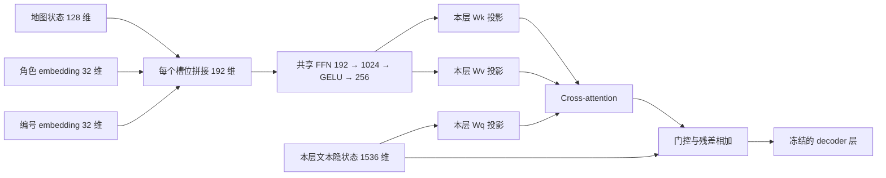

# 完整轨迹 SFT：寻路原方案与积木 FFN 重训

本页按原寻路方案的顺序说明数据、输入、监督、训练和评测。积木采用 2026-10-07 确认的基础设置：**融合 FFN、失败上下文、全局 batch 4，从头训练 10 个 epoch；每 0.1 epoch 保存，每 0.5 epoch 评测主测试**。初始为四卡各 1 条；2026-10-08 经授权从完整断点迁移为两卡各 2 条，维持逐轨迹等权目标。评测初始四卡，同日再次重启后经授权扩至两节点六卡，使用互斥分片，启动见 README。寻路列为上一轮方案参照，本次不重启寻路训练。

正式参数以[积木基础配置](configs/blocks_ffn_failure_batch4.json)及[两卡接续合同](configs/blocks_batch4_two_gpu_resume.json)为准；[全局 batch 64 配置](configs/blocks_ffn_failure.json)对应已停止的对照运行，[寻路配置](configs/path_single_long.json)对应上一轮方案。进度见[项目状态页](../../docs/PROJECT_STATUS_AND_TODO.md)。上一轮两任务的[设计](DESIGN_long_trajectory.md)与[报告](results/report_long_trajectory.md)在原目录保留，其成绩不属于当前小 batch 运行。

本轮大 batch 试点的负结果与小 batch 证据状态见[本轮报告](results/report.md)。

## 1. 这轮实验检验什么

**冻结语言模型和地图后，读取接口能否学会利用地图选择动作，并区分“已经到达目标”与“没有合法动作、但还未到达目标”？**

寻路继续检验同图新目标下的地图关系读取与连续行动。积木在原成功轨迹基础上增加地图特征 FFN 和失败上下文，再从头训练接口。环境提供当前状态、合法候选和真实执行反馈，语言模型负责排序、动作选择及终止回答。

| 项目 | 寻路：沿用原方案 | 积木：本次重训 |
|---|---|---|
| 环境 | 固定 `graph_00`，256 节点、768 个有向边动作，禁止重复访问节点 | 10×10 二值棋盘，按八种规定形状移除占据格，目标可以非空 |
| 冻结地图 | 既有 `graph_00` 的 Q/V，状态向量 128 维 | 共享棋盘编码器 `tree_1000_132f5a1/best.pt`，状态向量 128 维 |
| 每轮地图内容 | current、goal，以及每个合法后继的 `Q(current)+V(action)` | current、goal，以及每个真实合法后继的 `Q(T(current, action))` |
| 标签依据 | 地图欧氏距离生成排序及贪心动作 | 地图 `directed_sum` 距离生成排序及贪心动作；耗尽合法动作后生成无解回答 |
| 读取接口 | 角色与编号作 K，状态投影作 V | 地图、角色、编号经共享 FFN 融合，特征同时用于 K/V |
| 留出任务 | 同图、未作为训练目标的 goal | 训练初始棋盘上的新任务，以及新初始棋盘上的任务 |

相对上一轮分离 K/V 的积木实验，本轮改变了接口、训练样本、batch 和训练轮数，旧成绩可作参照，但新旧差值不能单独归因于 FFN。地图贪心提供示范，不保证环境最短解。

当前小 batch 对照与已停止的融合 FFN 大 batch 运行之间，只修改每卡／全局 batch：16／64 改为 1／4。复用同一份准备数据、编号、标签和测试任务，保持种子、学习率、warmup 比例及其他配置一致，在独立目录从头训练；初始 adapter 已逐 tensor 核对一致。它不是从大 batch 中间权重续训，也不是恢复旧的分离 K/V 架构。

按 epoch 比较时，小 batch 对照的更新次数约为大 batch 的 16 倍；它同时改变梯度平均和不同长度样本的相对权重。因此须同时记录 epoch、更新次数、样本曝光量与耗时，不能把收益仅归因于更新次数。四卡全局 batch 4 也不等于上一轮单卡全局 batch 1。

## 2. 数据范围与实际数量

先确定真实任务和轨迹，再生成编号版本。“物理任务”是一个起点／目标对；“编号轨迹”是同一任务的不同候选编号呈现。

### 寻路：原数据直接沿用

256 个目标节点按训练／验证／测试的 192／32／32 个划分，起点可跨分区。训练优先选择较长任务，非零步任务最短长度为 8–11 步，实际训练贪心示范为 8–32 步；非零步测试贪心示范为 8–31 步。

| 划分 | 非零步任务 | 初始即目标 | 物理任务合计 | 可用编号轨迹 |
|---|---:|---:|---:|---:|
| train | 4,000 | 192 | 4,192 | 24,192 |
| validation | 500 | 32 | 532 | 3,032 |
| test | 1,000 | 32 | 1,032 | 6,032 |

原数据、动作覆盖和状态曝光的详细统计见[上一轮设计](DESIGN_long_trajectory.md#2-数据范围与实际数量)。

### 积木：8,000 + 1,000 + 1,000 混合训练

保留原 1,000 张训练初始棋盘上的 9,000 条成功轨迹，新增 1,000 条失败上下文轨迹。

| 训练类别 | 物理任务 | 每题编号版本 | 每个 epoch 的训练样本 | 监督内容 |
|---|---:|---:|---:|---|
| 普通成功任务 | 8,000 | 6 | 48,000 | 全部正常动作回答及到达后的终止回答 |
| 初始即目标 | 1,000 | 1 | 1,000 | 零步到达、空动作历史及停止 |
| 失败上下文 | 1,000 | 6 | 6,000 | 只监督最后的无解回答，前面的 assistant 回答全部 mask |
| **合计** | **10,000** | — | **55,000** | — |

三类放入同一个训练集，每个 epoch 随机打乱后由各训练进程分配，按样本采样；不按类别分阶段训练，也不强制每个 batch 各类数量相同。编号增强后的采样比例为 **48:1:6**。普通任务和失败任务各有 6 套固定编号，初始即目标只有 1 套。

上述比例是样本出现次数，不是监督 token 或梯度贡献比例。失败历史只监督最后回答，不能将全部历史长度计入其监督量；batch 对损失权重的影响见第 6 节。

原 8,000 条普通成功任务的最短长度分布仍为：6 步 200 条、7 步 4,784 条、8 步 3,004 条、9 步 12 条；成功训练示范为 6–11 步。原 9,000 条成功轨迹共 64,155 个决策轮、9,000 个到达终止段；这些是新增失败轨迹前的统计，不能作为新训练集总轮数。

### 失败样本怎样构造

旧训练清单里没有失败训练样本。原采样器记载筛除了 3,282 次地图贪心失败，但没有保存具体失败轨迹，因此此次在训练棋盘上重新生成。

失败轨迹照常选择地图贪心动作，沿真实状态继续执行，直到 **current 不等于 goal，而且合法候选列表为空**。每个历史回答仍保留在会话中，并绑定它当时的地图；历史 assistant token 的 label 为 `-100`，只有最后的无解回答计算损失。

目标在中途已不可达、但仍有合法动作时，不设置提前无解标签。达到动作预算、上下文超限等运行失败也不作为这类无解样本。

### 主测试：两个分组合计 510 题

按真实环境的最短解长度分层，而不是按地图贪心轨迹长度分层。每档一半来自训练初始棋盘上的新任务，一半来自新初始棋盘。

| 最短长度 | 训练初始棋盘上的新任务 | 新初始棋盘任务 | 合计 |
|---|---:|---:|---:|
| 6 步 | 50 | 50 | 100 |
| 7 步 | 100 | 100 | 200 |
| 8 步 | 100 | 100 | 200 |
| 9 步 | 5 | 5 | 10 |
| **合计** | **255** | **255** | **510** |

主测试全部是非零步、初始可解任务，不含旧 test 的初始即目标样本；选题不以地图贪心是否成功为筛选条件。优先复用符合分层要求的旧测试题，缺少的长度档补充新题。

另外保留 **100 条新棋盘失败上下文任务**，作为 `test_no_solution`，单独检验末端无解识别。原 **1,100 条 validation** 继续保存在数据清单中，可用于单独评测；本次自动 final 流程运行的是主测试和无解诊断。

起点／目标对跨 split 去重，留出起点任务排除训练轨迹已监督的 `(current, goal)` 后缀；新增失败轨迹也检查与既有任务及负例的重合。新初始棋盘与训练初始棋盘分离，但中间状态或 goal 仍可能已见，不能称为所有状态完全未见的泛化。

## 3. 动作覆盖与编号重复

寻路动作是有向边；积木动作是 `remove(shape_id,row,col)`。八种积木形状包含规定朝向，去除越界锚点后共有 664 个可能动作。原成功训练轨迹已覆盖全部 664 个动作作为合法候选及示范动作，这表示动作种类覆盖，不表示状态、目标和候选组合都已覆盖。

每条非零步轨迹固定真实动作序列，生成 6 套候选编号版本。重编号时同步调整真实动作、后继地图向量、文字映射、排序和输出编号；真实执行历史不变。

寻路最多 3 个候选，6 套版本覆盖 3! 种排列。积木候选更多，6 套版本只是固定抽样，不表示覆盖全部排列。失败历史也同步重编号，历史损失 mask 保持不变。

积木固定编号语料训练 10 遍：普通成功与失败任务各呈现 60 次，初始即目标各呈现 10 次。重复和重编号都不增加独立物理任务数。

## 4. 模型每轮收到什么

### 文字输入

两任务沿用英文任务文本和 Qwen 原有 chat template，以 user 环境消息与 assistant 回答交替构成完整会话。初始规则只出现一次，后续保留真实历史并追加环境更新。

寻路输入沿用原方案：完整邻接表、起终点、禁止重复访问规则，每轮列当前节点、实际已走路径及全部合法候选。

下面用一个 6 节点小图展示实际文本格式；正式任务会列出全部 256 个节点的邻接表。第一条 user 消息包含初始规则与首轮环境更新：

```text
Find a valid path from node 0 to node 5 in this undirected graph, as short as you can.
Reaching the goal is the first priority; among valid solutions, prefer fewer moves.
Use the listed edges and visit each node at most once.

Neighbors:
0: 1, 2
1: 0, 3, 4
2: 0, 4
3: 1, 5
4: 1, 2, 5
5: 3, 4

[Environment update]
Current node: 0
Actual executed path: [0]
Legal next moves:
1: 0 -> 2
2: 0 -> 1
Candidate numbers may change between turns; use only the numbers above.
[/Environment update]
```

模型回答后，假设环境实际执行了 `0 -> 1`，下一条 user 消息只追加环境更新：

```text
[Environment update]
Current node: 1
Actual executed path: [0, 1]
Legal next moves:
1: 1 -> 3
2: 1 -> 4
Candidate numbers may change between turns; use only the numbers above.
[/Environment update]
```

节点 0 已访问，因此虽然邻接表中有 `1 -> 0`，它不再出现在合法候选里。候选编号 2 在首轮表示 `0 -> 1`，在下一轮表示 `1 -> 4`；编号只在当前轮有效。初始说明和此前 assistant 回答继续保留在会话历史中。

积木先给初始／目标完整棋盘、八种形状及移除规则：坐标从零起，形状占据格必须覆盖当前占据格，只使用规定朝向；形状可复用，没有重力或库存限制，必须精确保留目标中的占据格。每轮追加：

```text
[Environment update]
Current board:
{完整 10×10 棋盘}
Actual executed actions: {实际 remove(...) 历史，无动作时为 (none)}
Legal next moves:
{编号}: remove(shape_id,row,col)
{其余全部合法候选；没有候选时为 (none)}
Candidate numbers may change between turns; use only the numbers above.
[/Environment update]
```

文字不提前给正确排序、Top-10 名单或距离数值。Top-10 限制只用于答案，输入保留全部合法候选。模板见 [prompt.py](src/prompt.py)、[blocks_prompt.py](src/blocks_prompt.py) 和 [text.py](src/text.py)。

### 积木前置融合 FFN 与 cross-attention

每轮地图包含 current、goal 和每个合法后继的槽位。**每个槽位分别拼接 128 维地图状态、32 维角色 embedding 和 32 维候选编号 embedding**，得到 192 维特征，经同一个 FFN 转为 256 维。



FFN 在所有槽位和读取层间共享；K 与 V 使用同一份融合特征，但每层的 `Wk`、`Wv` 分别训练。Query 来自该层语言隐状态，经归一化和 `Wq` 投影读取地图。attention 使用 4 个头、每头 64 维，输出投影回语言维度后，经可训练的 `tanh` 门控加入残差；门控从零初始化。

cross-attention 插入每个 decoder 层之前。每个历史 token 只能读取它所属轮次的地图，当前回答读取当前轮地图；候选 padding 槽位被 mask。地图编码器的 `Q(state)` 是状态表示，与 attention 的 Query 是两个概念。

前置 FFN 是这次新加的可训练特征映射，用于学习地图与角色信息如何供语言隐状态读取。结构采用门控 cross-attention 的思路；这里没有复现 Flamingo 的全部视觉结构。

## 5. 监督什么，输出怎样区分三种情况

### 有合法动作且尚未到目标

沿用原排序式答案，普通成功轨迹的全部 assistant 回答计算 token 交叉熵：

```text
The current state has not reached the goal.
Map-distance ranking to the goal, closest to farthest: {包含 current 的排序}.
Choose candidate {i} because its successor has the smallest map distance among the candidates.
<action>{i}</action>
```

排序用 `<` 表示更近、`=` 表示并列。寻路列全部候选；积木列最近的至多 10 个候选，再加入 current，最多 11 项。动作标签按全部候选的地图最小距离选择，并列最优允许多个真实动作；重编号后输出对应编号。距离用于离线生成标签，不作为文字输入或数值预测目标。

### 当前状态已到目标

```text
The current board matches the goal.
Executed actions: {实际 remove(...) 序列，无动作时为 (none)}.
Summary: Reached the goal after {步数} executed removals.
<done/>
```

初始即目标对应空历史、零步。达到目标优先判定为成功终止，即使该棋盘仍有可移除形状，也不判为无解。寻路沿用相同终止格式，把 board/removals 替换为 node/moves。

### 尚未到目标，且已经没有合法动作

固定训练答案为已确认的三行：

```text
No solution: no legal moves remain and the goal has not been reached.
<action>none</action>
<done/>
```

失败轨迹中，前面的错误动作及排序回答只是上下文，不参与损失；最后三行参与损失。目标在中途不可达但仍有合法候选，不要求模型直接判断全局无解。终止判断依赖当前棋盘、goal 和合法候选列表。

所有 user 文本均不计算损失。模型仍须通过完整历史的前向计算，才能学习最后回答；mask 历史标签并不等于删除历史或省去其计算。

## 6. 训练设置与保存恢复

冻结 Qwen2.5-1.5B-Instruct 与地图编码器，积木的角色／编号 embedding、融合 FFN、各层 cross-attention 投影及门控从头初始化并训练。每个训练样本是一条完整编号轨迹。

| 设置 | 寻路原方案 | 积木本次方案 |
|---|---|---|
| 训练样本／epoch | 24,192 | 55,000 |
| GPU 分配 | 一张训练卡 | 四张 NVLink 互联训练卡，DDP |
| 每卡 batch | 1 | 1 |
| 全局 batch | 1 | 4 |
| 梯度累积 | 1 | 1 |
| epoch | 3 | 10 |
| 优化步／epoch | 24,192 | 13,750 |
| 总优化步 | 72,576 | 137,500 |
| 保存频率 | 每 1/3 epoch，另存第 128 步 | 每 0.1 epoch，即每 1,375 步 |

两者均采用 AdamW：学习率 `2e-5`，前 5% 优化步 warmup 后保持恒定，weight decay 为 `0.01`，梯度裁剪为 `1.0`。冻结基座使用 BF16，新增接口参数保持 FP32，并采用 BF16 autocast。

当前积木 warmup 为 6,875 steps，即 0.5 epoch。相对于大 batch 运行，warmup 比例和覆盖的 epoch 不变，绝对步数随总更新预算增加。

积木训练启用逐层激活重计算，并仅对有监督 token 分块计算交叉熵，块大小为 128。两项用来降低显存，不改变同一个 batch 的损失定义；重计算会增加计算时间。每张卡先对本卡 batch 内所有有监督 assistant token 求平均，再由 DDP 平均各卡梯度；不是跨四卡按全局监督 token 数重新归一化。训练集随机混合，本卡 batch 内按最长文本与地图形状补齐。

每卡 batch 1 时，每条轨迹先计算自己的 token 平均损失，四条轨迹再跨卡平均；此前每卡 batch 16 时，同卡长监督轨迹对该次平均损失的权重更高。由此，缩小 batch 会同时改变短终止样本与长动作轨迹的相对权重。token 数也不等同于实际梯度贡献，需结合分类损失或对照结果判断。

两卡接续时，每条轨迹先对自身监督 token 求平均，再对本卡轨迹等权平均，最后由 DDP 平均两卡梯度。这样维持四卡各 1 条时的样本权重，而不是把两条轨迹合并为 token 加权平均。迁移及梯度等价验证见[本轮报告](results/report.md)。

55,000 条样本按全局 batch 4 分配，每 epoch 恰好 13,750 步，无须因整除问题补齐。保存点为 1,375、2,750、4,125……13,750，后续 epoch 按同一间隔继续。另存初始权重和最终 `final`；主测试按 0.5 epoch 评测，对应 6,875、13,750、20,625……steps。保存频率不代表每个保存点都评测。

历史积木对照：分离 K/V 的单卡全局 batch 1 实验为 49,000 个样本／更新每 epoch；已停止的融合 FFN 全局 batch 64 实验为 55,000 个样本、860 次更新每 epoch、每 86 steps 保存。三者的“1 epoch”不代表相同优化更新数。

中间断点保存 adapter、optimizer、scheduler、trainer state，以及各卡随机状态。通过统一入口的 `--resume` 选择最新完整断点，沿原步数、epoch、数据顺序和学习率进度继续剩余预算。初始权重目录不含完整训练状态；没有完整断点时明确报错。

默认恢复要求同一运行、配置、batch 和设备拓扑；未保存的更新从最近完整断点重算。两卡接续使用显式迁移合同，保持全局 batch、样本权重、数据分组、更新预算与 optimizer 状态，当前 rank 只恢复自己的有效 CUDA 设备 RNG。已通过梯度、分组和恢复检查，但批量 padding、bf16 与求和顺序改变，不能承诺逐位一致。大／小 batch 对照仍使用新目录从头训练，不能按旧 Trainer 步数直接续接；`--prepared-manifest` 仅复用数据，不加载旧 adapter 或优化器。

上下文上限 32,768 token，不静默截断；每次动作／终止生成预算为 4,096／2,048 token，最大执行动作数为 32。GPU 数、batch、保存间隔和生成预算的正式值均见配置。

## 7. 评测设置与指标口径

### reference 与 rollout

| 模式 | 当前轮之前的历史 | 如何进入下一轮 | 所检验的能力 |
|---|---|---|---|
| reference | 真实示范历史 | 当前回答自由生成后恢复示范答案，不执行模型动作 | 同一状态下的排序、动作与终止判断 |
| rollout | 模型自己的回答及实际执行历史 | 执行模型动作，环境更新棋盘和候选 | 是否到达目标、正确停止，以及错误如何累积 |
| 失败上下文 reference | 已提供的失败历史 | 历史轮直接装入上下文，只生成最后的无解回答 | 没有合法动作且未到目标时能否正确结束 |

### 本次积木自动评测

当前运行包含两条评测流程，均使用同一 `trajectory_eval.py` 和汇总器，每题使用 1 套编号，每片最多 64 个物理任务：

- **中间评测：**另一节点的独立队列读取每 0.5 epoch 已发布的 checkpoint，评测主测试 reference 和 rollout，各 510 题；两张卡负责 rollout，两张负责 reference。队列优先最新 checkpoint，再补较早节点，因此较新结果出现时，较早节点仍可能未全量。100 条独立无解诊断不在这个中间队列中。
- **最终评测：**训练入口在训练结束后对 `final/adapter.pt` 自动运行下表三组。它与中间队列使用不同输出目录；若半 epoch 队列也评到了 final 的同一权重，汇报时只作为同一条件，不合并为独立重复。

| 数据集 | 模式 | 物理任务 | 每题编号数 | 主要报告 |
|---|---|---:|---:|---|
| 主测试 `test` | reference | 510 | 1 | 动作可达率、最短路动作率、排序及误判无解 |
| 主测试 `test` | rollout | 同一批 510 | 1 | 到达率、到达且最短解率、停止与失败原因 |
| 无解诊断 `test_no_solution` | reference | 100 | 1 | 无解召回率、none/done 输出与原始回答 |

最终三组合计 1,120 个评测案例，来自 610 个独立物理任务；reference 与 rollout 的同题结果不作为两批独立任务。validation 与训练诊断可通过同一评测器单独调用，不在上述自动三组任务中。半 epoch 队列是额外启动的进程，训练入口本身不会自动启动它；统一源码为 [blocks_checkpoint_queue.py](src/blocks_checkpoint_queue.py)，原运行快照保留旧名 `blocks_half_epoch_eval_queue.py`，评测 `contract.json` 和 `launch.json` 记录原设置与调用。

评测重启跳过已有完整摘要的分片，不从片内某道题续接。半 epoch 队列先归档未完成分片再重做，汇总排除 `.interrupted.*` 目录；训练入口的 final 流程则清除未完成分片再重做。有效题数可能在重启后暂时回落。部分结果必须注明已评数量及棋盘来源，比较趋势优先使用全量结果或对齐同一批题目。

寻路沿用原有 reference／rollout、训练诊断与 validation／final test 口径：训练诊断及 validation 每题 1 套编号，final test 的普通任务可用 6 套编号、初始即目标 1 套。本次积木运行不会触发新一轮寻路训练；寻路已有的地图反序和早期干预合同见[上一轮设计第 8 节](DESIGN_long_trajectory.md#8-最终-checkpoint-诊断先-reference-q-倒序再-rollout-早期干预)。

### 主要指标与解释

| 指标 | 判定与分母 |
|---|---|
| rollout 到达率 | 实际轨迹到达 goal 的任务数／全部 rollout 任务 |
| rollout 到达且最短解率 | 已到达且实际动作数等于环境最短距离的任务数／全部 rollout 任务 |
| reference 动作可达率 | 选择后仍可到目标的轮数／作答前可解的非终止决策轮 |
| reference 最短路动作率 | 使剩余最短距离减少 1 的轮数／同一批作答前可解决策轮 |
| 无解召回率 | 在“无合法动作且未到 goal”状态正确输出 none/done 的轮数／全部此类生成轮 |
| 误判无解率 | 在不满足上述无解条件时输出无解控制标记的轮数／全部非无解生成轮 |

任意合法最短解均算正确，reference 不要求唯一最优动作。作答前已经不可达的轮次不进入动作可达率／最短路动作率分母；非法动作、缺失动作和可解状态上的提前停止仍计错。

模型走错后到达无合法动作的状态，正确识别无解只表示终止判断正确，原任务仍算失败。模型到 goal 后输出无解也属于误判。动作预算耗尽、上下文耗尽、非法动作和格式错误分别报告，不合并成正确无解。

到达率与正确停止分别报告；现有 `success`、`shortest_success` 还要求正确停止，不能直接替代仅按到达状态和步数计算的到达指标。无解控制判定检查 `<action>none</action>` 和 `<done/>`，英文原因句是训练目标，完整生成文本保留以便核对。

`summary_correct` 检查动作历史与总结文本，不单独代表控制标记正确；`success` 也不要求总结文本完全正确，两者须分别报告。`premature_done` 包含“尚有合法动作便结束”和“耗尽合法动作后错报成功”，应按末轮候选数拆分，不能把死局上的成功误报全部解释为模型主动提前放弃。

Top-10 集合、排序、逐对关系、current 关系、地图最优动作、合法性与总结作为辅助诊断。积木排序指标只评价应报告的 Top-10 集合；动作是否地图最优仍按全部合法候选判断。主结果至少按两类棋盘来源和最短长度分层；同一任务的轮次、编号副本及同一棋盘上的题目存在关联，不能当作独立重复实验。

## 8. 配置、运行入口与产物

所有调用从仓库根目录执行，数据和模型路径由调用者传入。统一入口复用准备数据、HF Trainer、共享评测器及汇总器；机器地址和进程号留在 Git 外。

```bash
python -m experiments.flamingo_map_reader.src.retrain_blocks \
  --config experiments/flamingo_map_reader/configs/blocks_ffn_failure_batch4.json \
  --source-manifest "$SOURCE_MANIFEST" \
  --prepared-manifest "$PREPARED_MANIFEST" \
  --model-path "$MODEL_PATH" --out "$RUN_DIR"
```

本轮用 `--prepared-manifest "$PREPARED_MANIFEST"` 复用已停止大 batch 运行的数据，`RUN_DIR` 必须为独立的新目录。中断后，在同一配置、模型路径及输出目录下调用同一命令并加 `--resume`。两卡迁移还需按 [README](README.md) 增加 `--resume-topology` 和 `--training-only`，将计划训练结束后的 final 评测交给四卡队列。恢复会复用已完成的评测分片，仅重做未完成分片。

单独评测一个保存点：

```bash
python -m experiments.flamingo_map_reader.src.trajectory_eval \
  --manifest "$RUN_DIR/data/manifest.json" --model-path "$MODEL_PATH" \
  --adapter-checkpoint "$CHECKPOINT_DIR/adapter.pt" \
  --split test --mode reference --variants 1 --out "$EVAL_DIR"
```

自主执行使用 `--mode rollout`；无解诊断使用 `--split test_no_solution --mode reference`；validation 使用 `--split validation`。可用 `--start`、`--stop` 指定分片。

| 产物 | 内容 |
|---|---|
| `data/manifest.json`、`data/audit.json` | 配置、任务划分、编号版本及失败数据来源 |
| `training/config.json`、`training/logs/train.jsonl` | 实际训练合同与逐步日志 |
| `training/models/checkpoint-N/` | 可恢复的中间训练状态 |
| `training/models/final/adapter.pt` | 最终读取接口权重及合同 |
| `evaluation/<split>_<mode>_<start>_<stop>/` | 原始回答 `cases.jsonl` 和分片 `summary.json` |
| `evaluation_half_epoch/step-N/test_<mode>/<start>_<stop>/` | 中间评测的原始回答及分片摘要，模式目录另有全量汇总 |
| `evaluation_half_epoch/contract.json`、`launch.json`、`status.json` | 独立半 epoch 队列的合同、启动记录与当前状态 |
| 运行根目录 `summary.json`、`status.json` | 自动三组评测汇总与流程状态 |

实现入口见 [README](README.md)。新运行的原始回答与成绩以其自身 manifest、权重合同和运行目录为准；上一轮报告继续保留在 [report_long_trajectory.md](results/report_long_trajectory.md)。
