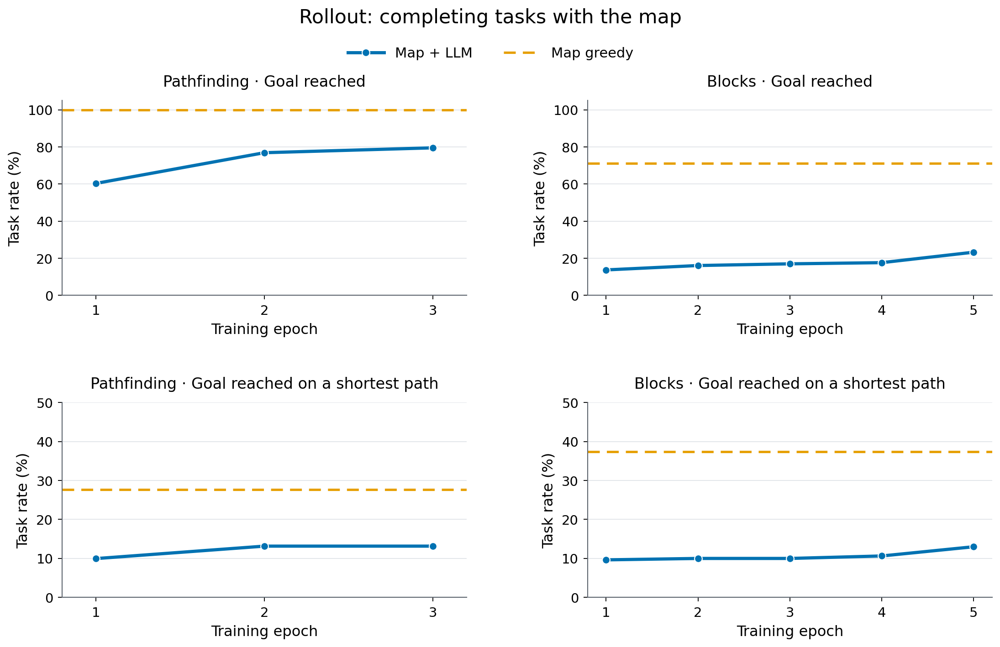
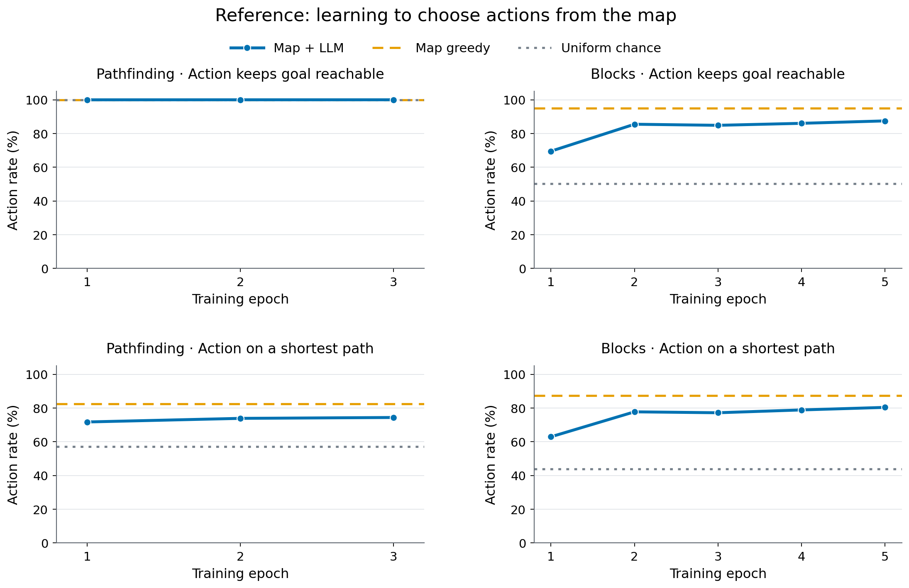
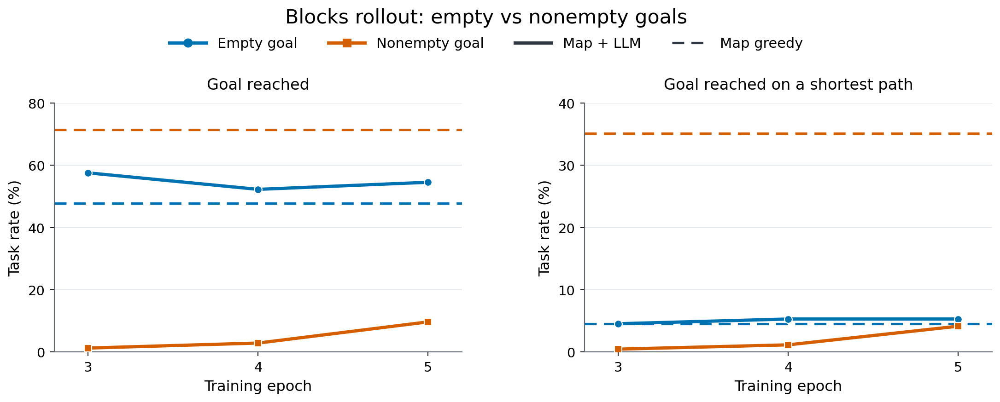
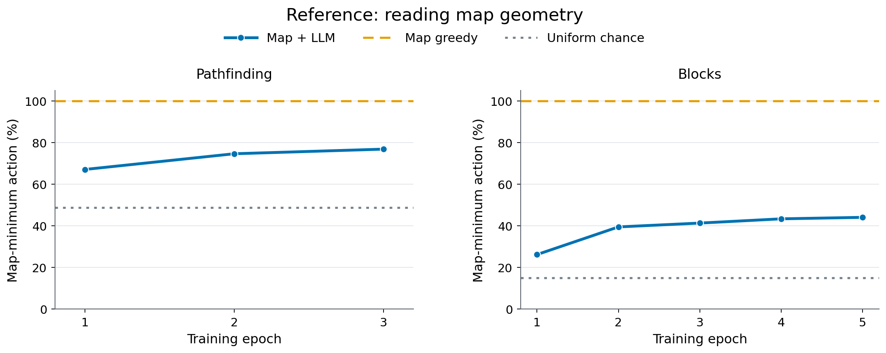

# 完整长轨迹 SFT：结果

**当前主结果：寻路 final validation 到达率为 79.5%、到达且最短路率为 13.2%。积木 epoch 5 的 reference 动作可达率为 87.5%，自主 rollout 到达率为 23.3%，排除初始即目标后为 15.6%。积木清空目标的到达率为 54.5%，非清空目标仅 9.7%；参考状态下的一步能力、不同目标的完整任务能力和自身轨迹上的风险累积必须分别判断。**

结果快照：2026-10-06（北京时间），运行 `long_f73b700_20261004`。积木 epoch 1–5 validation 已齐；主表更新到 epoch 5，目标分层与闭环分析分别见第 4、5 节。最终 checkpoint 的 Q 倒序 reference 已完整验收，见第 7 节；积木安全前缀 rollout 仍在运行，最终 test 尚未收齐。no_map 已按用户决定停止。epoch 1–4 原有证据见[运行摘要](long_trajectory_summary.json)，epoch 3–5 复核与新增结果见[逐轮证据](blocks_rollout_turn_analysis.json)和[目标分层证据](blocks_target_analysis.json)，协议见[设计页](../DESIGN.md)。

**本轮读取接口只有一种结构。**角色与编号作为 attention 的 K（寻址），Q 的投影作为 V（状态内容），门控随训练更新；状态值尺度 `value_scale` 与固定门控 `fixed_gate_tanh` 都取默认值，不生效。此前的混合 K/V、固定门控、关系 token 加权与状态值尺度校准都不参与下面任何读数，逐条对照见[失败变体清单](archive/abandoned_readout_variants.md)。

## 1. 四个主指标

本实验的目标是：**冻结 LLM 和地图，通过训练读取接口，让 LLM 学会读取地图并利用它选择动作、完成任务。**因此，报告分别检查选择是否符合地图几何（第 7 节）、参考状态下能否选对动作（第 3 节），以及自行执行后能否完成整条任务（第 2 节）。学习曲线展示训练中的变化；地图内容是否实际影响动作，则由最终 checkpoint 的 Q 倒序干预补充判断。

| 模式 | 主指标 | 判定与分母 |
|---|---|---|
| rollout：执行模型动作，保留自己的历史 | 到达率 | 到达目标的案例数／全部案例数 |
| rollout | 到达且最短路率 | 到达目标且实际步数等于环境最短距离的案例数／全部案例数 |
| reference：每轮给示范历史，模型回答不执行 | 动作可达率 | 选中合法动作后目标仍可达的轮数／作答前可解的决策轮数 |
| reference | 最短路动作率 | 选中动作使剩余最短距离减少 1 的轮数／同一批作答前可解决策轮数 |

最短路可能有多条，积木也可能有多种同样短的移除序列；**选中任意最优动作或走出任意最短解都算正确，不要求匹配唯一示范**。reference 的最短路动作是可行动作的子集；非法动作或未给出动作仍计错。rollout 的两项主指标不额外要求正确输出停止，总结与停止另列辅助诊断。

初始即目标任务只进入 rollout 的零步任务统计与终止诊断，不进入 reference 决策轮分母。reference 排除作答前已有死局，并保留全部轮次的原始计数供核对。百分比保留一位小数，精确值见摘要。

rollout 额外报告**动作可达率**：选中合法动作后目标仍可达的轮数／作答前可解的决策轮数。排除作答前已无解及终止轮；在可解状态上输出非法动作、格式错误或提前停止仍计错。它衡量模型自身历史下的一步选择，作为四个主指标之外的补充。

下面四张图均以训练 epoch 为横轴，只使用已完成的 validation：寻路 epoch 1–3、积木 epoch 1–5，目标分层仅有 epoch 3–5。圆点和实线表示模型，地图贪心用虚线、均匀随机 chance 用灰色点线；清空／非清空用颜色和点形区分，避免把不同分母的指标混在一张坐标轴上。原表继续保留精确计数与辅助诊断。

**辅助线是参照，不是严格上下界。**reference 的随机线是在同一批状态上逐轮均匀选择合法候选的期望；地图贪心使用这些状态中原示范的固定动作及并列选择。rollout 的贪心线来自同一批完整任务，尚无完整随机 rollout 数据，因此不画随机任务成功率。图的数据、绘图依据与复现入口见[图表说明](figures/README.md)。

## 2. 主结果：长程 rollout



*图 1．完整任务的两项主指标；左右分别为寻路与积木，上下分别为到达率与到达且最短路率。各任务含初始即目标案例；同一行共享纵轴范围，最短路率一行显示 0–50%。[矢量 PDF](figures/rollout_learning_curves.pdf)。*

### 寻路 final：validation 全部完成

| 范围 | 题数 | 到达率 | 到达且最短路率 |
|---|---:|---:|---:|
| 全部 validation | 532 | 423/532（79.5%） | 70/532（13.2%） |
| 非零步新目标任务 | 500 | 391/500（78.2%） | 38/500（7.6%） |
| 初始即目标 | 32 | 32/32（100.0%） | 32/32（100.0%） |

validation 涉及 32 个未作训练目标的节点、532 个物理任务；目标节点可能以 current／successor 出现在训练中，因此这是同图新目标泛化。每题 1 套编号。闭环与 reference 访问的状态不同，逐轮指标不直接相减来解释错误累积。

### 积木：epoch 1–5 全部完成

| checkpoint | 全部 validation 到达率 | 到达且最短路率 | 非零步新目标任务 | 初始即目标 |
|---|---:|---:|---:|---:|
| epoch 1 | 151/1,100（13.7%） | 106/1,100（9.6%） | 51/1,000（5.1%） | 100/100（100.0%） |
| epoch 2 | 177/1,100（16.1%） | 110/1,100（10.0%） | 77/1,000（7.7%） | 100/100（100.0%） |
| epoch 3 | 187/1,100（17.0%） | 110/1,100（10.0%） | 87/1,000（8.7%） | 100/100（100.0%） |
| epoch 4 | 194/1,100（17.6%） | 117/1,100（10.6%） | 94/1,000（9.4%） | 100/100（100.0%） |
| epoch 5（final） | 256/1,100（23.3%） | 143/1,100（13.0%） | 156/1,000（15.6%） | 100/100（100.0%） |

非零步组再按棋盘分（到达率）：

| 组 | 题数 | epoch 1 | epoch 2 | epoch 3 | epoch 4 | epoch 5 |
|---|---:|---:|---:|---:|---:|---:|
| 训练棋盘新任务 | 500 | 19/500（3.8%） | 29/500（5.8%） | 37/500（7.4%） | 40/500（8.0%） | 73/500（14.6%） |
| 新棋盘 | 500 | 32/500（6.4%） | 48/500（9.6%） | 50/500（10.0%） | 54/500（10.8%） | 83/500（16.6%） |

初始即目标组 100 题五个 epoch 均满分，贡献整体到达率的 9.1 个百分点。非零步到达率为 5.1%→7.7%→8.7%→9.4%→15.6%；epoch 5 比 epoch 4 提升 6.2 个百分点，仍远低于参考状态下的一步动作可达率。下面先看 reference，再按目标类型分层，并分析闭环怎样累积失败风险。

失败构成（epoch 3：1,100 个 episode）：模型宣称到达但目标已不可达 781（71.0%）、非法动作 913/9,185 个决策轮（9.9%）、格式错误 28/9,372 个回答段（0.3%）、真正成功 180（16.4%）；epoch 4 同类计数为 766、906/9,085（10.0%）、14/9,279（0.2%）、187（17.0%）。此前按首个分片报出的 3/64（4.7%）是 epoch 3 的一个低抽样分片，已被完整的 18 分片读数取代，此处不再保留为头条。

### 补充：rollout 动作可达率

以下均为完整 validation，分母随模型实际轨迹变化。

| 任务／checkpoint | 保住可达／作答前可解决策轮 | 动作可达率 | 排除的已无解决策轮 |
|---|---:|---:|---:|
| 寻路 epoch 1 | 12,023/12,037 | 99.9% | 4 |
| 寻路 epoch 2 | 10,401/10,406 | 100.0% | 2 |
| 寻路 final（epoch 3） | 10,176/10,182 | 99.9% | 0 |
| 积木 epoch 1 | 1,781/2,730 | 65.2% | 6,905 |
| 积木 epoch 2 | 1,907/2,830 | 67.4% | 6,344 |
| 积木 epoch 3 | 1,972/2,885 | 68.4% | 6,300 |
| 积木 epoch 4 | 2,212/3,118 | 70.9% | 5,967 |
| 积木 epoch 5（final） | 3,014/3,858 | 78.1% | 4,986 |

旧评测在提前退出或动作预算耗尽时可能漏写逐轮可达性字段。epoch 1–4 原表从已保存的状态、回答和候选编号离线补齐 446 个可解决策轮，epoch 5 另补齐 12 轮，当前分母无缺失；预算末轮已给出但未执行的动作也按选择评分，不改变实际轨迹及到达率。原始分片保持不变，补算记录见证据摘要。

## 3. 主结果：reference 动作选择



*图 2．同一批参考状态下的两项动作主指标；左右为任务，上下为动作可达率与最短路动作率。寻路可达率接近 100%，区分度主要来自最短路动作率；积木的两项能力均随接口训练明显改善。[矢量 PDF](figures/reference_learning_curves.pdf)。*

### 寻路

train 为固定 256 题、3,004 个可解决策轮；validation 为全部 532 题、6,140 个可解决策轮。每题 1 套编号，checkpoint 间状态相同。初始 checkpoint 的 2 题仅作通路检查，不进入同题比较。

| checkpoint | train 动作可达率 | train 最短路动作率 | validation 动作可达率 | validation 最短路动作率 |
|---|---:|---:|---:|---:|
| step 128 | 85.0% | 47.3% | — | — |
| epoch 1 | 100.0% | 72.6% | 100.0% | 71.7% |
| epoch 2 | 100.0% | 73.2% | 100.0% | 73.9% |
| final（epoch 3） | 99.9% | 74.0% | 100.0% | 74.4% |

这批参考状态中，均匀随机选择合法动作的可达率也是 100%；因此寻路可达率本身区分度很低，要结合最短路动作率、闭环到达与地图使用对照判断。

### 积木

train 为固定 256 题、1,799 个可解决策轮；validation 为全部 1,100 题中的 **6,409 个可解决策轮**。另外 1,833 个参考决策轮在作答前已经不可达，不纳入下面两项主指标；它们不是模型本轮选择造成的失败。

| checkpoint | train 动作可达率 | train 最短路动作率 | validation 动作可达率 | validation 最短路动作率 |
|---|---:|---:|---:|---:|
| epoch 1 | 68.4% | 62.5% | 69.5% | 62.9% |
| epoch 2 | 86.7% | 79.5% | 85.5% | 77.7% |
| epoch 3 | 87.4% | 80.8% | 84.9% | 77.2% |
| epoch 4 | 89.5% | 82.5% | 86.1% | 78.9% |
| epoch 5（final） | — | — | 87.5% | 80.4% |

逐轮均匀随机的动作可达率：train 为 48.6%，validation 为 50.3%。epoch 2 起 validation 稳定在 85% 附近（epoch 3 比 epoch 2 低 0.6 个百分点），train 则继续缓慢上升，两者之差从 epoch 2 的 1.2 个百分点扩大到 epoch 3 的 2.5 个百分点。这些是正确参考历史下的一步判断，不能直接推算完整任务成功率——同一 checkpoint 的闭环到达率见第 2 节。

epoch 5 validation reference 已收齐 18/18 分片：6,409 个可解决策轮中，5,607 次动作保住可达，5,151 次为最短路动作。final train 诊断尚未收齐，因此不填训练列。

| validation 分组／epoch | 可解决策轮 | 动作可达率 | 最短路动作率 |
|---|---:|---:|---:|
| 训练棋盘新任务，epoch 1 | 3,215 | 69.5% | 63.6% |
| 训练棋盘新任务，epoch 2 | 3,215 | 85.0% | 78.0% |
| 训练棋盘新任务，epoch 3 | 3,215 | 84.7% | 78.2% |
| 训练棋盘新任务，epoch 4 | 3,215 | 86.6% | 80.4% |
| 训练棋盘新任务，epoch 5 | 3,215 | 87.5% | 81.4% |
| 新棋盘，epoch 1 | 3,194 | 69.6% | 62.3% |
| 新棋盘，epoch 2 | 3,194 | 86.0% | 77.4% |
| 新棋盘，epoch 3 | 3,194 | 85.0% | 76.2% |
| 新棋盘，epoch 4 | 3,194 | 85.5% | 77.3% |
| 新棋盘，epoch 5 | 3,194 | 87.4% | 79.3% |

两类留出组在所有 epoch 上点估计都接近（epoch 3 相差 0.3 个百分点），当前未显示新棋盘组明显更差；这不证明棋盘曝光没有影响。注意最短路动作率上，新棋盘组在 epoch 3 反而低于训练棋盘组 2.0 个百分点，方向与动作可达率相反，样本量下不宜解读为趋势。

## 4. 积木目标分层：清空与非清空

**清空任务到达率高于需要精确保留目标占据格的非清空任务；它们应分别报告。**清空定义为 `goal=0`，非清空为 `goal!=0` 且 `start!=goal`；初始即目标单列，不并入任何动作任务的成功率。训练和评测的目标构成见 [DESIGN 第 2 节](../DESIGN.md#2-数据范围与实际数量)，完整计数见[目标分层证据](blocks_target_analysis.json)。

validation 的 1,000 个非零步任务包括清空 132 题、非清空 868 题。相同物理任务在各 checkpoint 之间比较：



*图 3．清空为蓝色圆点，非清空为朱红色方点；相同颜色的虚线为该目标组的地图贪心。仅比较非零步任务。非清空在 epoch 5 明显改善，仍与贪心参照有较大差距；清空的到达率未单调上升。[矢量 PDF](figures/blocks_goal_learning_curves.pdf)。*

| checkpoint | 清空闭环到达 | 非清空闭环到达 |
|---|---:|---:|
| epoch 3 | 76/132（57.6%） | 11/868（1.3%） |
| epoch 4 | 69/132（52.3%） | 25/868（2.9%） |
| epoch 5（final） | 72/132（54.5%） | 84/868（9.7%） |

epoch 4→5 的非零步成功增加 62 题，其中非清空增加 59 题、清空增加 3 题。清空成绩并未随 epoch 单调上升，不能把整体改善概括为两类任务共同改善。

| epoch 5 validation | 清空 | 非清空 |
|---|---:|---:|
| 到达且最短／物理任务 | 7/132（5.3%） | 36/868（4.1%） |
| reference 动作可达率 | 696/764（91.1%） | 4,911/5,645（87.0%） |
| reference 最短路动作率 | 589/764（77.1%） | 4,562/5,645（80.8%） |
| rollout 动作可达率（作答前可解） | 756/816（92.6%） | 2,258/3,042（74.2%） |
| rollout 同状态逐轮随机参照 | 61.7% | 43.4% |
| 地图贪心到达／同一批任务 | 63/132（47.7%） | 620/868（71.4%） |

清空条件的 reference 和 rollout 一步可达率接近，但非清空条件从参考历史下的 87.0% 降至自身历史下的 74.2%。清空时也可能留下无法按规定形状移除的残余棋盘，因此并非任意合法动作都能成功；非清空还必须保留指定占据格，一旦误删就无法补回。两类任务的随机可达参照本身不同，不能只把差异解释为地图读取能力。

首轮也体现目标约束的差异：清空／非清空平均合法候选数几乎相同（62.8／62.0），但 rollout 动作可达率为 115/132（87.1%）／588/868（67.7%），相应随机参照为 65.7%／46.8%。因此早期失败除了候选数量，还需要考虑哪些移除会破坏目标与剩余结构；“首轮候选多”不足以单独解释这两类任务的差距。

按初始棋盘来源再分，epoch 5 清空到达率为训练棋盘新任务 25/55（45.5%）、新棋盘 47/77（61.0%）；非清空分别为 48/445（10.8%）、36/423（8.5%）。清空优于非清空的方向在两类棋盘都成立，并非初始即目标或棋盘分组混入造成。

训练的 8,000 个非零步任务中清空仅占 779（9.7%），非清空占 7,221（90.3%），所以清空高成绩不来自更多训练题。清空目标只有一个固定状态，非清空训练目标则有 5,238 个不同状态；validation 非清空也有 747 个不同目标。两者同时改变目标多样性、状态约束与可行动作比例，不是匹配难度的单因素比较。地图贪心在非清空反而更好（71.4% vs 清空 47.7%），说明现有地图具备读图模型尚未兑现的非清空任务能力；清空模型的点估计超过贪心，也不能直接归因于地图增益。第 7 节的 Q 倒序补充地图内容依赖证据，但未测量完整闭环的全部地图净收益。

最终 test 有清空 272、非清空 1,728、初始即目标 200 题；模型完整结果尚未收齐，本节不以 validation 替代 test 结论。

## 5. 闭环差距：闭环承担动作后果，风险沿轨迹累积

**闭环与 reference 的关键区别是：rollout 必须承担自己每次动作的真实后果，风险会沿整条轨迹累积；reference 的下一轮则由示范历史推进，不继承模型上次回答造成的状态后果。**首轮双方都没有旧的示范历史，epoch 5 动作可达率也接近（70.3%／70.1%）。首轮是闭环损失最多的一轮，之后即使条件动作可达率总体改善，仍会持续失去可解任务。候选数随任务推进减少，是理解这一过程的辅助线索。

本节补充快照为 **2026-10-06（北京时间）**。使用同一运行的积木 epoch 3、4、5，每个 checkpoint 的 validation rollout／reference 均收齐 18/18 分片、1,100 个物理任务，每题 1 套编号。epoch 5 为真正的 `final`（245,000 步）；完整计数、分片范围和分层结果见[逐轮证据](blocks_rollout_turn_analysis.json)。轮次从 **1** 开始；原始字段 `turn=0` 对应第一轮。

每轮动作可达率仍按“选择后保住目标可达／作答前仍可解的非终止决策轮”计算。非法动作、格式错误或提前停止计错；作答前已有死局及终止回答不进入分母。沿用证据汇总器的状态回放，分别补齐 epoch 3、4、5 rollout 的 6、3、12 个缺失决策轮，未改写原始分片，也未重新生成回答。随机参照先计算每个可解状态的可行候选比例，再对同一轮的状态取平均，不能用候选槽位加权比例替代。

#### 每一轮的动作可达率（epoch 5）

| 轮次 | rollout 保住可达／作答前可解 | rollout 动作可达率 | rollout 已无解轮（排除） | rollout 平均候选数 | rollout 随机参照 | reference 保住可达／作答前可解 | reference 动作可达率 |
|---|---:|---:|---:|---:|---:|---:|---:|
| 1 | 703/1,000 | 70.3% | 0 | 62.1 | 49.3% | 701/1,000 | 70.1% |
| 2 | 551/703 | 78.4% | 290 | 48.0 | 47.1% | 764/903 | 84.6% |
| 3 | 431/551 | 78.2% | 442 | 36.8 | 45.2% | 722/826 | 87.4% |
| 4 | 345/431 | 80.0% | 562 | 27.8 | 44.4% | 664/752 | 88.3% |
| 5 | 288/345 | 83.5% | 648 | 20.3 | 44.0% | 660/720 | 91.7% |
| 6 | 242/288 | 84.0% | 705 | 14.1 | 43.3% | 659/703 | 93.7% |
| 7 | 193/242 | 79.8% | 749 | 9.1 | 43.4% | 648/686 | 94.5% |
| 8 | 148/172 | 86.0% | 772 | 5.4 | 52.3% | 530/556 | 95.3% |
| 9 | 86/98 | 87.8% | 604 | 3.1 | 65.4% | 232/236 | 98.3% |
| 10 | 26/27 | 96.3% | 198 | 1.6 | 80.2% | 24/24 | 100.0% |
| 11 | 1/1 | 100.0% | 16 | 1.0 | 100.0% | 3/3 | 100.0% |

epoch 5 rollout 共 8,844 个非终止决策轮，其中 4,986 轮作答前已无解。**不能把这些已无解轮继续计作后续动作错误**，也不能把晚轮分母缩小全部解释为死亡：部分任务已经到达并转入终止回答。第 10、11 轮只有 27、1 个可解状态，其高比例只作描述，不作为稳定的后期能力结论。

#### 首次进入死局：首轮损失最大，但错误还会继续累积

积木只允许移除，合法移除一旦令目标不可达，后续移除无法补回目标。epoch 5 的 1,000 个非零步任务里，156 个到达，844 个未到达；其中 **832 个实际执行过首次破坏可达性的合法动作**，占未到达任务的 98.6%。其余 12 个在可解状态上因无效输出或停止等退出。这里的“首次死局”只统计实际执行的合法移除，不把非法动作当成状态已经死亡。

首轮有 **290/1,000（29.0%）** 的任务直接进入死局，另有 7 个无效选择；290 个占全部 832 个首次死局的 **34.9%**。前两轮、前三轮累计首次死局分别为 442、562 个，前三轮占 **67.5%**。这定位了“**首轮是最大单轮瓶颈，前三轮的不可逆错误累积更关键**”。

风险累积可以直接从同一批任务读出：首轮 703/1,000 保住可达，第二轮留下 551/703，第三轮留下 431/551，所以前三轮连续保住可达的比例为 **(703/1,000)×(551/703)×(431/551)=43.1%**。这使用沿真实轨迹观测到的条件比例，不假设各轮错误独立。虽然第二、三轮单步可达率都约 78%，前三轮之后已经只剩 431/1,000 个任务仍可解。reference 在同一轮答错，并不会让其下一轮改走模型造成的死局。

| checkpoint | 首轮 rollout／reference 可达率 | 首轮直接死局／1,000 题 | 首次死局发生于前三轮／全部首次死局 | 非零步闭环到达 |
|---|---:|---:|---:|---:|
| epoch 3 | 59.0%／59.0% | 405/1,000（40.5%） | 723/907（79.7%） | 87/1,000（8.7%） |
| epoch 4 | 61.0%／60.6% | 388/1,000（38.8%） | 684/903（75.7%） | 94/1,000（9.4%） |
| epoch 5 | 70.3%／70.1% | 290/1,000（29.0%） | 562/832（67.5%） | 156/1,000（15.6%） |

首轮改善与闭环到达改善同时出现，是重要线索，但这些 checkpoint 的所有轮次都在变化，不能把 epoch 5 的全部收益归因于首轮。epoch 5 整体到达为 256/1,100（23.3%），其中包含 100 个初始即目标任务；到达且最短为 143/1,100（13.0%）。

#### 候选数量减少后，选择是否更有效？

epoch 5 rollout 的全部可解状态按候选数分层如下。“选择地图最优”指选中全部合法候选中的任意地图距离最小动作；它衡量动作与地图的一致性，不是地图的因果增益。

| 合法候选数 | 可解决策轮 | 动作可达率 | 同状态随机参照 | 选择地图最优 |
|---|---:|---:|---:|---:|
| 1–10 | 564 | 480/564（85.1%） | 52.7% | 64.7% |
| 11–20 | 551 | 450/551（81.7%） | 41.2% | 35.0% |
| 21–40 | 1,042 | 830/1,042（79.7%） | 43.4% | 23.9% |
| 41–60 | 1,031 | 767/1,031（74.4%） | 47.4% | 20.0% |
| 61 及以上 | 670 | 487/670（72.7%） | 53.5% | 13.9% |

这支持“**较少候选的状态上，模型选得更有效，也更符合地图最优动作**”的描述。按轮次看，平均候选从首轮 62.1 降至第六轮 14.1，动作可达率从 70.3% 升至 84.0%，同期随机参照反而从 49.3% 降至 43.3%；因此前六轮的改善不能简单解释为剩余合法动作天然更安全。但第七轮可达率回落至 79.8%，表明“候选减少→可达率提高”不是逐轮单调规律。

候选数也不能单独解释首轮瓶颈：**仅在首轮内**，21–40、41–60、61 及以上候选组的可达率分别为 30/43（69.8%）、294/419（70.2%）、379/538（70.4%），未呈现候选越多越差的梯度。同样有 41–60 个候选时，首轮为 70.2%，第 2–3 轮为 431/563（76.6%），第 4 轮以后为 42/49（85.7%）；这些也仍是不同状态之间的描述性比较。完整证据另保留轮次×候选数及剩余最短距离×候选数分层，避免将轮次、任务进度和候选数当成同一因素。

#### 为什么 reference 好，rollout 仍弱？

**reference 使用示范历史，把模型带到后续参考状态；rollout 必须靠自己的每一次选择保住可达性。**两种评测的 1,000 个非终止初始状态相同，首轮也都没有旧的示范回答；首轮率相近符合这一设置，但不表示逐题选择一致，也不把这两组当作完全匹配的提示／编号消融。第 2–7 轮 reference 的可达率比 rollout 高约 6–15 个百分点，即使 rollout 当前仍可解，它也已经处在不同的棋盘和回答历史上。后续状态的差异、自身回答历史的偏离及存活筛选，都可能影响条件动作可达率；与“任何一步的不可逆错误都会令完整任务失败”的累积风险应分别理解。示范自身也可能走入死局，因此 reference 的 1,833 个作答前无解决策轮同样排除，但不会将模型此前自由回答产生的错误叠加到示范状态上。

两者的总体逐轮平均还受权重影响：首轮低可达率状态占 rollout 可解决策轮的 1,000/3,858（25.9%），占 reference 的 1,000/6,409（15.6%）。将 reference 各轮可达率按 rollout 的可解决策轮数重新加权，参考值由 87.5% 降为 **84.5%**，仍高于 rollout 的 **78.1%**。这只是轮次组成的描述性标准化，没有匹配同一后续状态，不能作因果分解。

**当前证据支持把研究重点放在早期不可逆选择和自身历史下的连续决策。**“多候选干扰读取”是与总体分层结果一致、但首轮内部尚未支持的机制假设。第 7 节补充了同状态 Q 倒序证据；其按候选数分层的差异仍混合状态难度，要检验“候选少时地图帮助更大”的单因素机制，还需要在同一物理状态上改变候选呈现的受控实验。后期可达率升高还混合了任务变简单与存活筛选，不能只归因于更好地利用地图。

复现命令（只读已完成案例，输出紧凑摘要；不会启动评测）：

```bash
python -m experiments.flamingo_map_reader.src.analyze_rollout_turns \
  --run-root RUN --out experiments/flamingo_map_reader/results/blocks_rollout_turn_analysis.json
```

## 6. 地图贪心参照：按相同任务范围比较

清单中的 `greedy_baseline` 是固定地图加贪心动作选择器的成绩，**不是所有读图模型的上限**：并列时的选择、非贪心策略及文字信息都可能改变轨迹。训练题经过贪心成功筛选，训练到达率 100% 是数据构造条件；留出题没有此筛选。

| 任务／留出范围 | 题数 | 地图贪心到达 | 到达且最短 |
|---|---:|---:|---:|
| 寻路 validation 全部 | 532 | 532/532（100.0%） | 147/532（27.6%） |
| 寻路 test 全部 | 1,032 | 1,032/1,032（100.0%） | 232/1,032（22.5%） |
| 积木 validation 全部 | 1,100 | 783/1,100（71.2%） | 411/1,100（37.4%） |
| 积木 test 全部 | 2,200 | 1,549/2,200（70.4%） | 839/2,200（38.1%） |
| 积木 validation 训练棋盘新任务 | 500 | 338/500（67.6%） | 172/500（34.4%） |
| 积木 validation 新棋盘 | 500 | 345/500（69.0%） | 139/500（27.8%） |
| 积木 test 训练棋盘新任务 | 1,000 | 655/1,000（65.5%） | 335/1,000（33.5%） |
| 积木 test 新棋盘 | 1,000 | 694/1,000（69.4%） | 304/1,000（30.4%） |

整体成绩含初始即目标任务；非零步 group 应与对应 group 比较。逐题“到达且最短”也不能与逐轮“环境最短路动作”互换。积木两类留出组的贪心成绩相近，但不能据此断言失败与棋盘是否见过无关。

## 7. 地图使用证据：以动作与对照为主

动作落入地图最小候选集合，说明选择与地图几何一致；接受集合中的任意动作，不要求复现某一个并列示范。它是读图的动作诊断，不替代上面的任务主指标。



*图 4．参考状态下选择地图最优动作的比例，分母为全部非终止决策轮，积木包含示范历史已死局状态。贪心的 100% 由指标定义决定；随机线计入地图最优候选的全部并列项。曲线上升说明与地图几何的动作一致性改善，地图依赖的因果证据见下方 Q 倒序实验。[矢量 PDF](figures/map_reading_learning_curves.pdf)。*

| 任务／checkpoint | train 选择地图最优 | validation 选择地图最优 |
|---|---:|---:|
| 寻路 epoch 1 | 69.2% | 67.1% |
| 寻路 epoch 2 | 77.0% | 74.6% |
| 寻路 final（epoch 3） | 78.7% | 76.8% |
| 积木 epoch 1 | 25.9% | 26.2% |
| 积木 epoch 2 | 40.5% | 39.5% |
| 积木 epoch 3 | 43.2% | 41.3% |
| 积木 epoch 4 | 45.7% | 43.4% |
| 积木 epoch 5（final） | — | 44.1% |

上表沿用全部参考决策轮分母，因为已有死局仍可评价地图一致性。积木的地图一致率（epoch 3 validation 41.3%）远低于同期动作可达率（84.9%），两者不矛盾：可达动作通常远多于地图最优动作，因此该列不能当作“是否用图”的主指标。下面的同状态 Q 倒序提供地图内容干预证据；长排序是更强的辅助输出要求，不能以其成败代替“能否选择有效动作”的判断。

### 最终 checkpoint Q 倒序：完整 reference 验收

2026-10-06 完整结果：寻路 epoch 3 为 532 题／6,140 个可解决策轮，积木 epoch 5 为 1,100 题／6,409 个可解决策轮。终止轮与示范历史已死局轮排除；正常回答直接复用 final validation reference 的同题、编号版本 0，不重新生成。仅将当前轮候选后继 Q 按目标地图距离从近到远的顺序反向分配；current、goal、候选编号、动作、文字与此前示范历史不变。下一轮恢复原始地图，倒序回答不进入历史，详见 [DESIGN 第 8 节](../DESIGN.md#8-最终-checkpoint-诊断先-reference-q-倒序再-rollout-早期干预)。

| 任务／范围 | 可解决策轮 | 正常 Q 动作可达率 | 倒序 Q 动作可达率 | 正常 Q 最短路动作率 | 倒序 Q 最短路动作率 |
|---|---:|---:|---:|---:|---:|
| 寻路全部 | 6,140 | 6,140/6,140（100.0%） | 6,140/6,140（100.0%） | 4,567/6,140（74.4%） | 4,387/6,140（71.4%） |
| 积木全部 | 6,409 | 5,607/6,409（87.5%） | 3,630/6,409（56.6%） | 5,151/6,409（80.4%） | 3,364/6,409（52.5%） |
| 积木清空 | 764 | 696/764（91.1%） | 173/764（22.6%） | 589/764（77.1%） | 138/764（18.1%） |
| 积木非清空 | 5,645 | 4,911/5,645（87.0%） | 3,457/5,645（61.2%） | 4,562/5,645（80.8%） | 3,226/5,645（57.1%） |
| 积木首轮 | 1,000 | 701/1,000（70.1%） | 318/1,000（31.8%） | 652/1,000（65.2%） | 278/1,000（27.8%） |

**积木的候选 Q 内容对动作选择有实质作用。**倒序使可达率降低 30.8 个百分点；配对中正常可达、倒序不可达有 2,182 轮，反方向有 205 轮。动作合法率仍为 99.8%／99.9%，说明主要差异是选了哪个合法动作，而非输出协议崩溃。积木改变物理动作 4,297/6,409（67.0%），寻路为 2,148/6,140（35.0%）。寻路可达率本就没有区分度，最短路动作率下降 2.9 个百分点；它对这一候选 Q 错配更稳健，但 current 与 goal Q 仍保留，不能据此推断不使用地图。

清空的变化尤其明确：倒序后仍选择原地图最优动作仅 46/764（6.0%），选择被赋予倒序后最近 Q 的动作为 461/764（60.3%），与正常 Q 的地图最优选择 474/764（62.0%）接近。这符合模型随给定地图内容改变选择的机制。非清空仍有 25.8 个百分点的可达率损失，因此非清空闭环弱不能概括为完全不读取地图；其倒序后选择呈现地图最优仅 739/5,645（13.1%），说明选择还涉及其他信息或不完全的地图读取。

这里的差值是**候选 Q 错配的影响**，不等同于关闭全部地图的信息收益。干预有意制造文字与地图矛盾，仍保留 current／goal Q 和历史示范中的排序；两任务还具有不同状态、候选数和随机可达参照。按候选数、轮次的分层保留在证据中，但不能直接用跨层差值证明候选数量的单独因果作用。

验收逐条核对 12,549 个 reference 配对轮的物理状态、正常回答复用、距离倒序来源、候选编号与评分，并复核原始分片计数和发布摘要。距离顺序未变的寻路 12 轮、积木 396 轮均未改变物理动作，作为复用对照一致性的附加检查。[验收证据](final_diagnostic_acceptance.json)记录完整计数；[只读验收脚本](../src/audit_diagnostics.py)不进行模型推理。

### 积木早期安全前缀：部分分片验收，完整结论待收齐

同一验收快照中，辅助第 1 步已验证 14/35 个完成分片、448/1,100 题及 3,995 个回答轮；448 次辅助执行均为真实最短且可达动作，交还模型前均仍可解。模型自身回答保留，实际棋盘与动作反馈随辅助执行更新。已完成分片到达 92/448，对应**同一批题**的原 rollout 为 67/448；这批任务没有零步任务，不能与全量 1,100 题成绩直接比较，也不能作为完整效果结论。辅助第 2、3 步在该快照尚未开始；全量三组结果收齐后再进行正式比较。

## 8. 尚未收齐的 test 与地图对照

“—”表示尚未收录完整结果，不是 0%。以下条件尚未收齐，不发布部分分片的全量成绩；跨机器按任务／checkpoint／划分／模式／地图开关／分片范围去重，不平均分片百分比。

### final test 与已停止的 no_map

| reference | 地图开关 | 物理任务／编号案例 | 可解决策轮 | 动作可达率 | 最短路动作率 |
|---|---|---:|---:|---:|---:|
| 寻路 | map | 1,032／6,032 | — | — | — |
| 寻路 | no_map | 1,032／1,032 | — | — | — |
| 积木 | map | 2,200／12,200 | — | — | — |
| 积木 | no_map | 2,200／2,200 | — | — | — |

| rollout | 地图开关 | 物理任务／编号案例 | 到达率 | 到达且最短路率 | 动作可达率（可解轮） |
|---|---|---:|---:|---:|---:|
| 寻路 | map | 1,032／6,032 | — | — | — |
| 寻路 | no_map | 1,032／1,032 | — | — | — |
| 积木 | map | 2,200／12,200 | — | — | — |
| 积木 | no_map | 2,200／2,200 | — | — | — |

map 的非零步任务各 6 套编号，初始即目标仅 1 套。no_map 原计划各 1 套，但其实际实现会跳过整个训练后的地图接口，退回冻结底座；2026-10-06 已按用户决定停止，表中 no_map 的「—」表示取消后没有正式成绩。当前优先级转为第 7 节的 Q 内容干预与积木早期安全 rollout，不等待 no_map 补齐。最终 test 仍不完整。

| 动作配对诊断 | 寻路（分子／分母） | 积木（分子／分母） |
|---|---|---|
| 重编号后选择同一物理动作 | —／— | —／— |
| 同起点不同真实目标，两题均选地图最优 | —／— | —／— |

配对诊断在合并完整 cases 后计算，保留跨分片配对；“两题均正确”是行为证据，不能单独证明地图的因果作用。这两行之所以为空而不是 0：重编号配对要求同一题有多套编号，而 validation 电池每题只跑了 1 套（`variants = 1`），可比轮数为 0；真实目标替换电池本轮尚未运行。地图失败状态的候选排序探针、全体候选与环境可行性的对应关系仍待分析。

## 9. 辅助诊断：排序、集合与输出协议

下表用于定位读取或表达错误，不进入任务主结果，也不以长排序全对作为动作选择学会与否的判据。积木排序只覆盖应报告的 Top-10 加 current。`valid_ranking` 同时要求可解析且名单齐全；名单不齐时，评分把全部应比较关系计错。因此逐对分数也包含候选筛选失败，不能直接读成单纯的两两比较能力。

本节辅助表保留原 epoch 1–4 快照；epoch 5 的动作与完整任务主指标已更新在第 2–5 节，不能将下面的旧诊断表当作 final 成绩。

### reference 排序与集合

| 任务／划分 | checkpoint | 列齐排序项 | 排序全对 | 最近集合正确 | 逐对关系正确 | current 关系正确 |
|---|---|---:|---:|---:|---:|---:|
| 寻路 train | step 128 | 80.3% | 22.4% | 39.5% | 37.5% | 39.5% |
| 寻路 train | epoch 1 | 100.0% | 48.1% | 69.2% | 67.5% | 66.8% |
| 寻路 train | epoch 2 | 100.0% | 55.3% | 77.0% | 75.2% | 74.4% |
| 寻路 train | final（epoch 3） | 99.9% | 58.9% | 78.7% | 78.6% | 78.6% |
| 寻路 validation | epoch 1 | 100.0% | 47.4% | 67.1% | 66.4% | 66.1% |
| 寻路 validation | epoch 2 | 100.0% | 53.2% | 74.6% | 73.7% | 72.9% |
| 寻路 validation | final（epoch 3） | 100.0% | 56.2% | 76.8% | 77.0% | 76.8% |
| 积木 train | epoch 1 | 30.1% | 9.1% | 17.1% | 9.8% | 13.8% |
| 积木 train | epoch 2 | 32.2% | 10.7% | 22.5% | 13.4% | 17.5% |
| 积木 train | epoch 3 | 32.9% | 11.3% | 23.8% | 14.3% | 18.3% |
| 积木 train | epoch 4 | 33.2% | 11.7% | 24.6% | 14.9% | 18.9% |
| 积木 validation | epoch 1 | 31.9% | 7.3% | 18.8% | 10.6% | 14.5% |
| 积木 validation | epoch 2 | 32.7% | 8.5% | 22.7% | 13.0% | 17.2% |
| 积木 validation | epoch 3 | 33.6% | 9.7% | 23.6% | 14.1% | 18.2% |
| 积木 validation | epoch 4 | 33.5% | 9.6% | 23.7% | 14.4% | 18.7% |

### reference 控制与总结

控制格式以全部回答段为分母，合法动作以全部决策轮为分母，停止和总结只以真实终止段为分母。train／validation 的终止段分别为：寻路 256／532，积木 256／783。

| 任务／划分 | checkpoint | 控制格式 | 合法动作 | 到达后正确停止 | 总结正确 |
|---|---|---:|---:|---:|---:|
| 寻路 train | step 128 | 82.3% | 85.0% | 0.0% | 0.0% |
| 寻路 train | epoch 1 | 100.0% | 100.0% | 100.0% | 99.2% |
| 寻路 train | epoch 2 | 100.0% | 100.0% | 100.0% | 100.0% |
| 寻路 train | final（epoch 3） | 100.0% | 99.9% | 100.0% | 99.6% |
| 寻路 validation | epoch 1 | 100.0% | 100.0% | 98.9% | 98.1% |
| 寻路 validation | epoch 2 | 100.0% | 100.0% | 99.4% | 98.5% |
| 寻路 validation | final（epoch 3） | 100.0% | 100.0% | 98.3% | 97.2% |
| 积木 train | epoch 1 | 100.0% | 99.9% | 98.0% | 98.0% |
| 积木 train | epoch 2 | 100.0% | 100.0% | 100.0% | 100.0% |
| 积木 train | epoch 3 | 100.0% | 100.0% | 100.0% | 100.0% |
| 积木 train | epoch 4 | 100.0% | 99.9% | 100.0% | 99.6% |
| 积木 validation | epoch 1 | 99.9% | 99.7% | 97.3% | 96.3% |
| 积木 validation | epoch 2 | 99.9% | 99.5% | 99.5% | 98.2% |
| 积木 validation | epoch 3 | 99.9% | 99.5% | 99.0% | 98.3% |
| 积木 validation | epoch 4 | 99.9% | 99.6% | 99.1% | 98.7% |

### rollout 停止与总结

| 范围 | 到达且正确停止／全部题数 | 到达、最短且正确停止／全部题数 | 到达后的总结正确率 |
|---|---:|---:|---:|
| 寻路 epoch 1 validation | 316/532（59.4%） | 50/532（9.4%） | 83.8% |
| 寻路 epoch 2 validation | 408/532（76.7%） | 69/532（13.0%） | 90.0% |
| 寻路 final validation | 417/532（78.4%） | 68/532（12.8%） | 91.7% |
| 积木 epoch 1 validation | 145/1,100（13.2%） | 100/1,100（9.1%） | 90.1% |
| 积木 epoch 2 validation | 173/1,100（15.7%） | 106/1,100（9.6%） | 93.2% |
| 积木 epoch 3 validation | 180/1,100（16.4%） | 103/1,100（9.4%） | 92.0% |
| 积木 epoch 4 validation | 187/1,100（17.0%） | 110/1,100（10.0%） | 95.9% |

寻路主表的 70/532 是“到达且最短”，此处 68/532 还要求正确停止，两者分开保留。积木“到达且正确停止”采用 success 字段，与主表只要求到达的口径不同（epoch 3 有 7 个到达案例停错）。该停止与总结表的积木结果仅覆盖 epoch 1–4；epoch 5 的主结果不附加正确停止要求，不能从其到达率直接推算本表指标。

### 分母与原始指标核对

积木 epoch 3 validation：6,409 个可解状态中，5,439 次保住可达（84.9%），4,947 次为最短路动作（77.2%）。其余 970 次是没有保住可达性的选择（重读案例为 962 次合法但不可达的动作、8 次无效选择）。若把作答前已不可达的 1,833 轮也放回分母，原始两率为 66.0%／60.0%；这两种口径不混用。

寻路 final 闭环：补算后全部 10,182 个可解决策轮中，10,176 次保住可达（99.9%），7,004 次为最短路动作（68.8%）。寻路的状态分布里合法动作几乎总保持可达，所以可达率区分度很低，必须与最短路动作率、闭环到达一起读。

随机基线先算每轮可行候选比例，再对相同轮次平均：积木 epoch 3 的可解子集为 50.3%，全部决策轮为 39.1%；寻路的可解子集为 100.0%。汇总器的 `reachable_candidate_rate` 现与 `action_keeps_goal_reachable_rate` 同取该可解子集（积木 epoch 3 为 48.8%），按候选槽位加权，不是相同分母的逐轮随机得分。所有原始计数保留在摘要中。

## 10. 当前结论边界

本轮已提供训练内动作拟合、留出 reference 泛化、积木五个 epoch 的 validation 闭环和寻路完整 validation 闭环证据。当前判断：

1. **积木能在参考状态下选择有效动作，但完整任务表现取决于目标。**epoch 5 reference 动作可达率 87.5%、最短路动作率 80.4%；rollout 清空到达率 54.5%，非清空仅 9.7%。不应把总体到达率 23.3% 当作两类目标均达到的能力。
2. **闭环承担不可逆动作的后果，风险沿轨迹累积。**前三轮后只有 43.1% 的非零步任务保持可达，98.6% 的未到达任务曾实际执行导致死局的合法动作。epoch 5 非零步到达率由 epoch 4 的 9.4% 提升到 15.6%，主要增量来自非清空任务；仍不能由这几个 checkpoint 判定训练已经饱和。
3. **候选少的状态上选择总体更有效，但机制仍未确定。**候选数、目标是否需保留占据格、任务进度、自身历史和存活筛选同时变化；首轮内部也未显示候选越多越差。应继续用匹配的地图对照及受控干预判断收益来源。
4. **寻路同图新目标的闭环表现已改善。**epoch 1→3 到达率由 60.3% 升至 79.5%；reference 可达率与逐轮随机参照同为 100.0%，应结合最短路动作率（74.4%）、闭环到达及地图内容干预，尚不支持跨图泛化。
5. **候选地图内容确实影响动作，积木比寻路对倒序更敏感。**保持训练后接口与文字历史不变，积木 reference 可达率由 87.5% 降至 56.6%，首轮由 70.1% 降至 31.8%；清空任务对呈现地图的动作方向响应更明确。该证据支持地图内容依赖，不证明自主连续执行已可靠，也不等同于全部地图的净收益。安全前缀 rollout 尚未完成验收。

排序与集合指标用于进一步诊断，不决定任务主结论。地图使用需结合动作一致性和匹配消融，不能仅由高到达率或低排序分数推断：积木 epoch 3 只有 41.3% 的决策轮选中地图最优动作，但这与 84.9% 的动作可达率并不冲突——可达动作远多于地图最优动作。这类“高可达率 + 低一致性”的组合本身说明两项指标在测不同东西。

本轮同时改变任务范围、轨迹长度、重复次数与监督格式，不能把变化单独归因于数据量。旧实验见[完整轨迹历史](archive/full_trajectory_history.md)与 [swap 归档](archive/swap_training.md)，不并入当前 run。
