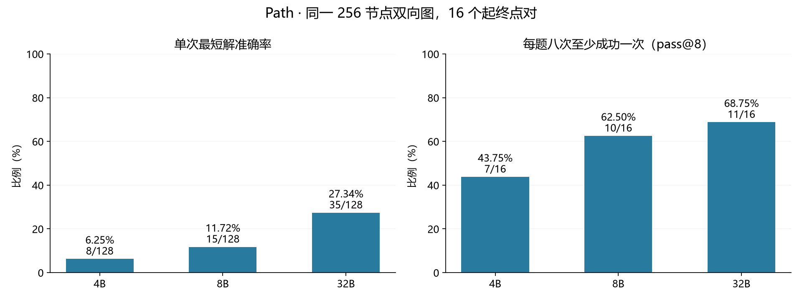
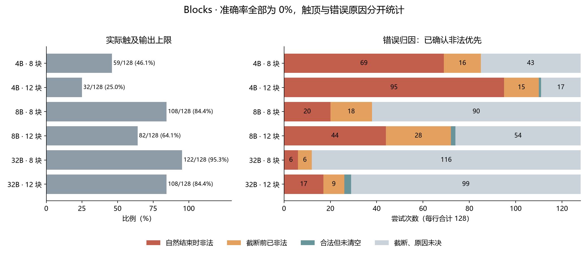
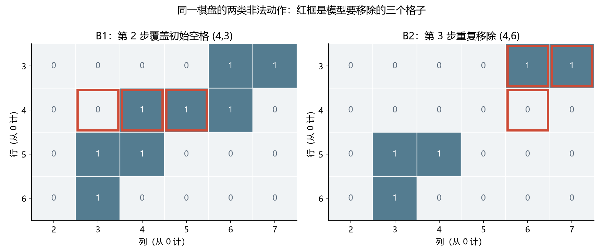

# Qwen 路径与积木实验验收报告

## 验收结论

**本轮基线运行与结果核验完成，但尚不构成状态增强方法的验收。** 官方 Qwen3-4B、8B、32B 在最终 256 节点双向图上的最短路径准确率分别为 **6.25%、11.72%、27.34%**；在 16k 输出预算下，8 块与 12 块积木均为 **0%**。本报告纳入 path 384 次、blocks 768 次，共 1,152 次尝试，无未解决的 service error。

**积木全错不能只归因于预算。** 768 次中，511 次触及输出上限（66.54%）；其中 92 次在截断前已提交可确认的非法动作前缀，按非法错误计算。加上自然结束答案中的 251 次非法动作，至少 **343/768（44.66%）** 已有直接的非法执行证据。其余是 6 次合法但未清空，以及 419 次尚未确认更早执行错误的截断。后者不等于“只差更多 token”。

**可见思考暴露了多种不同问题。** 定向检查发现棋盘坐标误读、形状约束误用、重复移除、状态报告与动作不一致，以及反复搜索后未能完成计划。正确报告当前棋盘也不保证下一步合法；这些证据支持分项诊断，不支持直接断言缺少认知地图就是共同原因。

## 范围与判分：准确率、触顶和错误原因分别报告

- **Path**：一个固定的 256 节点、每节点 3 个邻居的连通无向图，16 个不同起终点对，每题 8 次。边可双向行走；“双向图”不表示模型获得了双向搜索工具。实际最短距离为 8 步的题有 11 个、9 步有 4 个、10 步有 1 个。每题打乱节点行和邻居顺序，同题的三个模型使用相同输入。要求路径合法、无回访、到达目标且最短。
- **Blocks**：复用 Sol 的 32 个固定 10×10 二值棋盘；8 块、12 块各 16 题，每题 8 次。块数指构造数量，不是答案动作上限。形状为固定方向的 L 三格、直三格和 S/Z 四格；允许重复使用，形状的 0 格不移除也不约束棋盘。任何合法清空均算成功，无中途反馈，不要求还原原始分块。
- **准确率**＝成功尝试数／全部尝试数；触顶仍保留在分母。**pass@8**＝每题八次中至少一次成功的题数／题数，是候选覆盖率，不是已实现的答案筛选成功率。
- **触顶比例**＝实际输出达到预算上限的次数／全部尝试数。它是资源使用标签，会与已确认错误重叠，不能与错误原因列相加。
- **互斥失败归因**：自然结束的答案按环境裁判分类；触顶样本优先检查最终答案中已经确定的动作前缀，有非法则归非法，有可证明的最短性损失则归非最短，其余标为“截断、原因未决”。不把思考中试探后否定的候选当作正式错误，不从截在半个数字处的字段猜测动作。

三个模型均开启 thinking，16k 为思考与最终答案合计的输出预算。正式参数以 [blocks 合同](../configs/thinking.json) 和 [path 合同](../configs/path256_bidirectional_16k.json) 为准。本报告不混入早期 32 节点 DAG、32k/40k blocks、Base 或额外训练版本的结果。宽松恢复无歧义 JSON 内容后再判动作；外层 JSON、最终状态字段、逐步棋盘报告仅作诊断，均不额外降低主准确率。

## Path：模型越大，最短解成功率越高，但仍不稳定

图 1：左图衡量每次作答的可靠性，右图衡量八次采样能覆盖多少题。32B 的单次成功率仍不到三成；较高的 pass@8 不能替代单次准确率。

| 模型 | 最短解成功／尝试 | 准确率 | pass@8 | 合法到达／尝试 | 实际触顶 |
| --- | ---: | ---: | ---: | ---: | ---: |
| Qwen3-4B | 8/128 | 6.25% | 7/16（43.75%） | 43/128（33.59%） | 69/128（53.91%） |
| Qwen3-8B | 15/128 | 11.72% | 10/16（62.50%） | 57/128（44.53%） | 49/128（38.28%） |
| Qwen3-32B | 35/128 | 27.34% | 11/16（68.75%） | 64/128（50.00%） | 42/128（32.81%） |

规模增大同时伴随更少触顶和更多最短解。在自然结束的子集中，最短解成功率仍分别为 8/59（13.56%）、15/79（18.99%）、35/86（40.70%）；因此差异不只是“更多答案能写完”。这个子集有完成选择偏差，不能替代上表的主准确率。

按已确认错误优先重分类后，互斥结果如下；每行合计 128。括号内是从触顶样本重新归入该类的数量。

| 模型 | 成功 | 不存在的边／非法路径 | 非最短或前缀已不可能最短 | 无法解析 | 截断、原因未决 |
| --- | ---: | ---: | ---: | ---: | ---: |
| 4B | 8 | 15 | 37（+2） | 1 | 67（52.34%） |
| 8B | 15 | 22 | 44（+2） | 0 | 47（36.72%） |
| 32B | 35 | 21 | 29（+0） | 1 | 42（32.81%） |

原始完整答案中，合法到达但非最短分别有 35、42、29 次。新增的 4 条是尚未完成、但已有合法绕路前缀的触顶输出：已走步数加上当前位置至目标的精确最短距离，已经超过起点的最短距离。它们不应被描述为单纯预算不足。自然结束答案仅 2/224 无法解析，格式不是主要瓶颈。

三个模型共同的 0/8 题为 `path_undirected_256_01`、`_07`、`_11`。这提示存在共同困难实例，但只有一个固定图，不能推广为对任意 256 节点图的一般准确率。

## Path case study：辨认图边和保证最短性是两件事

### P1：把两跳关系写成直接边

`path_undirected_256_00`，4→98。真实邻接行为 `4:[216,251,120]`、`216:[4,72,35]`。**4B 第 6 次、32B 第 2 次**都在最终路径第一步输出 `4→72`；裁判在第 1 步即判不存在的边。双向关系只允许 `216→4` 的反向 `4→216`，不能把 216 的其他邻居直接接到 4 上。

这里不需要执行很长的状态更新才会失败：初始图关系的读取或绑定就已经出错。可见思考中存在反复查找节点行、混淆邻接行的现象；最终非法边是可以独立验证的证据，不能仅凭文字描述确定其内部成因。

### P2：路径全合法，终点正确，但不是最短

同题 **32B 第 1 次**返回：

`4→216→72→115→142→180→14→49→158→194→98`（10 步）。

裁判确认全部合法且终点正确；但存在 9 步路线：

`4→251→19→41→221→0→209→217→198→98`。

这个失败属于最短路径选择，不能归为“忘了自己在哪”。其可见思考提出使用 BFS（逐层搜索），但手工查表与前沿维护没有给出最短解保证。提到算法名称不等于正确执行算法。

### P3：截断前已确定失去最短性

同题 **4B 第 2 次**触及输出上限，但最终答案前缀已走 `4→251→19→64`。走完第 3 步后，即便接上精确最短后缀，总长也至少为 11，超过最优 9。因此归入“非最短”，同时保留触顶标签。延长当前路线不能修复这一错误，必须回退并改写计划。

## Blocks：两种规模均全错，较大模型更多触顶

| 模型 | 条件 | 成功／尝试 | 准确率 | pass@8 | 自然结束 | 实际触顶 |
| --- | --- | ---: | ---: | ---: | ---: | ---: |
| 4B | 8 块 | 0/128 | 0.00% | 0/16 | 69 | 59/128（46.09%） |
| 4B | 12 块 | 0/128 | 0.00% | 0/16 | 96 | 32/128（25.00%） |
| 8B | 8 块 | 0/128 | 0.00% | 0/16 | 20 | 108/128（84.38%） |
| 8B | 12 块 | 0/128 | 0.00% | 0/16 | 46 | 82/128（64.06%） |
| 32B | 8 块 | 0/128 | 0.00% | 0/16 | 6 | 122/128（95.31%） |
| 32B | 12 块 | 0/128 | 0.00% | 0/16 | 20 | 108/128（84.38%） |

按模型合并，触顶率为 4B 35.55%、8B 74.22%、32B 89.84%。三者的自然结束答案也全部失败，分别为 0/165、0/66、0/26。不能据此说大模型整体更差：本条件中成功率都在零点，而较大模型的完成子集更小，推理时间与完整答案之间存在明显的预算权衡。

两种棋盘来自不同构造分布，12 块的触顶较少也不能证明 12 块更容易。32 个输入的原始构造分解均已重放成功，排除了“题目本身无解”作为全错的共同解释。

## Blocks 失败归因：截断前的非法动作已计入非法类

图 2：左图统计实际触顶，右图按已确认错误重新分类。橙色部分虽然触顶，但此前已经非法；不能将其继续归为预算原因。右图每行合计 128 次，细小分段的精确数值见下表。

| 模型 | 条件 | 已确认非法总数 | 其中截断前已非法 | 合法但未清空 | 截断、原因未决 |
| --- | --- | ---: | ---: | ---: | ---: |
| 4B | 8 块 | 85（66.41%） | 16 | 0 | 43（33.59%） |
| 4B | 12 块 | 110（85.94%） | 15 | 1 | 17（13.28%） |
| 8B | 8 块 | 38（29.69%） | 18 | 0 | 90（70.31%） |
| 8B | 12 块 | 72（56.25%） | 28 | 2 | 54（42.19%） |
| 32B | 8 块 | 12（9.38%） | 6 | 0 | 116（90.63%） |
| 32B | 12 块 | 26（20.31%） | 9 | 3 | 99（77.34%） |

每行“非法总数＋合法但未清空＋截断、原因未决＝128”，“其中截断前已非法”是非法总数的子集，不重复相加。343 条已确认非法中，**覆盖初始空格 237 次、重复移除 103 次、形状编号或越界 3 次**。分类取计划的第一个非法动作；不是所有后续错误的发生次数。

511 条触顶记录中，370 条尚无最终答案文本，141 条已开始最终答案。重放后者能确认 92 条非法；余下 49 条尚不能确认非法。对未定案思考的错误不作自动执行判定：因此上述非法数量是可靠下界，419 条“原因未决”不是经过证明的纯预算失败。

合法前缀中的逐步棋盘自报也很不可靠，但它不参与主成功判分：

| 模型 | 8 块：整盘正确／可评步 | 12 块：整盘正确／可评步 |
| --- | ---: | ---: |
| 4B | 40/119（33.61%） | 76/266（28.57%） |
| 8B | 12/40（30.00%） | 32/154（20.78%） |
| 32B | 7/16（43.75%） | 24/100（24.00%） |

该表沿用自然结束答案的合法前缀口径，不混入本次新提取的不完整答案前缀。格子级准确率可因大量 0 格而很高，不能替代整盘准确率。非法步骤之后不再评估；32B 的 8 块只有 16 个可评步骤，不能据这个小子集推断模型间状态能力排名。

## Blocks case study：思考中的问题如何落到可验证错误

对全部 768 条保存记录检查了思考文本存在性、输出终止状态和最终动作；另对 **8 个定向案例**的思考开头、中段与结尾进行了人工语义检查，覆盖三个模型、两种棋盘和截断／非法／提前结束。以下为行为摘要，不是完整思考转录，也不是对全部思考逐句标注后的发生率。

图 3：均为裁判执行到首个非法动作之前的真实局部棋盘。红框标出下一步拟移除的格子；左图包含初始空格，右图包含此前已移除格子。以下 B1、B2 对应这两种失败。

### B1：同题三个模型都出现坐标读取问题

`blocks8_00` 初始第 4 行为 `0010111000`，真实占用列是 `{2,4,5,6}`（从 0 计数）。**4B 第 1 次**在思考早期把部分行多读出格子；**8B 第 1 次**在反复重读时把该行写成 `{2,3,4,6}`。两条均用完预算且没有最终答案，保留为原因未决；思考中的读数错误是诊断线索，不自动当作其最终计划。

**32B 第 1 次**自然结束，最终第 1 步是竖三格 `(shape_id=4,row=3,col=2)`，动作合法，`board_after` 也完全正确；第 2 步却移除横三格 `(5,4,3)`，覆盖 `(4,3)` 这个初始空格。思考中也曾把该行坐标读错，但即使最终已经正确写出第一步后的棋盘，仍没有据它约束下一步。

**判断**：这里同时存在观测到坐标的转换问题，以及状态记录到动作合法性的脱节。“让模型写棋盘”本身不足以保证正确行动。

### B2：初始坐标读对，后续仍重复移除

同题 **32B 第 5 次**在思考开头正确列出了第 4 行的占用坐标。最终计划先执行横三格 `(5,4,4)`，移除 `(4,4),(4,5),(4,6)`；再执行竖三格 `(4,3,2)`。第 3 步选择 `(shape_id=0,row=3,col=6)`，需要 `(3,6),(3,7),(4,6)`，但 `(4,6)` 已由第 1 步移除，因此第 3 步非法。

两步合法前缀的整盘自报均错误；思考末尾仍将这套动作汇总为完整计划并转入 JSON。**判断**：这一例支持检查动作后果维护或计划汇总的一致性，但不能把错误局限为最初的棋盘读取。

### B3：输出最终答案时截断，但早在第 3 步已非法

`blocks12_00`，**8B 第 1 次**达到 16k。已输出的最终动作前缀至少包含 48 个坐标完整的动作；前两步合法且棋盘自报正确，第 3 步 `(shape_id=2,row=2,col=2)` 覆盖初始空格 `(2,3)`，因此归入**非法动作**，不计入“截断、原因未决”。此处无需等待整个 JSON 或最后一张 `board_after` 写完才能判错。

这也说明冗长最终输出与前期动作错误可以共存。其他已重分类案例包括 4B 的 `blocks12_01` 第 6 次（第 4 步重复移除），以及 32B 的 `blocks12_03` 第 4 次（第 10 步覆盖初始空格）。逐条位置保存在审计摘要中。

### B4：合法执行很多步，也可能留下无法继续的残余

`blocks12_14`，**32B 第 1 次**自然结束，输出 13 个合法动作并自报 `unsolved`。裁判重放后剩余 `(2,9),(8,0),(9,2),(9,4)` 四格，没有任何合法移除动作；原始棋盘有完整构造解。思考末尾反复尝试修补孤立残余，最后决定提交未完成计划。

它对“尚未解决”的最终判断是对的，因此不是虚报成功；但 13 步里只有 3 步整盘自报正确，思考末尾还漏列了真实残余 `(2,9)`。**判断**：这一例同时涉及规划造成不可继续的残余和状态报告错误；本次未定位第一次失去可解性的动作，不能断言必须深层搜索才能避免。

作为补充，4B 的 `blocks12_01` 第 5 次也主动提交未完成计划：5 步均合法，剩余 23 格，自报 `unsolved` 正确，但 5 步棋盘报告均错误。8B 的 `blocks12_00` 第 3 次则在自然结束后第 5 步非法。32B 的 `blocks12_00` 第 1 次在思考中反复检查形状与残余后触顶，没有最终答案。它们进一步说明自然结束、状态正确、动作合法、目标完成是不同的验收项。

## 验证边界与下一步

**已完成的核验**：三个 path 原始批次各 128 个唯一槽位；三个原始 16k 批次各 384 个唯一槽位，从中只取各 256 条 blocks。原始与内容判分版本均完成且无未解决服务错误，同条件 suite 在模型间完全相同。重放全部 481 条自然结束的纳入答案，与现有裁判的成功、失败类型、首个非法动作及状态计数一致；所有 671 条触顶记录的输出计数均达到上限。32 个积木构造解全部合法清空。新增前缀审计的针对性测试覆盖不完整坐标、未完成棋盘、探索文本隔离与错误优先归因。

**尚不能据此断言**：未训练或比较显式状态网络；没有确定网络接口、训练损失或因果增益。8 次重复采样不是 8 个独立棋盘，path 的 16 题还共享同一个图。可见思考只提供输出行为证据，不能直接等同于内部机制。16k 是 token 上限匹配，不是实际计算量或 FLOPs 匹配。Sol 的 blocks 使用相同题目但预算条件不同，Sol 的 DAG 也不是本次 path 图，不将跨条件差值解释为公平性能排名。

建议先在已保存错误上做三个最小对照，再决定是否训练：

1. **观测读取**：将同一棋盘同时表达为二值行或占用坐标列表，检查形状偏移与坐标读取错误是否减少。
2. **状态到动作**：给定正确当前棋盘，单独判断候选动作是否合法、预测一步结果，区分状态维护和动作前提利用。
3. **计划与预算**：分别比较精简状态输出、完整棋盘输出，以及匹配预算下的计划成功率。提供精确合法动作或搜索器时须单列工具辅助条件。

这些是诊断建议，本次仅离线审计与文档整理，没有启动新推理、训练或预算条件。尚待回答：419 条未决 blocks 截断中有多少来自观测读取、规划回退或序列化开销；换表示能否消除错误；状态增强能否超过简单的文本状态记录基线。

## 来源与复核入口

验收日期：2026-09-11。紧凑指标、逐题结果与重分类定位见 [acceptance_audit.json](acceptance_audit.json)，复核脚本见 [acceptance_audit.py](../src/acceptance_audit.py)。原始思考、完整响应和机器运行元数据保留在 Git 外。

- Path：`/zhanghanyue/experiment/grounded_llm/runs/qwen_path256_bidirectional_16k/{4b_official,8b_official,32b_official}/`；已有汇总位于同根目录 `all_models_report/`。
- Blocks 原始 16k：`/zhanghanyue/experiment/grounded_llm/runs/qwen3_thinking_sol/{4b_official,8b_official,32b_main}/`。
- Blocks 内容判分派生结果：`/zhanghanyue/experiment/grounded_llm/runs/qwen3_thinking_sol_content_only/{4b_official,8b_official,32b_official}/`。该派生文件不保留思考文本，本次语义检查回到原始运行读取。

人工思考检查的 8 个槽位：4B `blocks8_00/1`、`blocks12_01/5`；8B `blocks8_00/1`、`blocks12_00/3`；32B `blocks8_00/1`、`blocks8_00/5`、`blocks12_00/1`、`blocks12_14/1`。案例是定向选取，不用于估计错误发生率。
