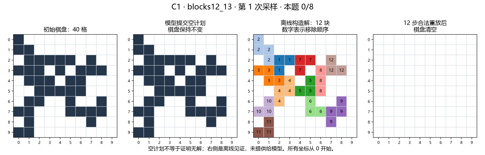
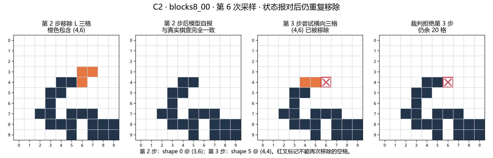
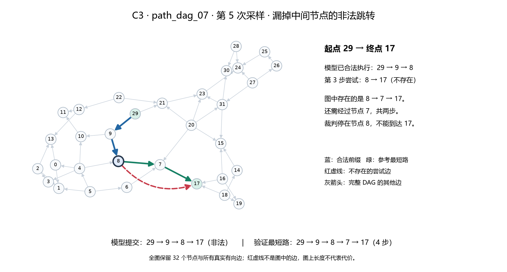
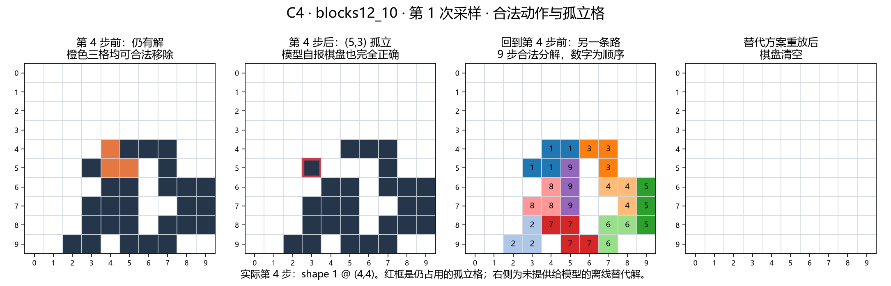

# Sol medium 实验结果

原始运行：`D:\opd_RL_learning\recognition_llm\experiments\sol_dag_blocks\runs\sol_medium_recovery\run.json`；运行源码 commit：`528c43cfc6dae70ef278b7dea7ca153419b37510`。

| 条件 | 已完成试验 | 任务成功 | 完整合同通过 | pass@8 | 截断 | 非法答案 |
| --- | ---: | ---: | ---: | ---: | ---: | ---: |
| blocks8 | 128/128 | 91 | 82 | 16/16 | 0 | 10 |
| blocks12 | 128/128 | 69 | 67 | 13/16 | 0 | 15 |
| path_dag | 128/128 | 119 | 119 | 16/16 | 0 | 9 |

pass@8 仅在八次均已有最终试验记录的实例上计算；预算截断计失败。完整合同通过额外要求严格 JSON、正确最终状态与积木每一步完整棋盘报告。非法答案计数限完整响应。

## blocks8

失败分类：`{"success": 91, "stopped_early": 27, "illegal_action": 10}`。八次全失败实例：`[]`。

严格 JSON：111/128；输出 token 共 676,152，其中推理 614,293，非推理差值 61,859（可拆分 128/128 次）。

合法前缀逐步棋盘完全正确：777/802；格式有效：802/802。缺失报告计错，非法动作及后续不评价。

| shape_id | mask | 子类 | 输入构造计数 | 输出全部可解析动作 | 合法前缀动作 | 成功答案动作 |
| --- | --- | --- | ---: | ---: | ---: | ---: |
| 0 | `11/10` | L3 | 13 | 126 | 111 | 107 |
| 1 | `10/11` | L3 | 18 | 109 | 103 | 100 |
| 2 | `11/01` | L3 | 15 | 134 | 125 | 117 |
| 3 | `01/11` | L3 | 17 | 115 | 107 | 101 |
| 4 | `1/1/1` | I3 | 11 | 109 | 97 | 92 |
| 5 | `111` | I3 | 10 | 115 | 97 | 90 |
| 6 | `011/110` | SZ4 | 14 | 58 | 56 | 51 |
| 7 | `10/11/01` | SZ4 | 10 | 41 | 41 | 39 |
| 8 | `110/011` | SZ4 | 8 | 31 | 31 | 29 |
| 9 | `01/11/10` | SZ4 | 12 | 34 | 34 | 32 |

归一化频率、按子类分布和输入含该形状时的输出出现率见 `summary.json`。输入分解不唯一，这些是经验选择频率，不是识别准确率。

## blocks12

失败分类：`{"success": 69, "stopped_early": 44, "illegal_action": 15}`。八次全失败实例：`['blocks12_05', 'blocks12_09', 'blocks12_13']`。

严格 JSON：94/128；输出 token 共 975,578，其中推理 891,026，非推理差值 84,552（可拆分 128/128 次）。

合法前缀逐步棋盘完全正确：973/1008；格式有效：1008/1008。缺失报告计错，非法动作及后续不评价。

| shape_id | mask | 子类 | 输入构造计数 | 输出全部可解析动作 | 合法前缀动作 | 成功答案动作 |
| --- | --- | --- | ---: | ---: | ---: | ---: |
| 0 | `11/10` | L3 | 15 | 174 | 132 | 117 |
| 1 | `10/11` | L3 | 22 | 184 | 164 | 150 |
| 2 | `11/01` | L3 | 17 | 160 | 141 | 123 |
| 3 | `01/11` | L3 | 25 | 152 | 136 | 122 |
| 4 | `1/1/1` | I3 | 18 | 156 | 118 | 105 |
| 5 | `111` | I3 | 16 | 190 | 164 | 155 |
| 6 | `011/110` | SZ4 | 20 | 50 | 45 | 35 |
| 7 | `10/11/01` | SZ4 | 14 | 35 | 29 | 25 |
| 8 | `110/011` | SZ4 | 21 | 51 | 47 | 44 |
| 9 | `01/11/10` | SZ4 | 24 | 34 | 32 | 26 |

归一化频率、按子类分布和输入含该形状时的输出出现率见 `summary.json`。输入分解不唯一，这些是经验选择频率，不是识别准确率。

## path_dag

失败分类：`{"success": 119, "illegal_move": 9}`。八次全失败实例：`[]`。

严格 JSON：128/128；输出 token 共 24,364，其中推理 18,260，非推理差值 6,104（可拆分 128/128 次）。

## 限制

本轮只有 Sol 的一次性完整计划基线；形状集合、提示词、样本和网关均与旧轮不同，不能用差值证明状态增强或模型优劣。路径按至少四步筛选，不能代表任意随机点对。逐步棋盘自报来自模型，没有环境反馈；报告正确不等于搜索或规划机制正确。第三方网关返回名称只作为元数据，不证明底层模型身份。

## 最终验收与解释

已核对全部 48 个输入与固定种子生成结果一致，384 个预期采样槽位无遗漏、无重复；所有请求均为指定的 Sol/medium、匹配提示词且工具列表为空，所有返回模型名与推理强度符合请求。384 个完整答案逐一重放一致，六个历史接续阶段中已保存的完整答案（包括失败）均原样保留。九项针对性测试通过。本轮没有 token 截断或未解决的服务错误槽位。

三个 12-block 稳定失败实例的组成如下；它们均有离线验证的构造解。

| 实例 | 空计划 | 非法动作答案 | 成功 |
| --- | ---: | ---: | ---: |
| blocks12_05 | 7 | 1 | 0/8 |
| blocks12_09 | 6 | 2 | 0/8 |
| blocks12_13 | 8 | 0 | 0/8 |

这 24 次输出中 21 次为空计划，因此不能把三个稳定失败直接写成状态预测能力不足。另有六个非法积木答案具有非空且全部报告正确的合法前缀（8-block 一次、12-block 五次），随后动作仍违反当前棋盘约束；这表明自报状态正确与下一步动作合法是不同指标，也不能仅凭报告反推出内部机制。

25 个非法积木答案中，20 次覆盖初始空格，5 次重复移除。九个路径失败中，四次使用不存在的有向边，五次 from 与当前节点不符；没有合法到达但非最短的答案。严格 JSON 共 333/384，完整合同通过共 268/384，任务成功共 279/384，三者分开统计。

## 形状子类经验频率

下表每列分别在对应统计范围内归一化。输入构造按每个棋盘计一次；输出按动作计数，重复采样均保留。

| 条件 | 子类 | 输入构造 | 全部可解析输出 | 合法前缀 | 成功答案 |
| --- | --- | ---: | ---: | ---: | ---: |
| blocks8 | L3 | 49.2% | 55.5% | 55.6% | 56.1% |
| blocks8 | I3 | 16.4% | 25.7% | 24.2% | 24.0% |
| blocks8 | SZ4 | 34.4% | 18.8% | 20.2% | 19.9% |
| blocks12 | L3 | 41.1% | 56.5% | 56.8% | 56.8% |
| blocks12 | I3 | 17.7% | 29.2% | 28.0% | 28.8% |
| blocks12 | SZ4 | 41.1% | 14.3% | 15.2% | 14.4% |

S/Z 四格在输出中的占比低于构造输入，但两者不是同一个分解目标：模型可采用其他合法分解，成功答案还包含样本选择差异。这些频率用于描述形状选择，不能直接当作形状识别概率或偏好的因果证据。逐 shape_id 的频率及输入含该形状时输出出现的条件频率保存在 summary.json。

## 调用与用量记录

正式组为 384 个完整答案；另归档 22 次明确的服务/连接故障：3 次并发限制、13 次 server_error、4 次 upstream_error、2 次 URLError。三次客户端运行中断涉及最多 24 个可能在途请求，其最终响应未保存，不计为模型失败。额外发送数量只能给出上界，不能把 384 称为全部 HTTP 请求数。原始记录与接续链保留在 Git 忽略的 runs/。

正式答案输出用量共 1,676,094 token，其中推理 1,523,579（90.9%），非推理输出差值 152,515。该统计不包含未知在途请求的未返回用量。所有响应的 max_output_tokens 均为 null，且实际曾超过请求上限；用户明确允许不限制 token，因此本轮不作严格 token 预算结论。高 token 用量主要来自推理，不能直接解释为最终答案冗长或格式违规。

## 四个简短案例

以下为事后选取的四份真实答案，用于解释错误，不改变总体统计；本次没有新增模型调用。积木图沿用之前的四联图，坐标均从零开始；路径图保留完整 32 节点 DAG。图中的参考解只由离线裁判核验，未提供给模型。来源均为本报告原始运行，可按实例编号和采样序号定位。

### C1：空计划，但存在明确的合法分解

`blocks12_13` · 第 1 次采样 · 本题 0/8

模型最终提交 `{"actions":[],"final_status":"unsolved"}`，40 个占用格全部留下；原响应还带有 JSON 之外的说明，因此格式也未通过。右侧用颜色和序号给出一份 12 步构造解，已逐步验证合法并清空。本题八次均为空计划：这是没有交付解的稳定失败，不能仅据此判断是状态预测错误，也不能把 `unsolved` 解读为模型证明题目无解。

### C2：前两步棋盘报对，第三步仍重复移除

`blocks8_00` · 第 6 次采样

第 2 步 `shape 0 @ (3,6)` 已移除 `(4,6)`；模型随后自报的完整棋盘与真实状态一致。第 3 步却提交 `shape 5 @ (4,4)`，试图移除 `(4,4)、(4,5)、(4,6)`，其中最后一格已经为空。裁判拒绝执行，仍余 20 格。这个案例直接说明：正确报告状态与用状态检查下一步动作是不同能力，不能仅凭逐步棋盘准确率判断整个计划可靠。

### C3：从节点 8 跳到 17，漏掉必经的节点 7

`path_dag_07` · 第 5 次采样

模型提交 `29 → 9 → 8 → 17`。前两步合法，但图中没有 `8 → 17`，存在的是 `8 → 7 → 17`；裁判停在 8。补上节点 7 后，`29 → 9 → 8 → 7 → 17` 是已验证的四步最短路。可观察错误是漏掉一个中间动作，尚不能区分图解析、路线生成或最终输出遗漏；不应把它自动归为深层搜索失败。

### C4：动作合法、棋盘报对，却留下无法移除的孤立格

`blocks12_10` · 第 1 次采样 · 第 4 步

第 4 步 `shape 1 @ (4,4)` 移除 `(4,4)、(5,4)、(5,5)`，三格当时均被占用，因此动作完全合法。但它切断了 `(5,3)` 的最后一个相邻占用格，留下四周皆空的单格。允许形状均为连通的三格或四格，不能覆盖这个孤立格；后续只能移除、不能补格，因此从此无法清空。模型该步自报的完整棋盘与真实状态完全一致，包含这个孤立格。

这不是进入第 4 步前就已经无解：右侧给出从该步之前出发的另一份九步分解，已逐步重放并清空。其第一步改用 `shape 6 @ (4,3)`，以 S/Z 四格覆盖 `(5,3)`；九步只是可行见证，不声称最少。由此前三步合法且还能接上这份解，可确认第 4 步才是本答案首次从有解变成无解的动作。原裁判最终记录的是第 6 步重复移除导致的非法动作，早于它的规划陷阱已发生在第 4 步。

这个案例支持区分三件事：动作是否合法、状态是否报对、动作是否保留完成任务的可能。前两项正确仍可能作出不可挽回的选择；但单个事后案例不足以确定模型内部搜索或状态表示的具体缺陷。

图片生成脚本：`experiments/sol_dag_blocks/src/case_studies.py`（依赖 matplotlib、networkx 和 Microsoft YaHei 字体）。脚本重放四份原始答案，并核验构造解、关键格、最短路，以及孤立格无法覆盖和陷阱前的替代解；图片已逐张目视检查。

## 下一步建议（尚未启动新实验）

本轮积木的 96 次任务失败中，63 次为空计划（8-block 24 次、12-block 39 次），8 次提交了非空合法前缀却未清空，25 次包含非法动作。空计划占主要部分，首先应解释模型为何不提交可执行解，而非直接假设所有错误都是状态遗忘。已知存在解只排除了题目无解；尚不能区分搜索失败、停止策略、输出协议负担或其他原因。

优先在相同模型、固定棋盘、规则和采样预算下设计两个小型诊断：一是对空计划案例比较仅输出动作与逐步输出棋盘的协议，识别状态报告负担是否影响解题完成；二是对已保存的首次非法动作前状态，单独测试候选动作是否合法及执行后的棋盘，区分动作前提检查、转移预测和完整计划生成。若使用精确合法性工具，应列为独立工具辅助条件，不混入本轮无工具结果。需保留成功案例作对照，避免把针对失败样本的结论推广到整体。

状态报告指标也须谨慎：8-block 有 9 个答案的合法前缀报告存在错误，其中 2 个仍合法清空；12-block 分别为 12 个和 1 个。相反，有六个答案此前状态全报对却随后动作非法。报告准确与解题成功并不等价。接近 99.9% 的逐格准确率容易被大量空白格抬高，应优先关注整棋盘完全正确率、变化格与动作约束，不以逐格平均值替代机制解释。
